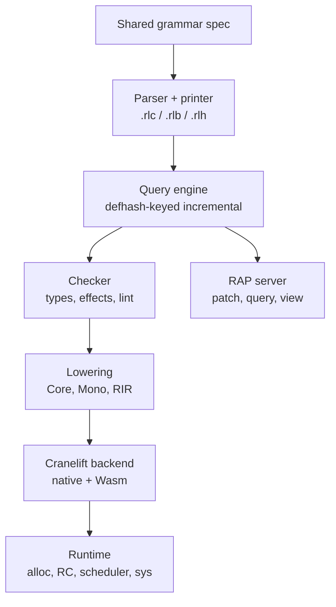

# rAiL

rAiL is a programming language designed for software agents. It is strict,
statically typed and effect-tracked, and it is functional. Its source of truth
is a deterministic canonical form that agents read and write. That form is
compiled ahead of time to native code or to sandboxed WebAssembly. Humans work
through a generated view that converts back to the canonical form with no loss.

> **Status: specification only.** No compiler exists yet. Every performance
> figure below is a v1 target that the `rail-perf` harness must verify. None of
> them are measurements. The full specification is in
> [`aidlc/spaces/default/knowledge/documents/rail-language-spec.md`](aidlc/spaces/default/knowledge/documents/rail-language-spec.md).

## Why rAiL

rAiL is built for the program an agent can write, verify and run fastest, with
as few ways to get it wrong as possible. The compiler enforces these rules;
they are not conventions.

- **One tree, one spelling.** Each construct has exactly one canonical encoding,
  so regenerating the same logic produces identical bytes and clean diffs.
- **Cost is visible.** Allocation, effects, parallelism and failure all appear
  in types or explicit calls. Nothing expensive happens implicitly.
- **Pure and immutable by default.** Mutation, I/O and nondeterminism are
  opt-in effects.
- **No ambient authority.** Code can reach the file system, network,
  processes, clock, randomness or environment only through capabilities that
  its caller passes in.
- **Edits without line numbers.** Stable definition IDs and anchor paths
  survive reformatting, reordering and concurrent edits.
- **Structured diagnostics.** Every error and lint carries a rule ID, an exact
  node location and a fix that tools can apply.

## Key design decisions

| Area | Choice |
| --- | --- |
| Source of truth | rAiL Canonical Form (RCF): one abstract tree with two encodings that map one-to-one, text `.rlc` and binary `.rlb` |
| Human view | `.rlh`, generated by the translator and parsed back by it |
| Evaluation | Strict; laziness only through explicit `Iter` and `Lazy` |
| Types | Hindley–Milner inference with row-typed effects, ADTs, single-parameter traits, monomorphized generics |
| Memory | Perceus-style reference counting with borrow and reuse inference, plus arenas; no tracing GC |
| Effects | 12 fixed effect labels that compile to capability or evidence parameters; no resumable handlers |
| Errors | `Result`/`Option` with `?`; no exceptions; `abort`, overflow and out-of-bounds access trap |
| Concurrency | Structured tasks on an M:N work-stealing scheduler; deterministic unless the `nd` effect is used |
| Backends | Cranelift (dev), LLVM (release), WebAssembly component (portable and sandboxed) |
| Linting | Part of `rail check`; errors and high-severity security findings block builds |
| Dependencies | Minimal version selection, BLAKE3-locked, signed, effect-bounded per package, no build scripts |
| Agent edits | Structured patches addressed by definition ID and anchor path |

## A quick look

The same module in both forms.

Canonical text (`.rlc`):

```
(mod geo)
(pub Pt Shape area)
(typ #k2m9qa Pt () (rec (x f64) (y f64)) (der Eq Show))
(typ #p7c1vd Shape () (sum (Circle Pt f64) (Rect Pt Pt)) (der Eq Show))
(fn #a4x0te area (s) (: (-> (Shape) f64)) (? s ((Circle _ r) (* 3.14159 (* r r))) ((Rect a b) (* (abs (- (. b x) (. a x))) (abs (- (. b y) (. a y)))))))
```

Human form (`.rlh`):

```
module geo

pub type Pt = {x: f64, y: f64} derive Eq, Show
pub type Shape = Circle(Pt, f64) | Rect(Pt, Pt) derive Eq, Show

pub area(s: Shape) -> f64 =
  match s
    Circle(_, r) -> 3.14159 * r * r
    Rect(a, b) -> abs(b.x - a.x) * abs(b.y - a.y)
```

The canonical text has 18 core form heads plus `ext`, `req` and `ens`. It has
no `if`, no loop form and no mutation syntax. A Boolean conditional is a match.
Loops are tail calls or fused iterator combinators. Local mutation happens
inside `st.run` regions.

## Effects

Functions are pure unless their inferred effect row says otherwise.

| Effect | Grants | Runtime form |
| --- | --- | --- |
| `fs`, `net`, `proc`, `env`, `ffi` | Files, sockets, processes, env vars, foreign calls | Explicit capability value (scoped) |
| `clk`, `rnd`, `log`, `par` | Clocks, randomness, logging, task spawning | Hidden evidence parameter, replaceable in tests |
| `st`, `nd`, `div` | Local mutation, nondeterminism, possible non-termination | Erased; static only |

Dependencies declare an effect bound. For example, a CSV parser declared with
`(fx)` provably cannot touch the disk or the network.

## Toolchain

Everything ships in a single `rail` binary. Each command is available as a
CLI with JSON output. Each is also available through the rAiL Agent Protocol
(RAP), a JSON-RPC 2.0 service over stdio that keeps a warm incremental
compiler in memory.

| Command | Purpose |
| --- | --- |
| `rail parse` / `rail fmt` | Parse to a tree with IDs; format or check canonical text |
| `rail check` | Types, effects and lints in one pass, one diagnostic stream |
| `rail build` / `rail run` | Compile (`dev`, `release`, `wasm`); run, sandboxed by default for agent code |
| `rail test` / `rail bench` / `rail prof` | Tests and property tests; benchmarks; CPU, allocation and reference-counting profiles |
| `rail view` / `rail absorb` | Canonical → human form and back (lossless) |
| `rail patch` / `rail merge` | Structured, ID-addressed edits; three-way merge on the tree |
| `rail diff` / `rail equiv` | Semantic diff in human form; equivalence at the canonical, hash and tested levels |
| `rail query` / `rail deps` | Callers, callees, effect users; dependency graph with effect bounds |
| `rail audit` / `rail verify` | Security findings and advisories; reproducible-build and bounded-model-check verification |
| `rail vendor` / `rail publish` | Offline vendoring; publishing with semver enforced by an API diff |

Agents address code as `module#defid/anchor-path`, for example
`ingest.report#t3n8wq/rows`. Patches are canonical text, pinned to a base
hash, and apply atomically:

```
(patch ingest.report base:blake3:8f2c…
 (set #t3n8wq/acc (text.build))
 (ren #t3n8wq summarize)
 (del #h1w7ep))
```

## File extensions

| Extension | Content |
| --- | --- |
| `.rlc` | Canonical text (the source of truth in repositories) |
| `.rlb` | Canonical binary (packages, caches, transmission) |
| `.rlh` | Human form (generated; can be edited when in formatter-canonical form) |
| `.rlmap` | Source map |
| `rail.pkg`, `rail.lock`, `rail.review` | Manifest, lockfile, signed approvals |

## Planned architecture

The compiler will be written in Rust as one crate workspace that produces one
binary. One shared grammar definition generates the three parsers and printers,
which makes round trips correct by construction. A Salsa-style query engine
caches every phase by `defhash`.



Text fallback: grammar spec → parser/printer → query engine → checker →
lowering (Core IR, Mono IR, RIR) → Cranelift backend → runtime. The query
engine also feeds the RAP server.

## Roadmap

| Phase | Duration | Scope | Exit criterion |
| --- | --- | --- | --- |
| 0. Foundations | 2 months | Grammar, parsers, printers, binary codec, IDs, hashes, `fmt`, `view`, `absorb` | T1, T2, T4 |
| 1. Checker and agent loop | 4 months | HM + effects, exhaustiveness, lint framework, RAP, patches, merge | T5, T6; token-count gate decided |
| 2. Execution | 5 months | Core/Mono/RIR, Perceus RC, Cranelift native, runtime, core std modules | T9, T10 |
| 3. Concurrency and sandbox | 4 months | Scheduler, `std.task/par`, Wasm target, Wasmtime host, capabilities, audit log | T7, T11, T12 |
| 4. Supply chain | 3 months | Packages, MVS, lockfile, signing, registry, vendoring, semver checks | T3, T14 |
| 5. Performance | 6 months | LLVM backend, full optimizer, security and performance lints, BMC verifier | T8, T13; 1.0 |

The prototype is accepted when all 14 acceptance suites (T1–T14) pass in CI on
Linux, macOS and Windows. They cover deterministic parsing and builds, lossless
round trips, stable source maps, localized edits, cross-platform consistency,
defect detection, correctness, memory safety, resource limits, capability
enforcement, performance targets and offline operation.

## Selected v1 targets

| Metric | Target |
| --- | --- |
| Dev clean build, 10 K lines | ≤ 1.5 s |
| Incremental check after a one-definition patch (100 K lines) | ≤ 50 ms p95 |
| Native cold start | ≤ 5 ms Linux/macOS, ≤ 10 ms Windows |
| Execution time (corpus geomean) | ≤ 1.3× Rust, ≤ 1.0× Go |
| Hello-world binary | ≤ 400 KB |
| Parallel speedup at 16 cores | ≥ 12× |
| Toolchain | Single binary ≤ 60 MB, zero external dependencies |

**Open decision:** the canonical S-expression text is currently 9–27% larger in
bytes than the human form. If it also costs more than 5% extra in model
tokens, or its check-pass rate trails by more than 2 points, the text encoding
will switch before 1.0 to the formatter-canonical human syntax. The tree, the
binary form, IDs, hashes and patches are unaffected by that switch.

## Name

The display spelling is **rAiL**, which highlights the "AI" in the name and the
idea of rails that keep agents on safe, deterministic tracks. The CLI, file
names, package namespaces and binary magic use lowercase `rail` (or `RAIL`).
