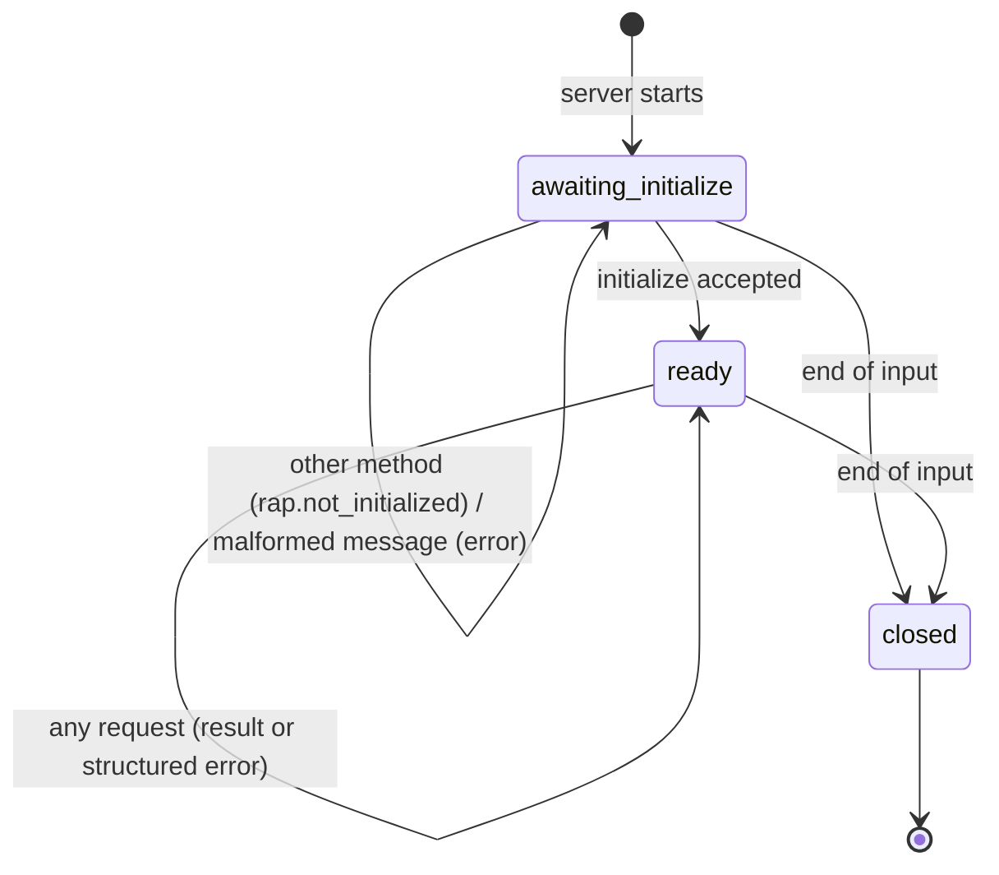
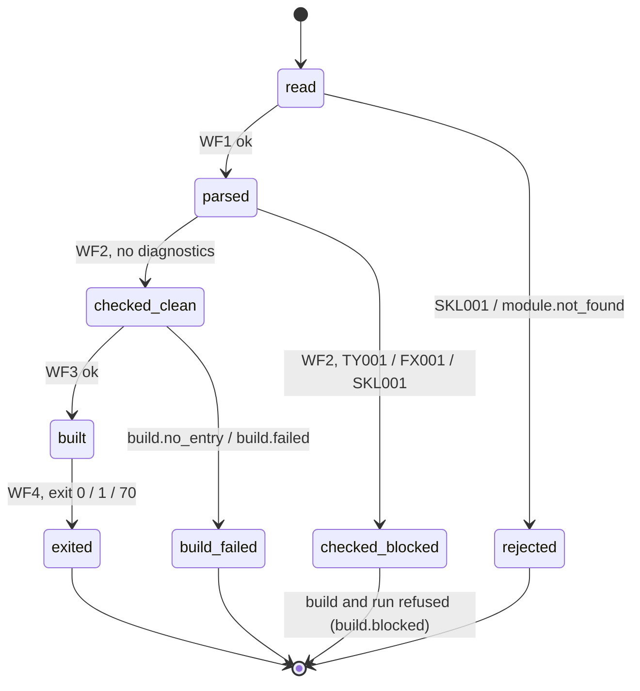
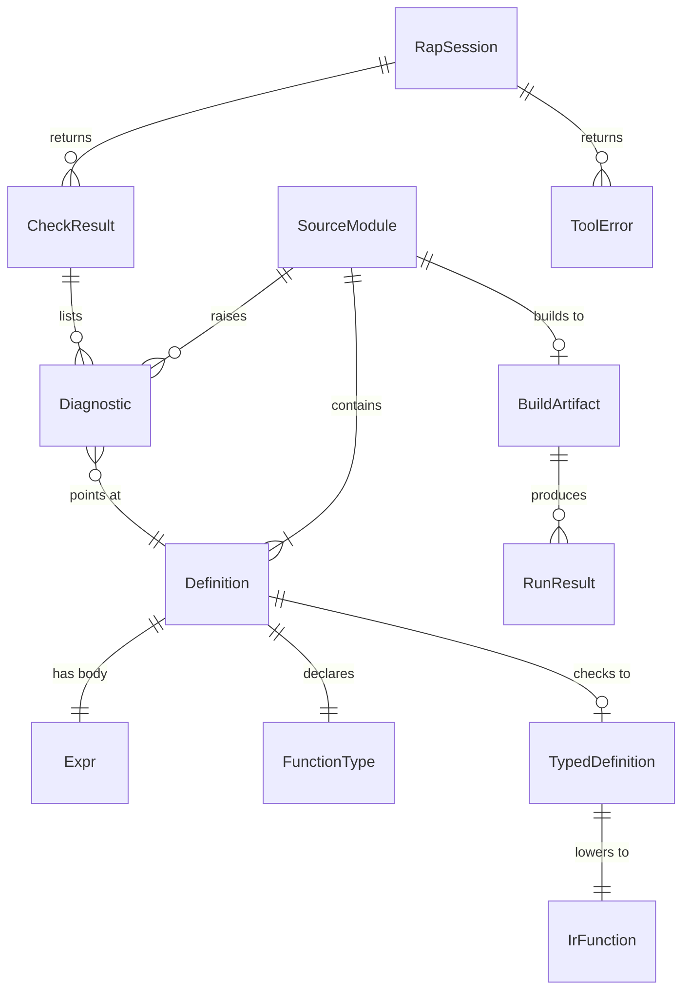

# Functional Specification — walking-skeleton (U1)

## Purpose

The walking skeleton proves that the toolchain's pieces connect before any of them is built out. It is one small canonical rAiL module going end to end, on macOS and Linux:

text → parse → check → served over the agent protocol → lower → Cranelift → link with a minimal runtime → native binary → run.

It delivers requirement FR27 and the workspace layout (one Cargo workspace, several crates, one `rail` binary) that later units fill in. Every part is deliberately thin. Every part keeps the shapes agreed in Contract Design, so later units deepen it instead of rewriting it.

This document is the source of truth for the skeleton's **workflows** and **state machines**. The data shapes live in `entities.md` and the decision logic in `rules.md`. The ER diagram and rules summary below are derived views of those two files.

## Sources

- `unit-of-work.md` (U1) and `bolt-plan.md` (Bolt 1): scope, definition of done, expected demo.
- `requirements.md`: FR27, plus the cross-cutting FR13.1, FR13.2, NFR3, NFR6 and NFR7.1.
- `components.md`: owning building blocks.
- `contract-summary.md`: C1–C4, E1, E2, E7.
- The rAiL spec: §2.2–§2.7 (forms, grammar, layout, IDs), §3.1 (types, checked arithmetic), §3.3 (effects), §6.1–§6.4 (diagnostics), §7.3 (traps), §9.1 (tool surface).
- `functional-design-questions.md` [Q1]–[Q7], confirmed.

## Decisions taken in this design

| Decision | Choice | Source |
|---|---|---|
| What the program does | A pure function computes 42 by arithmetic. `main` prints it with a temporary built-in, then returns `Ok` if it is correct and `Err` otherwise | Q1 (B) |
| Language subset | `mod`, `pub`, `fn` with signature, application, integer and Boolean literals, `()`, arithmetic and comparison operators, `let`, Boolean match; everything else rejected with a located diagnostic | Q2 (A) |
| Type checking | Monomorphic, with explicit signatures only. Types are `i64 bool unit`, plus `Result` and an opaque `Caps` for `main` | Q3 (A) |
| Protocol methods | `initialize`, `tree.get`, `check.run`, `build.run`, `run.run` | Q4 (A) |
| Failure path | A second module with a type error is shown failing through the command line and the protocol, and the build refuses it | Q5 (A) |
| Temporary print | `skel.print_i64 : (-> (i64) unit log)`; callers must declare `log`; removed by U7 | Q6 (A) |
| Program output over the protocol | Returned at the end with the exit code | Q7 (A) |
| Unsupported constructs | Reported as `SKL001`, a temporary rule ID that is retired and never reused | Derived from Q2 (BR4.4) |
| Every function exported | Canonical text allows a signature only on exported functions. Q3 requires a signature everywhere, so skeleton modules export every function | Derived from Q3 and spec §2.2 (BR2.1) |

## The skeleton programs

Two fixture modules drive every workflow and test. They are written by hand in canonical text, with fixed IDs. The listings below are illustrative. The exact bytes are fixed in Code Generation and must follow `rules.md`.

**`skeleton.answer`**, the happy path:

```
(mod skeleton.answer)
(pub answer main)
(fn #sk0a1b answer (x) (: (-> (i64) i64)) (* x 7))
(fn #sk0m4n main (_) (: (-> (Caps) (Result unit unit) log)) (let (n (answer 6)) (_ (skel.print_i64 n)) (? (== n 42) (true (Ok ())) (false (Err ())))))
```

Expected: standard output `42` plus a newline, empty standard error, exit code 0.

**`skeleton.broken`**, the failure path: the same module, except that `answer`'s body is `(== x 7)`. That is a `bool` where the signature promises an `i64`. Expected:

- `check` reports exactly one `TY001` located at `answer`'s body.
- `build` and `run` refuse it with that same diagnostic.
- No binary is produced.

## Workflows

### WF1 — Parse (`rail parse <module>` / `tree.get`)

1. Resolve the module path against the workspace root. If the file is missing or unreadable, fail with `module.not_found` or `module.unreadable`.
2. Read the bytes and check the layout (BR1.2), then tokenise and parse (BR1.4).
3. Accept only the skeleton's forms (BR1.1), well-formed unique IDs (BR1.5) and names that are not reserved (BR1.6).
4. If parsing succeeded, return the tree. Each definition carries its ID, name, signature, and a body with an anchor path and byte span on every node. Otherwise return the `SKL001` diagnostics. The command-line exit code is 1 in that case.
5. Invariant: printing the parsed tree gives back the input bytes exactly (BR1.3).

### WF2 — Check (`rail check <module>` / `check.run`)

1. Run WF1. Parse diagnostics end the check here.
2. Resolve names: locals, same-module functions, operators, `Ok`/`Err`, `skel.print_i64` (BR1.6, BR1.7).
3. Check each definition's signature: it must be present and exported, use only skeleton types, and carry only the `log` effect (BR2.1, BR2.2, BR3.3).
4. Type each body against its signature (BR2.3–BR2.6), then check effects (BR3.1, BR3.2).
5. Check the entry-point shape if the module defines `main` (BR2.7).
6. Sort the diagnostics (BR4.3) and return the CheckResult. `blocking` is true exactly when a diagnostic exists (BR4.2). The command-line exit code is 0 or 1.

### WF3 — Build (`rail build <module>` / `build.run`)

1. Run WF2. If the result is blocking, fail with `build.blocked`, carrying the CheckResult (BR4.2, BR5.2).
2. If there is no exported `main`, fail with `build.no_entry` (BR2.8).
3. Lower each typed definition to an SSA IrFunction. Arithmetic is checked (BR5.4). `skel.print_i64` becomes a call into the runtime.
4. Generate host code with Cranelift in dev mode (BR5.1).
5. Link the code with the skeleton runtime (entry shim, print, trap handler, exit) against the platform C library only (BR5.6). A linker or code-generation failure is `build.failed`.
6. Write the executable to a fixed workspace-relative location and return the BuildArtifact. The result carries no absolute path or machine details, and the same input gives identical bytes (BR5.5).

### WF4 — Run (`rail run <module>` / `run.run`)

1. Run WF3. Build failures are returned unchanged.
2. Start the executable as a separate process, with no arguments and empty standard input. Capture its standard output and standard error (BR6.5). If the process cannot start, fail with `run.failed`.
3. Wait for it to exit and return the RunResult `{exit_code, stdout, stderr}` (BR5.3, BR6.6).
4. Command line: print the program's output, then exit with the program's exit code (BR6.2). With `--json`, print the RunResult instead.

### WF5 — Protocol session (`rail rap`)

1. Read messages framed as `Content-Length: <n>\r\n\r\n<JSON>` from standard input (E1).
2. For each message:
   - If the framing or JSON is broken, answer `-32700`.
   - If the request is invalid, answer `-32600`.
   - While the session is `awaiting_initialize`, answer every method except `initialize` with `rap.not_initialized` (BR6.3).
   - `initialize` while the session is `awaiting_initialize`: record the workspace root, move to `ready`, and answer `{rap_version: "0.1", capabilities: [tree.get, check.run, build.run, run.run]}`.
   - `initialize` while the session is already `ready`: answer `-32600` (invalid request). The session and its workspace root are unchanged (BR6.3).
   - The four methods dispatch to WF1–WF4 through ToolServices, with params `{module}`. Any other params are refused with `rap.unsupported_param` (BR6.4).
   - An unknown method gets `-32601`.
   - A tool failure gets `-32000` with the ToolError in `data`.
3. Write each response, framed, to standard output. Nothing else is ever written there (BR6.5).
4. When standard input reaches end of file, close the session and exit 0.

The command-line command name `rail rap` is the entry point that starts the protocol server. Its exact spelling is fixed with the CLI in Code Generation.

### WF6 — End-to-end demonstration (what the recorded verification command must show)

The recorded verification command is chosen and approved at the skeleton checkpoint. Whatever command is chosen must show all of the following on both macOS and Linux:

1. `rail check skeleton.answer` reports no diagnostics.
2. `rail run skeleton.answer` prints `42` and exits 0.
3. A protocol session runs `initialize`, `tree.get`, `check.run`, `build.run` and `run.run` on `skeleton.answer`. `run.run` returns `{exit_code: 0, stdout: "42\n", stderr: ""}`.
4. `rail check skeleton.broken` reports the one `TY001`. `rail run skeleton.broken` is refused with the same diagnostic. `check.run` and `run.run` over the protocol return the same diagnostic.
5. The server is still answering after a malformed message.
6. Two builds of `skeleton.answer` are byte-identical.
7. The outputs of steps 1–4 are identical on both platforms. Paths are workspace-relative, so they compare directly.

## State machines

### RapSession



Text fallback: `awaiting_initialize` goes to `ready` on a successful `initialize`. Any other request, or a broken message, gets an error and leaves the state unchanged. `ready` answers every request, successful or not, and stays `ready`. End of input from either state closes the session. A second `initialize` in `ready` is answered with `-32600` and does not reset the session.

### Module through the pipeline



Text fallback: a module is read. If parsing fails it is `rejected`. Checking makes it `checked_clean` or `checked_blocked`, and only `checked_clean` may be built. The build either produces an artifact (`built`) or fails. Running a built artifact always ends in `exited` with exit code 0, 1 or 70. Every request starts again from `read`. The skeleton keeps no state between requests. The warm incremental cache arrives with U4 and U5.

## Entity relationships (derived from `entities.md`)



Text fallback: a SourceModule contains one or more Definitions. Each Definition has one Expr body and one FunctionType, and checks to at most one TypedDefinition. A module raises zero or more Diagnostics, each pointing at one Definition, and a CheckResult lists them. Each TypedDefinition lowers to one IrFunction. A module builds to at most one BuildArtifact, which can be run many times, each run giving a RunResult. A RapSession returns CheckResults, other results and ToolErrors.

## Rules summary (derived from `rules.md`)

| Group | Rules | What they guarantee |
|---|---|---|
| Reading text | BR1.1–BR1.7 | Only exact canonical text in the skeleton subset is accepted. Printing reproduces it. Errors are located. IDs are the author's own. `skel` is reserved |
| Types | BR2.1–BR2.8 | Explicit monomorphic signatures; `i64 bool unit` plus `main`'s `Caps` and `Result`; mismatches are `TY001` |
| Effects | BR3.1–BR3.3 | Printing carries `log`; every function that can print says so; `FX001` otherwise |
| Diagnostics | BR4.1–BR4.4 | Real diagnostic shape, sorted and deterministic; all are errors and block builds; `SKL001` is temporary and never reused |
| Build and run | BR5.1–BR5.7 | Host dev builds with Cranelift; always check first; exit 0/1/70; checked arithmetic; byte-identical binaries; C-library-only runtime; flushed one-line print |
| Tool surface | BR6.1–BR6.6 | The command line and the protocol share four operations. Exit codes are fixed. `initialize` comes first. Bad requests never end the server. Standard output carries only protocol messages. Run output comes back at the end |

## Error handling

- **Problems in the user's program** are diagnostics (`TY001`, `FX001`, `SKL001`), never tool errors.
- **Tool failures** are typed ToolErrors with stable codes: `module.not_found`, `module.unreadable`, `build.blocked`, `build.no_entry`, `build.failed`, `run.failed`, `rap.not_initialized`, `rap.unsupported_param`. Each has a message. `build.blocked` carries the CheckResult in `data`.
- **Nothing panics across a boundary.** An unexpected internal failure inside an operation becomes a tool failure: exit code 3 on the command line, a `-32000` error over the protocol. The server keeps running (FR13.1).
- **Recoverable vs fatal.** For the skeleton, every failure fails the one request and is reported. Nothing is retried automatically, and nothing leaves partial output behind: a failed build writes no artifact.

## Testing implications (tests first)

- Round-trip tests: every accepted fixture prints back byte for byte (BR1.3).
- For each SKL001, TY001 and FX001 rule: one accepting case and at least two rejecting cases, each with an exact expected diagnostic, including location.
- Diagnostic schema conformance on every emitted diagnostic (BR4.1).
- Exit-code tests for Ok, Err, overflow and division by zero (BR5.3, BR5.4).
- Protocol tests: initialize-first, malformed framing, malformed JSON, unknown method, unsupported params, and a failing tool call followed by a successful one (BR6.3, BR6.4). Also a byte-level check that the server's standard output carries only protocol frames (BR6.5).
- Command line vs protocol parity: `--json` output equals the protocol result for all four operations (BR6.1).
- Determinism: two builds give identical bytes, and diagnostics are identical across runs (BR4.3, BR5.5).
- Runtime dependency check: the linked program uses only operating-system libraries (BR5.6).
- CI runs all of the above on macOS and Linux, and coverage is at least 80% on Linux.

## Assumptions & Open Questions

- [assumption] `Caps` is an opaque type with no fields in the skeleton, because the spec fixes `main(caps: Caps)` and capabilities arrive with U7. The runtime passes an empty value.
- [assumption] The `log` effect is checked statically only. The skeleton passes no `log` evidence at run time. Evidence in the first argument registers (C6) arrives with U6, and `skel.print_i64` is removed by U7.
- [assumption] The skeleton computes no `defhash` or `modhash`, and `tree.get` omits them. Adding them later is an additive change (contract rule 4). The BLAKE3 choice stays with U3 (C1/C8 open question).
- [assumption] Guaranteed tail calls are not required in the skeleton, because the fixtures do not recurse. They are delivered and tested by U6 (FR23).
- Open question, deferred to Code Generation: the exact fixture file locations, the build output directory, and the spelling of the command that starts the protocol server. None of these changes behaviour, and all must stay workspace-relative.
- Open question, deferred to the skeleton checkpoint: the exact recorded verification command. It must demonstrate WF6.
- Spec upkeep (firm rule): `skel.print_i64` and `SKL001` are toolchain-internal and temporary, and are not added to the language spec. If the owner prefers to record them, the spec's roadmap note on the walking skeleton is the place.
