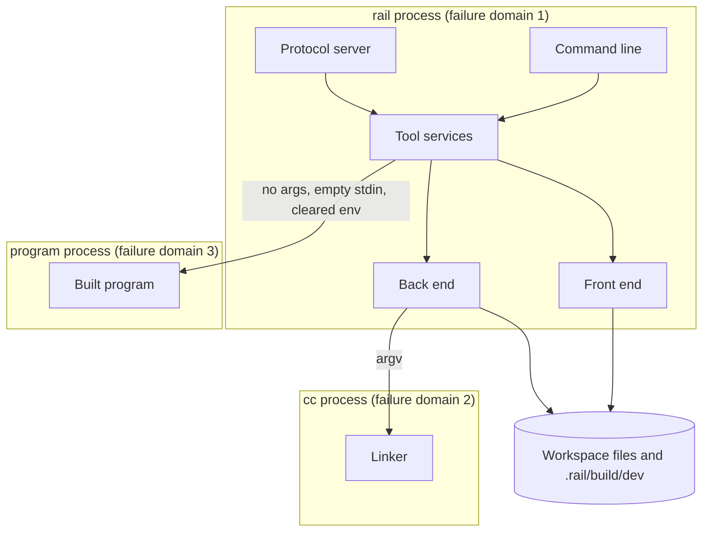

# Logical Components — walking-skeleton (U1)

A component-level view of where the skeleton's NFR patterns apply: what runs where, what can fail together, and what is shared. The skeleton has no deployed infrastructure. Its "infrastructure" is three kinds of operating-system process, the workspace file system, and CI.

## Sources

- `tech-stack-decisions.md` (workspace layout and crates), `security-design.md`, `reliability-design.md`, `performance-design.md`, `scalability-design.md` and `observability-design.md` for this unit.
- `components.md` (building blocks) and `contract-summary.md` (C1–C4, E1, E2, E7).

## Components and where NFR patterns apply

| Logical component | Crates | Runs in | NFR patterns applied |
|---|---|---|---|
| Command line | `rail` (binary) | `rail` process | Exit codes; logging switch and format; panic hook |
| Protocol server | `rail-rap`, `rail-json` | `rail` process | Framing and JSON limits; layered validation; sequential loop; protocol-only standard output |
| Tool services | `rail-tools` | `rail` process | Panic boundary; path confinement; typed ToolErrors; CLI and protocol parity |
| Front end | `rail-syntax`, `rail-check`, `rail-diag` | `rail` process | Nesting and size limits; `SKL001` for unsupported input; sorted, deterministic diagnostics |
| Back end | `rail-lower`, `rail-codegen`, `rail-build` | `rail` process | Checked arithmetic; atomic writes under `.rail/build/dev/`; `cc` started with an argument list; relative paths |
| Linker | system `cc` | `cc` child process | Started with an argument list; its failures mapped to `build.failed` |
| Built program | output of `rail-codegen` + `rail-runtime` | program child process | No capabilities; C-library allow-list; 10-second and 16 MiB limits; signals mapped to `run.failed` |
| Fuzz target | `fuzz/` | nightly CI only | 30-minute run; findings become regression tests |
| CI | GitHub Actions workflows | GitHub-hosted runners | Pinned actions, read-only permissions, security checks, coverage gate, time limits |

## Failure domains and blast radius

Text fallback: the `rail` process holds the command line, the protocol server, tool services, the front end and the back end. The linker and the built program each run in their own child process. The workspace file system is shared.

| Failure | Blast radius | Containment |
|---|---|---|
| Panic in a compiler crate | One request | Panic boundary in tool services; the session continues (`internal.error`) |
| Malformed protocol message | One message | Layered validation; the session continues |
| `cc` fails or is missing | One build | `build.failed`; no partial artifact |
| Built program crashes, loops or floods its output | One run | Separate process; time and output limits; `run.failed` |
| Stack exhaustion in the `rail` process | The whole process | Prevented by the explicit nesting limits in the parsers, not contained |
| Two `rail` processes building the same module | That module's build output | Not supported in the skeleton; the atomic rename means neither output is corrupt |

## Shared resources

| Resource | Shared by | Rule |
|---|---|---|
| Workspace source files | All `rail` processes; the user | Read-only for `rail` |
| `.rail/build/dev/` | `rail` processes in the workspace | Written only through the temporary-file-then-rename steps; listed in `.gitignore` [Q1] |
| The `rail` process's standard output | Protocol server only, in `rail rap` mode | Protocol frames only |
| Standard error | Logging, the panic hook | Log lines only; no program output |

## Handoff to later units

- U2 (acceptance harness) drives the command line and protocol server as black boxes, through the same components.
- U3 to U6 replace the thin front end and back end inside the same crates and process. The failure domains above stay the same.
- U7 and U15 add capabilities and the sandbox to the built-program domain.
