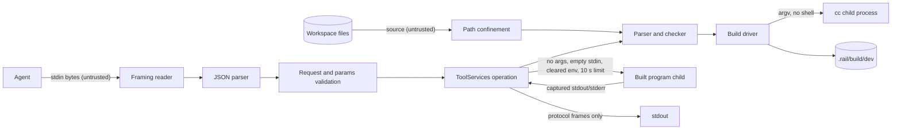

# Security Design — walking-skeleton (U1)

How the skeleton meets its security requirements (`security-requirements.md`). It is organised by trust boundary: untrusted input is checked in layers at each boundary before anything acts on it, and each layer turns a failure into a typed result.

## Sources

- `security-requirements.md`: NFR4.1–NFR4.5, NFR5.1–NFR5.6, NFR7.4, NFR7.5, NFR10.1, NFR10.2.
- `reliability-requirements.md` and `tech-stack-decisions.md` for this unit (error codes, crates, CI).
- `functional-spec.md` and `rules.md` for this unit: WF1–WF5, BR1.x, BR6.3–BR6.5.
- `contract-summary.md`: E1 (RAP framing and error codes), E2, E7.
- `nfr-design-questions.md` [Q1] (build directory `.rail/build/dev/`), [Q2] (30-minute nightly fuzz run).

## Trust boundaries and controls

Text fallback: agent bytes pass through the framing reader, the JSON parser, and request/params validation before any operation runs. Source files pass path confinement before parsing. The build driver starts `cc` with an argument list, never a shell, and writes only under `.rail/build/dev/`. A built program runs as a separate child with no arguments, empty standard input, a cleared environment and a 10-second limit. Its output is captured and returned inside results. Only protocol frames reach the server's standard output.

## Boundary 1 — protocol input (NFR4.3, NFR4.4, NFR4.5, BR6.3, BR6.4)

Each message goes through these layers, in order. The first failure ends that message's processing with the stated response. The session always continues.

| Layer | Check | Failure response |
|---|---|---|
| 1. Header | Header lines end in `\r\n`, and the header block is at most 1 KiB. `Content-Length` must be present exactly once, as decimal digits. A `Content-Type` header is accepted and ignored. Any other header is an error | `-32600` with `id: null`. The reader resynchronises by discarding bytes up to the next `\r\n\r\n` |
| 2. Size | `Content-Length` ≤ 16 MiB | `-32600` with `id: null`. The body is read and discarded in fixed 64 KiB chunks, so memory never grows with the declared length |
| 3. JSON | Strict RFC 8259 parse: UTF-8 only, no trailing data, no duplicate object keys, and nesting ≤ 64 (counted with an explicit counter on the parser's own work stack, not by recursion) | `-32700` with `id: null` |
| 4. Request shape | `jsonrpc` equals `"2.0"`, `method` is a string, and `id`, when present, is a string or an integer. A message without `id` is a notification: the skeleton handles none, so notifications (including `$/cancelRequest`) get no response, as JSON-RPC 2.0 requires | `-32600` with the request's `id` when readable, else `null` |
| 5. Method | One of `initialize`, `tree.get`, `check.run`, `build.run`, `run.run` | `-32601` |
| 6. Session state | Before `initialize`, only `initialize` is accepted. A repeated `initialize` is refused | `-32000` with ToolError `rap.not_initialized`; `-32600` for a repeated `initialize` |
| 7. Params shape | `params` is an object. Required fields are present with the right JSON type: `module` (string) for the four operations; `client_versions` (array of strings) and `workspace_root` (string) for `initialize` | `-32602` (invalid params), naming the field |
| 8. Params support | Every field is one the skeleton supports. Well-formed but unsupported fields (`depth`, `focus`, `_deadline_ms`, `target`, `mode`, or any unknown key) are refused, never ignored. `client_versions` must contain `"0.1"` | `-32000` with ToolError `rap.unsupported_param`, naming the field |

The last two rows settle when each code applies. `-32602` means the params are malformed as JSON-RPC params: missing, or the wrong type. `rap.unsupported_param` means they are well formed, but they ask for something the skeleton does not do.

**No panics.** The framing reader and the JSON parser are written so that every input path returns a value. Indexing uses checked access, and integer conversions use checked or saturating operations. The fuzz target (below) is the evidence.

## Boundary 2 — workspace files (NFR5.3, NFR4.4)

Path confinement runs before any file is read:

1. The module argument is a workspace-relative path using `/`. An empty path, an absolute path, a path with a `.` or `..` segment, a backslash or a NUL is rejected with `module.not_found`.
2. The workspace root is canonicalised once: at `initialize` for the protocol, at start-up for the command line (the current directory).
3. The joined path is canonicalised with symlinks resolved. If the result is not inside the canonical root, it is rejected with `module.not_found`.
4. The file is opened, and at most 16 MiB + 1 bytes are read. A larger file is `SKL001` at byte 16 MiB.

A file swapped between the check in step 3 and the read in step 4 is an accepted residual risk. The protocol is a local process run by the workspace owner, so there is no privilege boundary to cross.

The parser tracks expression nesting with an explicit counter. Nesting deeper than 256 levels is `SKL001` at the opening parenthesis, so no input can overflow the toolchain's stack.

## Boundary 3 — the link step (NFR5.4)

- `cc` is started through the operating system's process API with an argument list. No shell is involved anywhere, so no part of a module name or path is ever interpreted by a shell.
- The working directory is the module's build directory, and every argument is a relative path. No absolute workspace path can reach the linker or be embedded in the executable (see `reliability-design.md`, determinism).
- Arguments are a fixed list: the output name, the object file, the runtime library, and nothing taken from user input except the file names derived from the checked module path.

## Boundary 4 — running a built program (NFR5.1, NFR5.2, NFR5.5, NFR5.6)

- The program is started with no arguments, standard input connected to an empty source, a cleared environment, and standard output and standard error piped back to `rail`.
- Both pipes are read at the same time on separate threads, so a program that fills one pipe cannot deadlock the run. Captured output is capped at 16 MiB in total. Beyond that, the program is killed and the run fails with `run.failed` ("output limit exceeded").
- A wall-clock limit of 10 seconds is enforced by the run operation. When it expires, the program is killed, then waited for, and the run fails with `run.failed` ("time limit exceeded").
- The program has no capabilities (`Caps` is empty). The runtime library's C-library imports are limited to an allow-list (`write`, `exit`, and the platform's process start-up symbols). CI checks it by listing the library's undefined symbols (`nm -u`) and comparing them with a committed allow-list file.
- The program's captured output is placed inside the `run.run` result. It is never copied to `rail`'s own standard output while `rail rap` runs.

## Code-level controls (NFR4.1, NFR4.2)

- `#![forbid(unsafe_code)]` is at the top of every crate except `rail-runtime` and `rail-codegen`. A CI step checks that each other crate's root file carries it.
- In the two exempt crates, every `unsafe` block carries a `// SAFETY:` comment explaining why it is sound. `clippy::undocumented_unsafe_blocks` is denied.
- Compiled arithmetic uses Cranelift's overflow-checking forms, with branches to the runtime trap entry. That covers add, sub and mul overflow, a zero divisor, and minimum i64 divided by −1. The trap entry writes one line to standard error and exits with 70.

## Fuzzing (NFR4.5)

- The `fuzz/` directory holds one target, `json_parse`. It feeds arbitrary bytes to the JSON parser, and every input that parses successfully is written back out and parsed again. The two results must be equal.
- The seed corpus is the JSONTestSuite files kept in the repository.
- The nightly CI job runs the target for **30 minutes** on the pinned nightly toolchain [Q2]. A crash, a timeout or a round-trip mismatch fails the job and uploads the input as a CI artifact. Each finding is fixed in a pull request that adds the input as a regression test under the stable test suite.
- `fuzz/` is not a member of the main workspace, so `libfuzzer-sys` never appears in the `rail` binary's dependency tree. A CI step checks the tree to confirm this (NFR7.5).

## Supply chain and secrets (NFR7.4, NFR10.1, NFR10.2)

- `deny.toml` does the following:
  - Denies known advisories and yanked crates.
  - Allows sources from crates.io only.
  - Bans every crate outside an explicit allow-list, which holds the Cranelift family and its transitive dependencies as locked on the day they are added.
  - Allows only licences compatible with MIT OR Apache-2.0.
- CI runs `cargo deny check` on every pull request, and the advisories check also runs weekly.
- `gitleaks` runs on every pull request, alongside GitHub secret scanning. Nothing in the build, the tests or the verification needs a secret.
- Every build and test command uses `--locked`.
- Every workflow file sets `permissions: contents: read` at the top level. Every third-party action is referenced by a full commit SHA with a comment naming its version.
