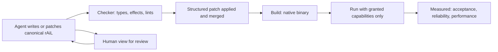

# Scope Document — rAiL Toolchain

Upstream: `ideation/intent-capture/intent-statement.md` (approved). Source tags: `[intent]` = the approved intent statement; `[Q<n>]` = confirmed answers in `scope-definition-questions.md`; `[spec]` = the rAiL language spec (`aidlc/spaces/default/knowledge/documents/rail-language-spec.md`), used only for the structure of the work it describes.

## Goal

Deliver the full rAiL 1.0 described in the spec — all six roadmap phases and all 14 acceptance suites — built by one person with AI agents, with no fixed deadline. [intent]

## Scope Boundary

### In scope

| Area | What is included | Source |
|------|------------------|--------|
| Representation (Phase 0) | Shared grammar, canonical text (`.rlc`), canonical binary (`.rlb`), human form (`.rlh`), lossless conversion, definition IDs, `defhash` / `modhash`, `fmt` / `view` / `absorb` | [intent] [spec] |
| Checker and agent loop (Phase 1) | Type and effect inference, exhaustiveness, lint framework with the `FMT TY FX DEAD UNU` families, diagnostics schema, agent protocol server (RAP), structured patches and merge, source maps | [intent] [spec] |
| Execution (Phase 2) | Core / Mono / RIR lowering, Perceus reference counting, Cranelift native backend, runtime, `std.core/col/text/fs/json`, test runner | [intent] [spec] |
| Concurrency and safety (Phase 3) | Scheduler, `std.task/par`, deterministic concurrency, capability-based access to `std.fs/net/proc/env` | [intent] [spec] [Q10] |
| Supply chain (Phase 4) | Packages, minimal version selection, lockfile, vendoring, API-diff semver, signing, and a registry server that can be run locally | [intent] |
| Performance (Phase 5) | LLVM release backend, full optimization pipeline, security and performance lint families, bounded model checking verifier | [intent] [spec] |
| Measurement | 40-program benchmark corpus written in rAiL, Rust, Go and OCaml; the `rail-perf` harness; tokenizer and generation-reliability measurements across model families | [Q11] [Q6] |
| Acceptance | All 14 suites automated; scaled-down volumes in everyday CI and the spec's full volumes as a separate release check | [intent] [Q5] |
| Spec maintenance | Each inconsistency resolved in this workflow is written back into the spec document | [intent] |

### Out of scope

| Item | Why | Source |
|------|-----|--------|
| Hosting a public package registry | Phase 4 is code only; the registry runs locally | [intent] |
| Deployment and operations steps | The confirmed plan has none | [intent] |
| Self-hosting the compiler | The spec defers it until after 1.0 | [spec] |

### May slip if needed (Should, not Must)

| Item | Acceptance suite affected | Source |
|------|---------------------------|--------|
| Wasm component target and Wasmtime host | Cold start (sandbox) target in T13 | [Q2] [Q10] |
| Execution limits and audit logging for sandboxed runs | T11 | [Q10] |

Capability enforcement (T12) stays Must. [Q10]

### Platforms

| Platform | Priority | Source |
|----------|----------|--------|
| macOS | Must | [Q3] |
| Linux | Must | [Q3] |
| Windows | Later (not must-have for this work) | [Q3] |

## First Usable Slice

The agent loop — spec Phases 0–1 — is built and usable before any later work starts: agents can write, check, lint and patch canonical rAiL through the agent protocol server. It is also the fallback if the full 1.0 takes longer than hoped. [Q1]

Exit check for the slice: acceptance suites T1, T2, T4, T5 and T6 pass at CI volumes. [Q1] [spec]

## Success Criteria

| Measure | Target | Source |
|---------|--------|--------|
| Acceptance suites | All suites for the in-scope Must items pass on macOS and Linux, at CI volumes on every build and at full volumes in the release check | [intent] [Q3] [Q5] |
| Agent reliability | rAiL (canonical form) check-pass rate at least 10 percentage points higher than Rust's on the same generation tasks and models | [Q4] [Q9] |
| Performance | §11.2 targets met against Rust, Go and OCaml | [intent] [Q11] |

## Sequencing

Where the design allows a choice, build order follows dependencies in the spec's phase order (0 → 1 → 2 → 3 → 4 → 5). [Q7]

The §11.3 canonical-encoding gate is decided only after the full toolchain exists, not at the end of Phase 1. [Q8]

## Decisions That Change the Spec

These answers differ from the spec as written; per the approved intent, the spec document is updated to match. [intent]

| Decision | Spec text affected | Source |
|----------|--------------------|--------|
| Windows is not must-have for this work | §12 "all 14 suites pass in CI on Linux, macOS and Windows"; §11.1 reference machines | [Q3] |
| Acceptance volumes are scaled in CI; full volumes run as a release check | §12 procedures | [Q5] |
| §11.3 gate decided after the full toolchain exists | Roadmap Phase 1 exit criterion "§11.3 gate decided" | [Q8] |
| Agent-reliability success target: +10 points over Rust | §11.3 (adds a cross-language target alongside the canonical-vs-human gate) | [Q9] |
| Wasm target, host and T11 limits may slip | Roadmap Phase 3 exit criterion "T7, T11, T12 pass" | [Q10] |

## Value Stream

Text fallback: agent writes or patches canonical rAiL → checker (types, effects, lints) → structured patch applied and merged → native build → run with granted capabilities only → measured against acceptance, reliability and performance targets; a human view supports review and feeds back to the agent. [intent] [spec]

## Assumptions & Open Questions

- [assumption] The spec's machine-to-human translator features beyond `view` / `absorb` (explanation levels §8.2, equivalence verification §8.5, translation-difference reports §8.6) are part of the full 1.0 even though the roadmap table does not name a phase for them; requirements analysis should confirm where they land.
- [assumption] The benchmark corpus and model measurements depend on access to at least three model vendors' tokenizers and models; cost and access are not yet confirmed.
