# Components — rAiL Toolchain

The 32 logical building blocks of the rAiL toolchain: the code we write, not infrastructure. Grouping into deployable units is decided in Units Generation. The fenced `yaml` catalogue is the source of truth; every section after it is derived from it.

Sources: `inception/requirements-analysis/requirements.md` (FR/NFR IDs), `inception/practices-discovery/team-practices.md`, the spec's prototype architecture, and the answers in `domain-design-questions.md` ([Q1]–[Q7]). Mapping from every functional requirement to its component is in `traceability.json`; decision records are in `decisions.md`.

## Catalogue

```yaml
components:
  - name: Syntax
    summary: "Shared grammar and the three encodings of the canonical tree: text, binary and human form."
    behaviour: "One grammar definition generates the canonical-text, canonical-binary and human-form parsers and printers, so round trips hold by construction. Rejects every non-canonical spelling with an FMT diagnostic and a deterministic autofix. Assigns and preserves definition IDs, resolves anchor paths, computes defhash and modhash, and produces total source maps. `view` and `absorb` are the human-form printer and parser. Also generates the grammar card and the constrained-decoding grammar from the same grammar. Pure and deterministic: no clock, no randomness except fresh ID generation, no hash-map ordering in output."
    responsibilities:
      - "Grammar definition and generated parsers/printers for .rlc, .rlb, .rlh"
      - "Unique-spelling rules (FMT001-010) with autofixes"
      - "Definition IDs, anchor paths, defhash, modhash"
      - "Source maps (.rlmap)"
      - "Grammar card and constrained-decoding grammar generation"
    depends_on: []
    dependents:
      - component: QueryEngine
        interaction: "parse and hash modules into the workspace"
      - component: TypeChecker
        interaction: "read the canonical tree and anchors"
      - component: LintEngine
        interaction: "FMT diagnostics and anchor locations"
      - component: Translator
        interaction: "render human form and compare canonical bytes and defhashes"
      - component: EditEngine
        interaction: "parse patches, address anchors and re-encode modules"
      - component: ToolServices
        interaction: "parse, format, view, absorb"
      - component: Debugger
        interaction: "anchor paths and human-form rendering"
      - component: PackageManager
        interaction: "read and write canonical manifests, lockfiles and archives"
      - component: RegistryServer
        interaction: "validate canonical binary archives"
    external_dependencies:
      - name: "BLAKE3 hashing"
        kind: other
        purpose: "defhash and modhash; implementation choice (in-house via CryptoTls primitives or an approved crate) is made in design under the dependency rule"
    entities:
      - name: Module
        identifier: qname
        attributes: [qname, items, modhash]
      - name: Definition
        identifier: defid
        attributes: [defid, kind, name, defhash]
        references:
          - entity: Module
            owned_by: Syntax
            relationship: "each Definition belongs to one Module"
      - name: SourceMap
        identifier: module_qname
        attributes: [module_qname, entries]
        references:
          - entity: Module
            owned_by: Syntax
            relationship: "one SourceMap per Module"
      - name: GrammarArtifact
        identifier: kind
        attributes: [kind, grammar_version, content]
  - name: QueryEngine
    summary: "Incremental, defhash-keyed cache and workspace model that every compiler phase runs through."
    behaviour: "Holds the in-memory workspace (modules, module import graph, package effect bounds supplied as inputs). Memoizes every phase's result keyed by defhash plus the query, so an edit re-computes only the edited definitions and their dependents. Rejects module import cycles. Deterministic evaluation order independent of hash-map iteration."
    responsibilities:
      - "Workspace model and module import graph"
      - "Incremental memoization keyed by defhash"
      - "Invalidation of dependents on edit"
    depends_on:
      - component: Syntax
        interaction: "parse and hash modules into the workspace"
        style: sync
    dependents:
      - component: TypeChecker
        interaction: "memoized per-definition checking"
      - component: Lowering
        interaction: "memoize lowered IR per definition"
      - component: ToolServices
        interaction: "workspace and incremental state"
    external_dependencies: []
    entities:
      - name: Workspace
        identifier: root
        attributes: [root, modules, effect_bounds]
        references:
          - entity: Module
            owned_by: Syntax
            relationship: "a Workspace contains many Modules"
      - name: QueryResult
        identifier: query_key
        attributes: [query_key, defhash, value_digest]
        references:
          - entity: Definition
            owned_by: Syntax
            relationship: "each QueryResult is keyed by one Definition's defhash"
  - name: TypeChecker
    summary: "Type and effect inference, trait resolution, exhaustiveness and package effect-bound enforcement."
    behaviour: "Hindley-Milner inference with top-level generalization only, row-typed effects over the 12 labels plus one row variable, single-parameter coherent traits, `?` propagation with unique From resolution, exhaustiveness and reachability. Requires signatures on exported functions. Enforces each dependency's declared effect bound against its exported signatures, using bounds provided as workspace inputs, so it never calls the package system."
    responsibilities:
      - "Type inference and checking"
      - "Effect inference and checking"
      - "Trait coherence and resolution"
      - "Exhaustiveness and reachability"
      - "Effect-bound enforcement at package boundaries"
      - "Public API extraction for semver diffs"
    depends_on:
      - component: QueryEngine
        interaction: "memoized per-definition checking"
        style: sync
      - component: Syntax
        interaction: "read the canonical tree and anchors"
        style: sync
    dependents:
      - component: Lowering
        interaction: "consume typed definitions"
      - component: LintEngine
        interaction: "tree-level rules and type/effect diagnostics"
      - component: Translator
        interaction: "types and effects for views and explanations"
      - component: ToolServices
        interaction: "types for queries"
      - component: PackageManager
        interaction: "public API extraction for semver diffs"
    external_dependencies: []
    entities:
      - name: TypedDefinition
        identifier: defhash
        attributes: [defhash, type, effect_row, resolved_traits]
        references:
          - entity: Definition
            owned_by: Syntax
            relationship: "each TypedDefinition is the checked form of one Definition"
  - name: Lowering
    summary: "Lowers checked code through Core IR, Mono IR and RIR, inserts reference counting and runs the fixed optimization pipeline."
    behaviour: "Core IR makes evidence explicit; Mono IR is monomorphized, closure-converted, lambda-lifted, with decision trees and fused iterators; RIR is SSA with explicit inc/dec/reuse/drop. Applies Perceus RC with borrow inference, reuse analysis and drop fusion, unboxes small values, marks self tail calls as jumps. Runs the eight-pass pipeline in fixed order with fixed iteration caps. RIR is serializable for the build cache. Deterministic."
    responsibilities:
      - "Core, Mono and RIR lowering"
      - "Perceus reference-count insertion and RC optimizations"
      - "Optimization pipeline (fixed order)"
      - "RIR serialization for caching"
    depends_on:
      - component: TypeChecker
        interaction: "consume typed definitions"
        style: sync
      - component: QueryEngine
        interaction: "memoize lowered IR per definition"
        style: sync
    dependents:
      - component: LintEngine
        interaction: "deep analyses over Mono IR"
      - component: Translator
        interaction: "control-flow graphs for the control-flow view"
      - component: BuildDriver
        interaction: "obtain RIR"
      - component: Verifier
        interaction: "RIR for contract-bearing functions"
    external_dependencies: []
    entities:
      - name: IrFunction
        identifier: instance_key
        attributes: [instance_key, ir_level, body_digest]
        references:
          - entity: TypedDefinition
            owned_by: TypeChecker
            relationship: "each IrFunction is one monomorphic instance of a TypedDefinition"
  - name: LintEngine
    summary: "Rule registry, overrides and the single diagnostic stream of `rail check`."
    behaviour: "Owns every rule ID (permanent, never reused) and the diagnostic schema. Runs tree-level rules on the checker's output and deep analyses (taint, uniqueness, termination, resource linearity, region escape) on lowered code, merging parse, type and lint results into one stream. Applies allow overrides (one rule, one target, reason, optional expiry; E rules never overridable; S-crit needs a signed approval). Per-function analysis budgets degrade to a W finding instead of timing out. Heuristic rules never block builds."
    responsibilities:
      - "Rule registry and diagnostic schema"
      - "Tree-level and deep lint rules"
      - "Overrides and their policy"
      - "Blocking decisions per severity and mode"
    depends_on:
      - component: TypeChecker
        interaction: "tree-level rules and type/effect diagnostics"
        style: sync
      - component: Lowering
        interaction: "deep analyses over Mono IR"
        style: sync
      - component: Syntax
        interaction: "FMT diagnostics and anchor locations"
        style: sync
    dependents:
      - component: Translator
        interaction: "findings for the findings view and reviewer packet"
      - component: ToolServices
        interaction: "check results"
      - component: BuildDriver
        interaction: "block builds on blocking findings"
    external_dependencies: []
    entities:
      - name: Rule
        identifier: rule_id
        attributes: [rule_id, family, level, autofix_kind]
      - name: Diagnostic
        identifier: diagnostic_key
        attributes: [rule_id, level, location, message, remedy, autofix, confidence, impact]
        references:
          - entity: Rule
            owned_by: LintEngine
            relationship: "each Diagnostic is raised by one Rule"
          - entity: Definition
            owned_by: Syntax
            relationship: "each Diagnostic points at one Definition anchor"
      - name: Override
        identifier: override_key
        attributes: [rule_id, target, reason, expiry]
        references:
          - entity: Rule
            owned_by: LintEngine
            relationship: "each Override names exactly one Rule"
          - entity: Definition
            owned_by: Syntax
            relationship: "each Override targets one Definition or anchor"
  - name: Translator
    summary: "Human-facing projections beyond view/absorb: explanations, derived views, semantic diff, equivalence and the reviewer packet."
    behaviour: "Generates explanation levels (concise, reviewer in Phase 1; developer, audit in Phase 5) from templates over the typed tree, so text cannot claim behaviour the code lacks; any model-written narrative is labeled non-authoritative. Produces typed, control-flow, dependency-summary and findings views. `rail diff --human` reports added, removed, renamed, moved and changed definitions with effect, capability, dependency, finding and signature deltas. `rail equiv` reports canonical, hash or tested equivalence (tested equivalence is evidence, not proof). Assembles the reviewer packet."
    responsibilities:
      - "Explanation levels"
      - "Typed, control-flow, dependency and findings views"
      - "Semantic diff"
      - "Equivalence checking"
      - "Reviewer packet assembly"
    depends_on:
      - component: Syntax
        interaction: "render human form and compare canonical bytes and defhashes"
        style: sync
      - component: TypeChecker
        interaction: "types and effects for views and explanations"
        style: sync
      - component: LintEngine
        interaction: "findings for the findings view and reviewer packet"
        style: sync
      - component: Lowering
        interaction: "control-flow graphs for the control-flow view"
        style: sync
      - component: TestRunner
        interaction: "generated-input runs for tested equivalence"
        style: sync
    dependents:
      - component: ToolServices
        interaction: "views, diffs, explanations, equivalence"
    external_dependencies: []
    entities:
      - name: Explanation
        identifier: explanation_key
        attributes: [module_qname, level, content]
        references:
          - entity: Module
            owned_by: Syntax
            relationship: "each Explanation describes one Module"
      - name: SemanticDiff
        identifier: diff_key
        attributes: [old_modhash, new_modhash, changes]
        references:
          - entity: Module
            owned_by: Syntax
            relationship: "each SemanticDiff compares two versions of one Module"
      - name: EquivalenceReport
        identifier: report_key
        attributes: [left, right, strength, evidence]
  - name: EditEngine
    summary: "Structured patches and three-way tree merge."
    behaviour: "Validates each patch operation (set, ins, add, del, ren, mov, meta) independently against the base modhash, applies the patch atomically or not at all, reports failures by operation index, and fails fast with the intervening changes when the base is stale. Three-way merge per definition: disjoint anchor paths merge; only overlapping node edits produce structured conflict items, never text markers. Renames update all references; moves fix imports."
    responsibilities:
      - "Patch validation and atomic application"
      - "Optimistic locking on base hash"
      - "Three-way merge and structured conflicts"
    depends_on:
      - component: Syntax
        interaction: "parse patches, address anchors and re-encode modules"
        style: sync
    dependents:
      - component: ToolServices
        interaction: "patch and merge"
    external_dependencies: []
    entities:
      - name: Patch
        identifier: patch_key
        attributes: [base_modhash, operations]
        references:
          - entity: Module
            owned_by: Syntax
            relationship: "each Patch targets one Module version"
      - name: MergeConflict
        identifier: conflict_key
        attributes: [defid, anchor_path, ours, theirs, base]
        references:
          - entity: Definition
            owned_by: Syntax
            relationship: "each MergeConflict sits in one Definition"
  - name: ToolServices
    summary: "The shared service layer behind every CLI command and RAP method."
    behaviour: "Implements each tool operation once (tree.get, fmt, check, patch, merge, test, bench, prof, debug, deps, audit, equiv, diff, query, verify, build, run, publish) by orchestrating the domain blocks, and returns results in one JSON schema. After a patch it returns new defhashes and the diagnostic delta for touched definitions. Records review approvals against the reviewed modhash. Orchestrates `rail verify` (rebuild through BuildDriver, compare through Trust). Starts native runs with the run manifest and, until SandboxHost exists, prints the no-sandbox warning. Answers queries (callers, callees, effect users, definitions by type)."
    responsibilities:
      - "One implementation per tool operation"
      - "Shared JSON result schema"
      - "Review approval records"
      - "Native run launch and no-sandbox warning"
      - "Query answering"
    depends_on:
      - component: Syntax
        interaction: "parse, format, view, absorb"
        style: sync
      - component: QueryEngine
        interaction: "workspace and incremental state"
        style: sync
      - component: TypeChecker
        interaction: "types for queries"
        style: sync
      - component: LintEngine
        interaction: "check results"
        style: sync
      - component: Translator
        interaction: "views, diffs, explanations, equivalence"
        style: sync
      - component: EditEngine
        interaction: "patch and merge"
        style: sync
      - component: BuildDriver
        interaction: "build and run artifacts"
        style: sync
      - component: TestRunner
        interaction: "test and bench runs"
        style: sync
      - component: Profiler
        interaction: "profiling runs"
        style: sync
      - component: Debugger
        interaction: "debug sessions"
        style: sync
      - component: Verifier
        interaction: "contract and bounded model checks"
        style: sync
      - component: PackageManager
        interaction: "dependency, publish and vendor operations"
        style: sync
      - component: Trust
        interaction: "audit, signing and verify comparison"
        style: sync
      - component: SandboxHost
        interaction: "sandboxed runs once available"
        style: sync
    dependents:
      - component: Cli
        interaction: "execute every command"
      - component: RapServer
        interaction: "execute every method"
    external_dependencies: []
    entities:
      - name: ReviewApproval
        identifier: approval_key
        attributes: [modhash, approved_at_version, reviewer]
        references:
          - entity: Module
            owned_by: Syntax
            relationship: "each ReviewApproval pins one Module version"
  - name: Cli
    summary: "The `rail` command line."
    behaviour: "Parses commands and flags, calls ToolServices, prints human-readable text by default and the RAP JSON schema with --json, and sets exit codes. Hosts `rail registry serve`. Contains no domain logic."
    responsibilities:
      - "Command parsing and dispatch"
      - "Human-readable and JSON rendering"
      - "Exit codes"
    depends_on:
      - component: ToolServices
        interaction: "execute every command"
        style: sync
      - component: RegistryServer
        interaction: "start the local registry server"
        style: sync
    dependents:
      - component: PerfHarness
        interaction: "build and run corpus programs as a black box"
      - component: ModelMeasurement
        interaction: "parse and check generated code"
      - component: AcceptanceHarness
        interaction: "black-box command runs"
    external_dependencies: []
    entities: []
  - name: RapServer
    summary: "The rAiL Agent Protocol server: JSON-RPC 2.0 over stdio with a warm incremental compiler."
    behaviour: "Reads requests from stdin and writes only protocol messages to stdout. Keeps the workspace warm across requests. One malformed or failing request returns a structured error and never ends the server. Accepts line/column positions only as a fallback and converts them to anchors."
    responsibilities:
      - "JSON-RPC 2.0 framing over stdio"
      - "Session lifecycle and warm state"
      - "Error isolation per request"
    depends_on:
      - component: ToolServices
        interaction: "execute every method"
        style: sync
    dependents:
      - component: AcceptanceHarness
        interaction: "protocol-level suites (T5, T6)"
    external_dependencies: []
    entities:
      - name: Session
        identifier: session_id
        attributes: [session_id, workspace_root, opened_modules]
  - name: BuildDriver
    summary: "Builds runnable artifacts: resolves, checks, lowers, generates code, links and caches."
    behaviour: "Refuses to build when the diagnostic stream contains blocking findings. Chooses the backend by mode (dev: Cranelift; release: LLVM; wasm: WasmBackend). Links the standard library and runtime statically. Caches compiled RIR and object code by (defhash, compiler version, target, mode). Produces byte-identical artifacts for fixed inputs (no timestamps, absolute paths, hostnames or seeds; merges parallel results in definition-ID order) and writes an unsigned provenance record for each artifact. Offline builds never touch the network."
    responsibilities:
      - "Build orchestration and mode selection"
      - "Linking with runtime and std"
      - "Artifact cache"
      - "Reproducibility"
      - "Unsigned provenance records"
    depends_on:
      - component: LintEngine
        interaction: "block builds on blocking findings"
        style: sync
      - component: Lowering
        interaction: "obtain RIR"
        style: sync
      - component: CraneliftBackend
        interaction: "dev native code"
        style: sync
      - component: LlvmBackend
        interaction: "release native code"
        style: sync
      - component: WasmBackend
        interaction: "Wasm components"
        style: sync
      - component: StandardLibrary
        interaction: "std sources and runtime libraries to link"
        style: sync
      - component: PackageManager
        interaction: "resolved and vendored dependencies"
        style: sync
    dependents:
      - component: ToolServices
        interaction: "build and run artifacts"
      - component: TestRunner
        interaction: "build test and benchmark binaries"
      - component: Profiler
        interaction: "build profiled binaries"
      - component: Debugger
        interaction: "build debuggable binaries"
    external_dependencies: []
    entities:
      - name: BuildArtifact
        identifier: content_hash
        attributes: [content_hash, target, mode, path]
      - name: ProvenanceRecord
        identifier: artifact_hash
        attributes: [artifact_hash, modhash_set, lockfile_hash, compiler_hash, target, mode, policy_digest]
        references:
          - entity: BuildArtifact
            owned_by: BuildDriver
            relationship: "each ProvenanceRecord describes one BuildArtifact"
      - name: ArtifactCacheEntry
        identifier: cache_key
        attributes: [defhash, compiler_version, target, mode, object_digest]
  - name: CraneliftBackend
    summary: "Dev-mode native code generation from RIR with Cranelift."
    behaviour: "Translates RIR to native code for x86-64 and AArch64 with guaranteed tail calls (return_call). Deterministic output."
    responsibilities:
      - "RIR to native code (dev)"
      - "Tail-call convention"
    depends_on: []
    dependents:
      - component: BuildDriver
        interaction: "dev native code"
    external_dependencies:
      - name: "Cranelift"
        kind: third-party-api
        purpose: "code generation library (approved)"
    entities: []
  - name: LlvmBackend
    summary: "Release-mode native code generation from RIR with LLVM (O2, ThinLTO, musttail)."
    behaviour: "Translates RIR to LLVM IR, runs O2 and ThinLTO across modules, guarantees tail calls with musttail. Deterministic output."
    responsibilities:
      - "RIR to native code (release)"
      - "Cross-module ThinLTO"
    depends_on: []
    dependents:
      - component: BuildDriver
        interaction: "release native code"
    external_dependencies:
      - name: "LLVM"
        kind: third-party-api
        purpose: "release optimization and code generation (approved)"
    entities: []
  - name: WasmBackend
    summary: "WebAssembly component generation from RIR. (Should - may slip.)"
    behaviour: "Emits Wasm components with 64-bit integer semantics preserved and return_call tail calls, size-optimized. Foreign libraries are unavailable except as imported components."
    responsibilities:
      - "RIR to Wasm component"
    depends_on: []
    dependents:
      - component: BuildDriver
        interaction: "Wasm components"
    external_dependencies: []
    entities: []
  - name: RuntimeCore
    summary: "Allocator, reference counting and traps, written from scratch."
    behaviour: "Size-class allocator written from scratch (mimalloc as design reference only). 8-byte object header with sticky-overflow count, non-atomic counts unless a value is marked shared, arena allocation. Trap path for abort, overflow, bounds, division by zero and stack limit; a trapped task's scope receives TaskTrap; an unhandled trap in main exits 70 with a structured trace. Exposes RC-traffic counters for profiling. Depends on nothing beyond the platform C library."
    responsibilities:
      - "Allocator and arenas"
      - "Reference counting"
      - "Traps and structured traces"
      - "Profiling counters"
    depends_on: []
    dependents:
      - component: SchedulerIo
        interaction: "allocation, shared marking and traps"
      - component: SystemInterface
        interaction: "allocation and traps"
      - component: CryptoTls
        interaction: "allocation and secret zeroing on free"
      - component: StandardLibrary
        interaction: "memory and traps"
    external_dependencies:
      - name: "Platform C library"
        kind: other
        purpose: "the only permitted runtime dependency"
    entities: []
  - name: SchedulerIo
    summary: "Tasks, work-stealing scheduler, I/O reactor and replay recording."
    behaviour: "Green-thread tasks with growable stacks on an M:N work-stealing scheduler, started lazily. Structured scopes: tasks cannot outlive their scope, a failing task cancels siblings, the scope returns the first error by spawn order. Blocking-style I/O over io_uring (Linux) and kqueue (macOS). Deterministic collection order for parallel results. Records and replays clk, rnd, net and nd outcomes."
    responsibilities:
      - "Tasks and structured scopes"
      - "Work-stealing scheduler"
      - "I/O reactor"
      - "Replay recording and playback"
    depends_on:
      - component: RuntimeCore
        interaction: "allocation, shared marking and traps"
        style: sync
      - component: SystemInterface
        interaction: "OS I/O primitives"
        style: sync
    dependents:
      - component: StandardLibrary
        interaction: "tasks, channels and I/O"
    external_dependencies: []
    entities:
      - name: Task
        identifier: task_id
        attributes: [task_id, scope_id, spawn_index, state]
      - name: ReplayLog
        identifier: run_id
        attributes: [run_id, events]
  - name: SystemInterface
    summary: "The std.sys platform layer and capability enforcement at the OS boundary."
    behaviour: "Implements the narrow set of OS operations once per platform (macOS, Linux; Windows later), normalizing paths, errors (IoErr) and time; returns typed Unsupported instead of diverging. Builds the Caps record from the run manifest; nothing else creates capabilities; scoping only narrows. Opens files relative to directory capabilities (no .. escape, symlinks resolved and checked), runs only allow-listed executables without a shell, reads only listed environment variables. Enforces execution limits and writes the hash-chained audit log when those features ship. Used identically by native runs and by SandboxHost."
    responsibilities:
      - "Per-platform OS operations"
      - "Capability construction and enforcement"
      - "Run manifest handling"
      - "Execution limits and audit log (Should)"
    depends_on:
      - component: RuntimeCore
        interaction: "allocation and traps"
        style: sync
    dependents:
      - component: SchedulerIo
        interaction: "OS I/O primitives"
      - component: StandardLibrary
        interaction: "capabilities and OS operations"
      - component: SandboxHost
        interaction: "same capability model and audit log as native runs"
    external_dependencies: []
    entities:
      - name: Capability
        identifier: capability_id
        attributes: [capability_id, kind, scope]
      - name: RunManifest
        identifier: manifest_hash
        attributes: [manifest_hash, grants, limits]
      - name: AuditLogEntry
        identifier: sequence
        attributes: [sequence, prev_hash, definition_id, operation, arguments_redacted]
        references:
          - entity: Capability
            owned_by: SystemInterface
            relationship: "each AuditLogEntry records the use of one Capability"
  - name: CryptoTls
    summary: "Cryptographic primitives and the TLS 1.3 client and server, written from scratch."
    behaviour: "Implements the primitives TLS 1.3 needs plus BLAKE3, SHA-256, HMAC and Ed25519, and the TLS 1.3 protocol as a sans-I/O state machine (the standard library supplies sockets). Secret-dependent code is constant-time. Must pass published test vectors, interoperability tests against two independent TLS implementations, constant-time checks and fuzzing of record and handshake parsers."
    responsibilities:
      - "Cryptographic primitives"
      - "TLS 1.3 protocol state machine"
      - "Certificate validation"
    depends_on:
      - component: RuntimeCore
        interaction: "allocation and secret zeroing on free"
        style: sync
    dependents:
      - component: StandardLibrary
        interaction: "hashing, TLS and secrets"
      - component: Trust
        interaction: "Ed25519 and hashing primitives"
    external_dependencies: []
    entities:
      - name: TlsSession
        identifier: session_id
        attributes: [session_id, role, state, negotiated_suite]
  - name: StandardLibrary
    summary: "The rAiL standard library modules and their runtime bindings."
    behaviour: "std.core, col, text, bin, json, hash, st, fs, net (with TLS), proc, env, time, rand, task, par, log, test, bench, ffi, written in rAiL over runtime intrinsics. External data enters as Untrusted; Secret values are never shown, logged or sent unencrypted. Resource handles are linear with scoped helpers that close on every exit path."
    responsibilities:
      - "Standard library modules in rAiL"
      - "Runtime intrinsic bindings"
      - "Untrusted and Secret types"
      - "Linear resource handles"
    depends_on:
      - component: RuntimeCore
        interaction: "memory and traps"
        style: sync
      - component: SchedulerIo
        interaction: "tasks, channels and I/O"
        style: sync
      - component: SystemInterface
        interaction: "capabilities and OS operations"
        style: sync
      - component: CryptoTls
        interaction: "hashing, TLS and secrets"
        style: sync
    dependents:
      - component: BuildDriver
        interaction: "std sources and runtime libraries to link"
      - component: FirstPartyPackages
        interaction: "networking, TLS and byte handling"
    external_dependencies: []
    entities: []
  - name: TestRunner
    summary: "`rail test` and `rail bench`: tests, property tests, contracts at runtime and benchmarks."
    behaviour: "Runs tst items, property tests with shrinking and deterministic seeds, reporting counterexamples as canonical literals; checks req/ens contracts at runtime in dev and tests; generates the par.fold associativity and Ord-law property tests. Benchmarks report median, p99, allocations and bytes with confidence intervals."
    responsibilities:
      - "Test and property-test execution"
      - "Runtime contract checks"
      - "Benchmarks"
    depends_on:
      - component: BuildDriver
        interaction: "build test and benchmark binaries"
        style: sync
    dependents:
      - component: Translator
        interaction: "generated-input runs for tested equivalence"
      - component: ToolServices
        interaction: "test and bench runs"
    external_dependencies: []
    entities:
      - name: TestResult
        identifier: result_key
        attributes: [definition_id, run_id, outcome, counterexample]
        references:
          - entity: Definition
            owned_by: Syntax
            relationship: "each TestResult belongs to one tst Definition"
      - name: BenchResult
        identifier: result_key
        attributes: [definition_id, run_id, median, p99, allocations, bytes]
        references:
          - entity: Definition
            owned_by: Syntax
            relationship: "each BenchResult belongs to one benchmark Definition"
  - name: Profiler
    summary: "`rail prof`: CPU, allocation and reference-counting profiles keyed by definition ID. (Must.)"
    behaviour: "Samples CPU, allocations and RC traffic (from RuntimeCore counters) and attributes them to definition IDs; supplies the RC-overhead measurement for the performance targets."
    responsibilities:
      - "Sampling and attribution to definitions"
      - "RC-overhead measurement"
    depends_on:
      - component: BuildDriver
        interaction: "build profiled binaries"
        style: sync
    dependents:
      - component: ToolServices
        interaction: "profiling runs"
    external_dependencies: []
    entities:
      - name: Profile
        identifier: run_id
        attributes: [run_id, samples, rc_share]
  - name: Debugger
    summary: "`rail debug`: DAP-compatible debugger with breakpoints on anchor paths. (Should - may slip.)"
    behaviour: "Maps anchor paths to machine locations through build debug info, sets breakpoints, prints values in human form."
    responsibilities:
      - "DAP session handling"
      - "Anchor-path breakpoints"
      - "Human-form value printing"
    depends_on:
      - component: BuildDriver
        interaction: "build debuggable binaries"
        style: sync
      - component: Syntax
        interaction: "anchor paths and human-form rendering"
        style: sync
    dependents:
      - component: ToolServices
        interaction: "debug sessions"
    external_dependencies: []
    entities:
      - name: Breakpoint
        identifier: breakpoint_id
        attributes: [breakpoint_id, anchor_path, enabled]
        references:
          - entity: Definition
            owned_by: Syntax
            relationship: "each Breakpoint sits in one Definition"
  - name: Verifier
    summary: "`rail verify --bmc`: bounded model checking of req/ens contracts over RIR."
    behaviour: "Encodes pure integer and ADT code from RIR into solver queries and checks contracts, reporting proofs within the bound or counterexamples."
    responsibilities:
      - "Contract encoding"
      - "Bounded model checking"
      - "Counterexample reporting"
    depends_on:
      - component: Lowering
        interaction: "RIR for contract-bearing functions"
        style: sync
    dependents:
      - component: ToolServices
        interaction: "contract and bounded model checks"
    external_dependencies:
      - name: "Bitwuzla"
        kind: third-party-api
        purpose: "SMT solver, bundled (approved)"
    entities:
      - name: ContractCheckResult
        identifier: contract_id
        attributes: [contract_id, bound, outcome, counterexample]
        references:
          - entity: Definition
            owned_by: Syntax
            relationship: "each ContractCheckResult checks one req/ens Definition"
  - name: PackageManager
    summary: "Packages, manifests, minimal version selection, lockfile, cache, vendoring and publishing."
    behaviour: "Reads rail.pkg and rail.lock (canonical text), resolves with minimal version selection, verifies archive hashes on download and every cache read, maintains the content-addressed cache, vendors packages, builds offline, supplies effect bounds to the workspace, and on publish diffs the public API and refuses under-bumped versions. Talks to the registry only over its network protocol."
    responsibilities:
      - "Manifest and lockfile"
      - "Minimal version selection"
      - "Content-addressed cache and vendoring"
      - "Publish with API-diff semver"
      - "Registry client"
    depends_on:
      - component: Syntax
        interaction: "read and write canonical manifests, lockfiles and archives"
        style: sync
      - component: TypeChecker
        interaction: "public API extraction for semver diffs"
        style: sync
      - component: Trust
        interaction: "verify package signatures and log inclusion"
        style: sync
      - component: RegistryServer
        interaction: "fetch and publish packages over the registry protocol"
        style: sync
    dependents:
      - component: ToolServices
        interaction: "dependency, publish and vendor operations"
      - component: BuildDriver
        interaction: "resolved and vendored dependencies"
    external_dependencies: []
    entities:
      - name: Package
        identifier: package_ref
        attributes: [name, version, effect_bound]
      - name: Manifest
        identifier: package_name
        attributes: [package_name, edition, dependencies, dev_dependencies, ffi_libraries]
        references:
          - entity: Package
            owned_by: PackageManager
            relationship: "each Manifest describes one Package"
      - name: LockEntry
        identifier: package_name
        attributes: [package_name, version, source, archive_hash, publisher_fingerprint, effect_bound]
        references:
          - entity: Package
            owned_by: PackageManager
            relationship: "each LockEntry pins one Package version"
      - name: CacheObject
        identifier: blake3
        attributes: [blake3, size, kind]
  - name: Trust
    summary: "Signing, provenance, transparency-log verification and `rail audit`."
    behaviour: "Signs and verifies packages and artifacts with Ed25519 (primitives from CryptoTls), verifies transparency-log inclusion proofs, signs provenance records produced by BuildDriver and compares rebuilt bytes for `rail verify`. `rail audit` checks locked packages against the advisory database and flags yanked versions, typosquat-similar names and packages younger than 72 hours; new dependencies and widened bounds raise DEP010."
    responsibilities:
      - "Package and artifact signing and verification"
      - "Transparency-log proof checking"
      - "Provenance signing and verify comparison"
      - "Advisory audit"
    depends_on:
      - component: CryptoTls
        interaction: "Ed25519 and hashing primitives"
        style: sync
      - component: RegistryServer
        interaction: "fetch transparency-log proofs and advisories"
        style: sync
    dependents:
      - component: ToolServices
        interaction: "audit, signing and verify comparison"
      - component: PackageManager
        interaction: "verify package signatures and log inclusion"
    external_dependencies: []
    entities:
      - name: Signature
        identifier: signed_hash
        attributes: [signed_hash, publisher_fingerprint, log_index]
        references:
          - entity: TransparencyLogEntry
            owned_by: RegistryServer
            relationship: "each Signature is included in one TransparencyLogEntry"
      - name: PublisherKey
        identifier: fingerprint
        attributes: [fingerprint, public_key]
      - name: AuditReport
        identifier: report_key
        attributes: [lockfile_hash, findings]
  - name: RegistryServer
    summary: "Locally runnable registry: package store, transparency log and advisory database (`rail registry serve`)."
    behaviour: "Accepts publishes of canonical binary archives, validates them, countersigns them into an append-only transparency log with inclusion proofs, serves packages, proofs and the advisory database in a documented format. Runs locally only; no public hosting."
    responsibilities:
      - "Package storage and serving"
      - "Transparency log"
      - "Advisory database serving"
    depends_on:
      - component: Syntax
        interaction: "validate canonical binary archives"
        style: sync
    dependents:
      - component: Cli
        interaction: "start the local registry server"
      - component: PackageManager
        interaction: "fetch and publish packages over the registry protocol"
      - component: Trust
        interaction: "fetch transparency-log proofs and advisories"
    external_dependencies:
      - name: "Local file system"
        kind: other
        purpose: "package, log and advisory storage"
    entities:
      - name: RegistryRelease
        identifier: release_ref
        attributes: [name, version, archive_hash, published_at, yanked]
      - name: TransparencyLogEntry
        identifier: log_index
        attributes: [log_index, leaf_hash, tree_head]
        references:
          - entity: RegistryRelease
            owned_by: RegistryServer
            relationship: "each TransparencyLogEntry records one RegistryRelease"
      - name: Advisory
        identifier: advisory_id
        attributes: [advisory_id, package_name, affected_versions, severity]
  - name: SandboxHost
    summary: "`rail run --sandbox`: embedded Wasmtime host for untrusted code. (Should - may slip.)"
    behaviour: "Runs Wasm components with only manifest-granted capabilities (through SystemInterface), fuel metering, a memory cap, a wall-clock deadline, a task cap and deterministic mode by default; caches compiled components by component hash."
    responsibilities:
      - "Wasm component execution"
      - "Resource limits"
      - "Compiled-component cache"
    depends_on:
      - component: SystemInterface
        interaction: "same capability model and audit log as native runs"
        style: sync
    dependents:
      - component: ToolServices
        interaction: "sandboxed runs once available"
    external_dependencies:
      - name: "Wasmtime"
        kind: third-party-api
        purpose: "Wasm runtime (approved)"
    entities:
      - name: SandboxRun
        identifier: run_id
        attributes: [run_id, component_hash, limits, outcome]
        references:
          - entity: RunManifest
            owned_by: SystemInterface
            relationship: "each SandboxRun follows one RunManifest"
  - name: FirstPartyPackages
    summary: "`rail/http` and `rail/zstd`, written in rAiL and published through the package system."
    behaviour: "Separately versioned packages built with the package system and published to the local registry; they use only the standard library (no FFI), so the runtime stays dependency-free."
    responsibilities:
      - "rail/http"
      - "rail/zstd"
    depends_on:
      - component: StandardLibrary
        interaction: "networking, TLS and byte handling"
        style: sync
    dependents: []
    external_dependencies: []
    entities: []
  - name: BenchmarkCorpus
    summary: "The 40 benchmark programs in rAiL, Rust, Go and OCaml (project tooling, outside the toolchain workspace)."
    behaviour: "Four classes of ten programs, each written once per language under the same prompt and reviewed for fairness; each rAiL program has a Rust twin for differential testing."
    responsibilities:
      - "Corpus programs in four languages"
      - "Fairness review records"
    depends_on: []
    dependents:
      - component: PerfHarness
        interaction: "programs to measure"
      - component: ModelMeasurement
        interaction: "programs to tokenize"
      - component: AcceptanceHarness
        interaction: "corpus inputs for T3, T4, T7, T9, T10, T13"
    external_dependencies: []
    entities:
      - name: CorpusProgram
        identifier: program_id
        attributes: [program_id, class, languages, inputs]
  - name: PerfHarness
    summary: "`rail-perf`: runs the corpus and reports performance targets (project tooling)."
    behaviour: "30 runs after 5 warm-ups, median and p95 with 95% bootstrap intervals; a target is met when the upper bound meets it; only reference-machine results count."
    responsibilities:
      - "Benchmark execution and statistics"
      - "Target evaluation"
    depends_on:
      - component: Cli
        interaction: "build and run corpus programs as a black box"
        style: sync
      - component: BenchmarkCorpus
        interaction: "programs to measure"
        style: sync
    dependents: []
    external_dependencies: []
    entities:
      - name: PerfRun
        identifier: run_key
        attributes: [machine, commit, metrics]
  - name: ModelMeasurement
    summary: "Tokenizer and generation-reliability measurements across model families (project tooling)."
    behaviour: "Tokenizes every corpus program in each form with official vendor tools, reports tokens per program, definition and patch, measures parse-valid and check-pass rates on 1,000 generation tasks per form, and records the canonical-encoding gate decision after the full toolchain exists. API keys stay out of the repository and out of saved output."
    responsibilities:
      - "Token counting"
      - "Generation reliability runs"
      - "Encoding gate evidence"
    depends_on:
      - component: Cli
        interaction: "parse and check generated code"
        style: sync
      - component: BenchmarkCorpus
        interaction: "programs to tokenize"
        style: sync
    dependents: []
    external_dependencies:
      - name: "Model vendor tokenizers and APIs"
        kind: third-party-api
        purpose: "token counts and generation tasks for at least three model families"
    entities:
      - name: TokenCount
        identifier: count_key
        attributes: [program_id, form, tokenizer, tokens]
        references:
          - entity: CorpusProgram
            owned_by: BenchmarkCorpus
            relationship: "each TokenCount measures one CorpusProgram"
      - name: GenerationTask
        identifier: task_id
        attributes: [task_id, form, model, parse_valid, check_pass]
  - name: AcceptanceHarness
    summary: "Automated T1-T14 acceptance suites at recorded CI volumes and full release volumes (project tooling)."
    behaviour: "Runs each suite with its recorded CI volume and seed policy in CI and at the spec's full volumes as the release check; drives rail through the command line and the protocol server."
    responsibilities:
      - "Suite definitions and volumes"
      - "CI and release runs"
      - "Result reporting"
    depends_on:
      - component: Cli
        interaction: "black-box command runs"
        style: sync
      - component: RapServer
        interaction: "protocol-level suites (T5, T6)"
        style: sync
      - component: BenchmarkCorpus
        interaction: "corpus inputs for T3, T4, T7, T9, T10, T13"
        style: sync
    dependents: []
    external_dependencies: []
    entities:
      - name: SuiteConfig
        identifier: suite_id
        attributes: [suite_id, ci_volume, full_volume, seed_policy]
      - name: SuiteRun
        identifier: run_key
        attributes: [suite_id, volume, platform, outcome]
        references:
          - entity: SuiteConfig
            owned_by: AcceptanceHarness
            relationship: "each SuiteRun executes one SuiteConfig"
```

## Component Diagram

The arrows point from a component to the component it calls. Runtime blocks (RuntimeCore, SchedulerIo, SystemInterface, CryptoTls) and StandardLibrary are linked into compiled rAiL programs; the compiler blocks reach them only through BuildDriver's linking step. PerfHarness, ModelMeasurement, AcceptanceHarness and BenchmarkCorpus are project tooling outside the `rail` binary.

```mermaid
graph TD
  QueryEngine -->|"parse and hash modules into the works..."| Syntax
  TypeChecker -->|"memoized per-definition checking"| QueryEngine
  TypeChecker -->|"read the canonical tree and anchors"| Syntax
  Lowering -->|"consume typed definitions"| TypeChecker
  Lowering -->|"memoize lowered IR per definition"| QueryEngine
  LintEngine -->|"tree-level rules and type/effect diag..."| TypeChecker
  LintEngine -->|"deep analyses over Mono IR"| Lowering
  LintEngine -->|"FMT diagnostics and anchor locations"| Syntax
  Translator -->|"render human form and compare canonic..."| Syntax
  Translator -->|"types and effects for views and expla..."| TypeChecker
  Translator -->|"findings for the findings view and re..."| LintEngine
  Translator -->|"control-flow graphs for the control-f..."| Lowering
  Translator -->|"generated-input runs for tested equiv..."| TestRunner
  EditEngine -->|"parse patches, address anchors and re..."| Syntax
  ToolServices -->|"parse, format, view, absorb"| Syntax
  ToolServices -->|"workspace and incremental state"| QueryEngine
  ToolServices -->|"types for queries"| TypeChecker
  ToolServices -->|"check results"| LintEngine
  ToolServices -->|"views, diffs, explanations, equivalence"| Translator
  ToolServices -->|"patch and merge"| EditEngine
  ToolServices -->|"build and run artifacts"| BuildDriver
  ToolServices -->|"test and bench runs"| TestRunner
  ToolServices -->|"profiling runs"| Profiler
  ToolServices -->|"debug sessions"| Debugger
  ToolServices -->|"contract and bounded model checks"| Verifier
  ToolServices -->|"dependency, publish and vendor operat..."| PackageManager
  ToolServices -->|"audit, signing and verify comparison"| Trust
  ToolServices -->|"sandboxed runs once available"| SandboxHost
  Cli -->|"execute every command"| ToolServices
  Cli -->|"start the local registry server"| RegistryServer
  RapServer -->|"execute every method"| ToolServices
  BuildDriver -->|"block builds on blocking findings"| LintEngine
  BuildDriver -->|"obtain RIR"| Lowering
  BuildDriver -->|"dev native code"| CraneliftBackend
  BuildDriver -->|"release native code"| LlvmBackend
  BuildDriver -->|"Wasm components"| WasmBackend
  BuildDriver -->|"std sources and runtime libraries to ..."| StandardLibrary
  BuildDriver -->|"resolved and vendored dependencies"| PackageManager
  SchedulerIo -->|"allocation, shared marking and traps"| RuntimeCore
  SchedulerIo -->|"OS I/O primitives"| SystemInterface
  SystemInterface -->|"allocation and traps"| RuntimeCore
  CryptoTls -->|"allocation and secret zeroing on free"| RuntimeCore
  StandardLibrary -->|"memory and traps"| RuntimeCore
  StandardLibrary -->|"tasks, channels and I/O"| SchedulerIo
  StandardLibrary -->|"capabilities and OS operations"| SystemInterface
  StandardLibrary -->|"hashing, TLS and secrets"| CryptoTls
  TestRunner -->|"build test and benchmark binaries"| BuildDriver
  Profiler -->|"build profiled binaries"| BuildDriver
  Debugger -->|"build debuggable binaries"| BuildDriver
  Debugger -->|"anchor paths and human-form rendering"| Syntax
  Verifier -->|"RIR for contract-bearing functions"| Lowering
  PackageManager -->|"read and write canonical manifests, l..."| Syntax
  PackageManager -->|"public API extraction for semver diffs"| TypeChecker
  PackageManager -->|"verify package signatures and log inc..."| Trust
  PackageManager -->|"fetch and publish packages over the r..."| RegistryServer
  Trust -->|"Ed25519 and hashing primitives"| CryptoTls
  Trust -->|"fetch transparency-log proofs and adv..."| RegistryServer
  RegistryServer -->|"validate canonical binary archives"| Syntax
  SandboxHost -->|"same capability model and audit log a..."| SystemInterface
  FirstPartyPackages -->|"networking, TLS and byte handling"| StandardLibrary
  PerfHarness -->|"build and run corpus programs as a bl..."| Cli
  PerfHarness -->|"programs to measure"| BenchmarkCorpus
  ModelMeasurement -->|"parse and check generated code"| Cli
  ModelMeasurement -->|"programs to tokenize"| BenchmarkCorpus
  AcceptanceHarness -->|"black-box command runs"| Cli
  AcceptanceHarness -->|"protocol-level suites (T5, T6)"| RapServer
  AcceptanceHarness -->|"corpus inputs for T3, T4, T7, T9, T10..."| BenchmarkCorpus
```



Text fallback: Syntax is the root that everything reads. QueryEngine, TypeChecker and Lowering form the compiler pipeline. LintEngine reads TypeChecker and Lowering. Translator reads Syntax, TypeChecker, LintEngine, Lowering and TestRunner. EditEngine reads Syntax. ToolServices orchestrates every tool block, and Cli and RapServer sit on top of it. BuildDriver drives the three backends and links StandardLibrary, which sits on RuntimeCore, SchedulerIo, SystemInterface and CryptoTls. PackageManager uses Trust and RegistryServer, and Trust reuses CryptoTls. SandboxHost uses SystemInterface. The project tooling drives Cli and RapServer as black boxes.

## Component Summary

| Component | Purpose | Depends On | Dependents | Entities Owned |
|---|---|---|---|---|
| Syntax | Shared grammar and the three encodings of the canonical tree: text, binary and human form. | — | QueryEngine, TypeChecker, LintEngine, Translator, EditEngine, ToolServices, Debugger, PackageManager, RegistryServer | Module, Definition, SourceMap, GrammarArtifact |
| QueryEngine | Incremental, defhash-keyed cache and workspace model that every compiler phase runs through. | Syntax | TypeChecker, Lowering, ToolServices | Workspace, QueryResult |
| TypeChecker | Type and effect inference, trait resolution, exhaustiveness and package effect-bound enforcement. | QueryEngine, Syntax | Lowering, LintEngine, Translator, ToolServices, PackageManager | TypedDefinition |
| Lowering | Lowers checked code through Core IR, Mono IR and RIR, inserts reference counting and runs the fixed optimization pipeline. | TypeChecker, QueryEngine | LintEngine, Translator, BuildDriver, Verifier | IrFunction |
| LintEngine | Rule registry, overrides and the single diagnostic stream of `rail check`. | TypeChecker, Lowering, Syntax | Translator, ToolServices, BuildDriver | Rule, Diagnostic, Override |
| Translator | Human-facing projections beyond view/absorb: explanations, derived views, semantic diff, equivalence and the reviewer packet. | Syntax, TypeChecker, LintEngine, Lowering, TestRunner | ToolServices | Explanation, SemanticDiff, EquivalenceReport |
| EditEngine | Structured patches and three-way tree merge. | Syntax | ToolServices | Patch, MergeConflict |
| ToolServices | The shared service layer behind every CLI command and RAP method. | Syntax, QueryEngine, TypeChecker, LintEngine, Translator, EditEngine, BuildDriver, TestRunner, Profiler, Debugger, Verifier, PackageManager, Trust, SandboxHost | Cli, RapServer | ReviewApproval |
| Cli | The `rail` command line. | ToolServices, RegistryServer | PerfHarness, ModelMeasurement, AcceptanceHarness | — |
| RapServer | The rAiL Agent Protocol server: JSON-RPC 2.0 over stdio with a warm incremental compiler. | ToolServices | AcceptanceHarness | Session |
| BuildDriver | Builds runnable artifacts: resolves, checks, lowers, generates code, links and caches. | LintEngine, Lowering, CraneliftBackend, LlvmBackend, WasmBackend, StandardLibrary, PackageManager | ToolServices, TestRunner, Profiler, Debugger | BuildArtifact, ProvenanceRecord, ArtifactCacheEntry |
| CraneliftBackend | Dev-mode native code generation from RIR with Cranelift. | — | BuildDriver | — |
| LlvmBackend | Release-mode native code generation from RIR with LLVM (O2, ThinLTO, musttail). | — | BuildDriver | — |
| WasmBackend | WebAssembly component generation from RIR. (Should - may slip.) | — | BuildDriver | — |
| RuntimeCore | Allocator, reference counting and traps, written from scratch. | — | SchedulerIo, SystemInterface, CryptoTls, StandardLibrary | — |
| SchedulerIo | Tasks, work-stealing scheduler, I/O reactor and replay recording. | RuntimeCore, SystemInterface | StandardLibrary | Task, ReplayLog |
| SystemInterface | The std.sys platform layer and capability enforcement at the OS boundary. | RuntimeCore | SchedulerIo, StandardLibrary, SandboxHost | Capability, RunManifest, AuditLogEntry |
| CryptoTls | Cryptographic primitives and the TLS 1.3 client and server, written from scratch. | RuntimeCore | StandardLibrary, Trust | TlsSession |
| StandardLibrary | The rAiL standard library modules and their runtime bindings. | RuntimeCore, SchedulerIo, SystemInterface, CryptoTls | BuildDriver, FirstPartyPackages | — |
| TestRunner | `rail test` and `rail bench`: tests, property tests, contracts at runtime and benchmarks. | BuildDriver | Translator, ToolServices | TestResult, BenchResult |
| Profiler | `rail prof`: CPU, allocation and reference-counting profiles keyed by definition ID. (Must.) | BuildDriver | ToolServices | Profile |
| Debugger | `rail debug`: DAP-compatible debugger with breakpoints on anchor paths. (Should - may slip.) | BuildDriver, Syntax | ToolServices | Breakpoint |
| Verifier | `rail verify --bmc`: bounded model checking of req/ens contracts over RIR. | Lowering | ToolServices | ContractCheckResult |
| PackageManager | Packages, manifests, minimal version selection, lockfile, cache, vendoring and publishing. | Syntax, TypeChecker, Trust, RegistryServer | ToolServices, BuildDriver | Package, Manifest, LockEntry, CacheObject |
| Trust | Signing, provenance, transparency-log verification and `rail audit`. | CryptoTls, RegistryServer | ToolServices, PackageManager | Signature, PublisherKey, AuditReport |
| RegistryServer | Locally runnable registry: package store, transparency log and advisory database (`rail registry serve`). | Syntax | Cli, PackageManager, Trust | RegistryRelease, TransparencyLogEntry, Advisory |
| SandboxHost | `rail run --sandbox`: embedded Wasmtime host for untrusted code. (Should - may slip.) | SystemInterface | ToolServices | SandboxRun |
| FirstPartyPackages | `rail/http` and `rail/zstd`, written in rAiL and published through the package system. | StandardLibrary | — | — |
| BenchmarkCorpus | The 40 benchmark programs in rAiL, Rust, Go and OCaml (project tooling, outside the toolchain workspace). | — | PerfHarness, ModelMeasurement, AcceptanceHarness | CorpusProgram |
| PerfHarness | `rail-perf`: runs the corpus and reports performance targets (project tooling). | Cli, BenchmarkCorpus | — | PerfRun |
| ModelMeasurement | Tokenizer and generation-reliability measurements across model families (project tooling). | Cli, BenchmarkCorpus | — | TokenCount, GenerationTask |
| AcceptanceHarness | Automated T1-T14 acceptance suites at recorded CI volumes and full release volumes (project tooling). | Cli, RapServer, BenchmarkCorpus | — | SuiteConfig, SuiteRun |

## Entity Ownership

Entities are captured at ownership and shape level only. Full schemas belong to Functional Design.

| Entity | Owning Component | Identifier | Attributes | References |
|---|---|---|---|---|
| Module | Syntax | qname | qname, items, modhash | — |
| Definition | Syntax | defid | defid, kind, name, defhash | Module (Syntax): each Definition belongs to one Module |
| SourceMap | Syntax | module_qname | module_qname, entries | Module (Syntax): one SourceMap per Module |
| GrammarArtifact | Syntax | kind | kind, grammar_version, content | — |
| Workspace | QueryEngine | root | root, modules, effect_bounds | Module (Syntax): a Workspace contains many Modules |
| QueryResult | QueryEngine | query_key | query_key, defhash, value_digest | Definition (Syntax): each QueryResult is keyed by one Definition's defhash |
| TypedDefinition | TypeChecker | defhash | defhash, type, effect_row, resolved_traits | Definition (Syntax): each TypedDefinition is the checked form of one Definition |
| IrFunction | Lowering | instance_key | instance_key, ir_level, body_digest | TypedDefinition (TypeChecker): each IrFunction is one monomorphic instance of a TypedDefinition |
| Rule | LintEngine | rule_id | rule_id, family, level, autofix_kind | — |
| Diagnostic | LintEngine | diagnostic_key | rule_id, level, location, message, remedy, autofix, confidence, impact | Rule (LintEngine): each Diagnostic is raised by one Rule; Definition (Syntax): each Diagnostic points at one Definition anchor |
| Override | LintEngine | override_key | rule_id, target, reason, expiry | Rule (LintEngine): each Override names exactly one Rule; Definition (Syntax): each Override targets one Definition or anchor |
| Explanation | Translator | explanation_key | module_qname, level, content | Module (Syntax): each Explanation describes one Module |
| SemanticDiff | Translator | diff_key | old_modhash, new_modhash, changes | Module (Syntax): each SemanticDiff compares two versions of one Module |
| EquivalenceReport | Translator | report_key | left, right, strength, evidence | — |
| Patch | EditEngine | patch_key | base_modhash, operations | Module (Syntax): each Patch targets one Module version |
| MergeConflict | EditEngine | conflict_key | defid, anchor_path, ours, theirs, base | Definition (Syntax): each MergeConflict sits in one Definition |
| ReviewApproval | ToolServices | approval_key | modhash, approved_at_version, reviewer | Module (Syntax): each ReviewApproval pins one Module version |
| Session | RapServer | session_id | session_id, workspace_root, opened_modules | — |
| BuildArtifact | BuildDriver | content_hash | content_hash, target, mode, path | — |
| ProvenanceRecord | BuildDriver | artifact_hash | artifact_hash, modhash_set, lockfile_hash, compiler_hash, target, mode, policy_digest | BuildArtifact (BuildDriver): each ProvenanceRecord describes one BuildArtifact |
| ArtifactCacheEntry | BuildDriver | cache_key | defhash, compiler_version, target, mode, object_digest | — |
| Task | SchedulerIo | task_id | task_id, scope_id, spawn_index, state | — |
| ReplayLog | SchedulerIo | run_id | run_id, events | — |
| Capability | SystemInterface | capability_id | capability_id, kind, scope | — |
| RunManifest | SystemInterface | manifest_hash | manifest_hash, grants, limits | — |
| AuditLogEntry | SystemInterface | sequence | sequence, prev_hash, definition_id, operation, arguments_redacted | Capability (SystemInterface): each AuditLogEntry records the use of one Capability |
| TlsSession | CryptoTls | session_id | session_id, role, state, negotiated_suite | — |
| TestResult | TestRunner | result_key | definition_id, run_id, outcome, counterexample | Definition (Syntax): each TestResult belongs to one tst Definition |
| BenchResult | TestRunner | result_key | definition_id, run_id, median, p99, allocations, bytes | Definition (Syntax): each BenchResult belongs to one benchmark Definition |
| Profile | Profiler | run_id | run_id, samples, rc_share | — |
| Breakpoint | Debugger | breakpoint_id | breakpoint_id, anchor_path, enabled | Definition (Syntax): each Breakpoint sits in one Definition |
| ContractCheckResult | Verifier | contract_id | contract_id, bound, outcome, counterexample | Definition (Syntax): each ContractCheckResult checks one req/ens Definition |
| Package | PackageManager | package_ref | name, version, effect_bound | — |
| Manifest | PackageManager | package_name | package_name, edition, dependencies, dev_dependencies, ffi_libraries | Package (PackageManager): each Manifest describes one Package |
| LockEntry | PackageManager | package_name | package_name, version, source, archive_hash, publisher_fingerprint, effect_bound | Package (PackageManager): each LockEntry pins one Package version |
| CacheObject | PackageManager | blake3 | blake3, size, kind | — |
| Signature | Trust | signed_hash | signed_hash, publisher_fingerprint, log_index | TransparencyLogEntry (RegistryServer): each Signature is included in one TransparencyLogEntry |
| PublisherKey | Trust | fingerprint | fingerprint, public_key | — |
| AuditReport | Trust | report_key | lockfile_hash, findings | — |
| RegistryRelease | RegistryServer | release_ref | name, version, archive_hash, published_at, yanked | — |
| TransparencyLogEntry | RegistryServer | log_index | log_index, leaf_hash, tree_head | RegistryRelease (RegistryServer): each TransparencyLogEntry records one RegistryRelease |
| Advisory | RegistryServer | advisory_id | advisory_id, package_name, affected_versions, severity | — |
| SandboxRun | SandboxHost | run_id | run_id, component_hash, limits, outcome | RunManifest (SystemInterface): each SandboxRun follows one RunManifest |
| CorpusProgram | BenchmarkCorpus | program_id | program_id, class, languages, inputs | — |
| PerfRun | PerfHarness | run_key | machine, commit, metrics | — |
| TokenCount | ModelMeasurement | count_key | program_id, form, tokenizer, tokens | CorpusProgram (BenchmarkCorpus): each TokenCount measures one CorpusProgram |
| GenerationTask | ModelMeasurement | task_id | task_id, form, model, parse_valid, check_pass | — |
| SuiteConfig | AcceptanceHarness | suite_id | suite_id, ci_volume, full_volume, seed_policy | — |
| SuiteRun | AcceptanceHarness | run_key | suite_id, volume, platform, outcome | SuiteConfig (AcceptanceHarness): each SuiteRun executes one SuiteConfig |

## External Dependencies

| Component | Dependency | Kind | Purpose |
|---|---|---|---|
| Syntax | BLAKE3 hashing | other | defhash and modhash; implementation choice (in-house via CryptoTls primitives or an approved crate) is made in design under the dependency rule |
| CraneliftBackend | Cranelift | third-party-api | code generation library (approved) |
| LlvmBackend | LLVM | third-party-api | release optimization and code generation (approved) |
| RuntimeCore | Platform C library | other | the only permitted runtime dependency |
| Verifier | Bitwuzla | third-party-api | SMT solver, bundled (approved) |
| RegistryServer | Local file system | other | package, log and advisory storage |
| SandboxHost | Wasmtime | third-party-api | Wasm runtime (approved) |
| ModelMeasurement | Model vendor tokenizers and APIs | third-party-api | token counts and generation tasks for at least three model families |

Cranelift, LLVM, Wasmtime and Bitwuzla are pre-approved (requirements Q5). Each still gets its own recorded entry, with a reason, when it is added. Any other crate, including one for BLAKE3 hashing or a binding crate for Bitwuzla, needs its own reason and the owner's approval under the dependency rule.

## Rationale

| Component | Why it is a separate building block |
|---|---|
| Syntax | Round-trip correctness (T1, T2, T4) is the foundation of every later phase and must not depend on type checking; it changes only when the language's spelling changes. |
| QueryEngine | The incremental-check target (50 ms p95) and the warm protocol server both depend on one shared cache; keeping it separate lets every phase use the same invalidation rules. |
| TypeChecker | Typing is the most complex front-end logic and changes at its own rate; lowering, linting, translation and API diffing all consume its output. |
| Lowering | The IR pipeline is shared by three backends and the deep lint analyses; separating it from the backends keeps each backend a pure RIR consumer. |
| LintEngine | One place owns the rule namespace and blocking policy, so the permanent-ID rule and one-stream guarantee hold across Phase 1 and Phase 5 rules. [Q7] |
| Translator | These outputs need types, findings and IR, while the round-trip core must not; separating them keeps Syntax dependency-free. [Q1] |
| EditEngine | The command line and the protocol server must behave identically on edits; one engine used by both keeps the front ends thin. [Q2] |
| ToolServices | Practices require thin front ends over one shared service layer; this is where cross-block orchestration lives so no front end duplicates it. |
| Cli | A thin front end with its own change rate (UX, flags) and no data of its own. [Q6] |
| RapServer | Agents' primary interface; its framing and failure isolation are distinct concerns from the command line. |
| BuildDriver | Build orchestration, caching and reproducibility change together and are shared by run, test, bench, prof, debug and verify. |
| CraneliftBackend | Each backend has its own external library and change rate; all consume RIR only. |
| LlvmBackend | Separate external library, separate phase (5), separate performance tuning. |
| WasmBackend | Portable/sandbox target with its own format and a Should priority, so it can slip without touching the native backends. |
| RuntimeCore | The memory-safety core with the strictest review bar (T10); changes rarely once correct. [Q3] |
| SchedulerIo | Concurrency and determinism logic changes with Phase 3 and is tested by T7 independently of memory management. [Q3] |
| SystemInterface | Capability safety is never traded away; one enforcement point shared by native and sandboxed runs keeps FR35 and FR36 consistent. [Q3] [Q8 of requirements] |
| CryptoTls | Highest-risk code in the project with its own verification bar; isolating it makes that bar enforceable and lets Trust reuse the primitives instead of adding crates. [Q3] |
| StandardLibrary | rAiL-language code with its own tests (T9) and release cadence; the compiler bundles it but does not own it. |
| TestRunner | Test execution is used by developers, agents, the Translator (tested equivalence) and the acceptance harness. |
| Profiler | Required for a performance target (RC overhead) and independent of the debugger, which may slip. [Q2 of requirements] |
| Debugger | Should priority; isolating it lets it slip without affecting anything else. |
| Verifier | Phase 5 capability with a heavy external dependency; kept apart from the checker's fast path. |
| PackageManager | Resolution, locking and caching change together and are the core of Phase 4; trust and hosting are separate concerns. |
| Trust | Supply-chain trust has its own threat model and review bar, and is used by both the package client and the build. |
| RegistryServer | Server-side concerns (storage, log integrity) differ from the client; the client uses it only over its protocol so it can be tested end to end. [Q4] |
| SandboxHost | Should priority and a large external dependency; isolated so it can slip, while capability rules stay in one place. |
| FirstPartyPackages | Real-world tests of the package system with their own versions and release cadence. [Q6 of requirements] |
| BenchmarkCorpus | Measurement data, not toolchain code; practices keep it outside the toolchain workspace. [Q5] |
| PerfHarness | Measurement tooling outside the shipped binary. [Q5] |
| ModelMeasurement | Evidence for the agent-reliability goal; external services and keys must stay out of the toolchain. [Q5] |
| AcceptanceHarness | Proof of the whole product, independent of any one block; outside the binary per Q5. |

### Decomposition choices and alternatives rejected

- **Syntax vs Translator [Q1].** Chosen: two blocks. Rejected: one Representation block. That would have made the round-trip core depend on the type checker and lint engine, so a type-system change could put T1, T2 and T4 at risk. See ADR-002.
- **Edit Engine [Q2].** Chosen: a separate block used by both front ends. Rejected: patching inside the protocol server. The command line would then depend on server code, and the thin-front-end practice would be broken. See ADR-003.
- **Runtime granularity [Q3].** Chosen: four blocks. Rejected: one Runtime block, and a two-block split. Both mix the highest-risk code (TLS and crypto, memory management) with code that changes more often (scheduler, platform layer), and blur which verification bar applies. See ADR-004.
- **Registry Server [Q4].** Chosen: inside `rail`, reached only over its protocol. Rejected: a separate program. That breaks the spec's single-binary rule and adds a second release artifact. See ADR-005.
- **Measurement and acceptance tooling [Q5].** Chosen: project tooling outside the binary. Rejected: shipping it in `rail`. That would grow the toolchain toward the 60 MB limit and put model-vendor access inside the product. See ADR-006.
- **CLI output [Q6].** Chosen: human text by default, `--json` with the protocol schema. Rejected: JSON by default, and JSON only. See ADR-007.
- **Lint placement [Q7].** Chosen: one Lint Engine. Rejected: splitting lints between the checker and a separate Analyzer. That creates two rule registries and a merge point for a stream that must stay single. See ADR-008.
- **Deliberate cycles.** None. Two cycles that the naive design would have had were broken on purpose. Artifact verification is orchestrated by ToolServices rather than by Trust calling BuildDriver (ADR-009). Package effect bounds reach TypeChecker as workspace inputs rather than by TypeChecker calling PackageManager (ADR-010).

## Assumptions & Open Questions

- [assumption] Build-time linking of the runtime and standard library is modelled as BuildDriver → StandardLibrary. The compiler blocks never call runtime blocks directly.
- [assumption] BLAKE3 for `defhash` and `modhash` can come from CryptoTls, which already implements BLAKE3 for the standard library. The alternative is an approved crate; the choice is made in Functional Design.
- Open question for Units Generation: which blocks become separate crates and which Units they fall into. Crate names and layout follow the Code Style practice.
- Open question for Contract Design: the registry protocol (RegistryServer ↔ PackageManager and Trust), the RAP method schemas, and the run-manifest format shared by native runs and SandboxHost.
