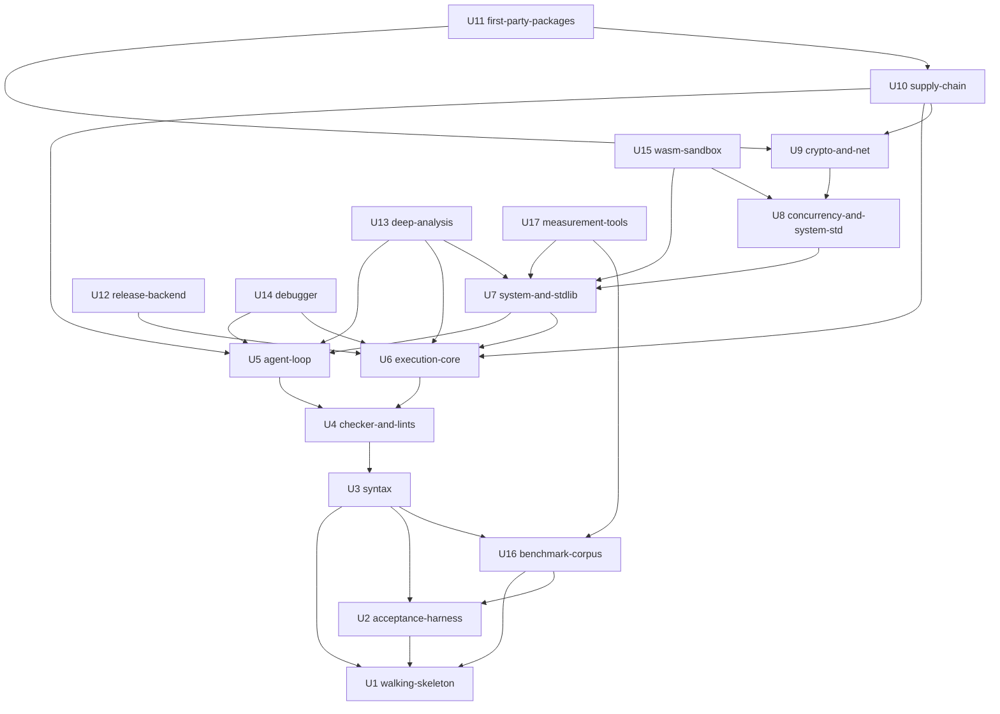

# Unit Dependencies — rAiL Toolchain

Topology only. "A depends on B" means A needs B's work to exist before A can be built and tested. Only genuine dependencies are drawn, so several build orders are valid [Q4]. Delivery Planning chooses the order and the critical path. Sources: `unit-of-work.md`, `components.md` (the component dependency graph), and ADR-001 to ADR-011.

## Dependency edges

```yaml
units:
  - name: walking-skeleton
    kind: service
    depends_on: []
  - name: acceptance-harness
    kind: library
    depends_on: [walking-skeleton]
  - name: syntax
    kind: library
    depends_on: [walking-skeleton, acceptance-harness, benchmark-corpus]
  - name: checker-and-lints
    kind: library
    depends_on: [syntax]
  - name: agent-loop
    kind: service
    depends_on: [checker-and-lints]
  - name: execution-core
    kind: library
    depends_on: [checker-and-lints]
  - name: system-and-stdlib
    kind: library
    depends_on: [agent-loop, execution-core]
  - name: concurrency-and-system-std
    kind: library
    depends_on: [system-and-stdlib]
  - name: crypto-and-net
    kind: library
    depends_on: [concurrency-and-system-std]
  - name: supply-chain
    kind: service
    depends_on: [agent-loop, execution-core, crypto-and-net]
  - name: first-party-packages
    kind: library
    depends_on: [crypto-and-net, supply-chain]
  - name: release-backend
    kind: library
    depends_on: [execution-core]
  - name: deep-analysis
    kind: library
    depends_on: [agent-loop, execution-core, system-and-stdlib]
  - name: debugger
    kind: library
    depends_on: [agent-loop, execution-core]
  - name: wasm-sandbox
    kind: service
    depends_on: [system-and-stdlib, concurrency-and-system-std]
  - name: benchmark-corpus
    kind: spec
    depends_on: [walking-skeleton, acceptance-harness]
  - name: measurement-tools
    kind: library
    depends_on: [system-and-stdlib, benchmark-corpus]
```

## Dependency diagram



Text fallback: an arrow points from a unit to what it depends on.

- U1 has no dependencies. U2 depends on U1. U16 depends on U1 and U2. U3 depends on U1, U2 and U16. U4 depends on U3.
- U5 and U6 each depend on U4. U7 depends on U5 and U6.
- U8 depends on U7. U9 depends on U8.
- U10 depends on U5, U6 and U9. U11 depends on U9 and U10.
- U12 depends on U6. U13 depends on U5, U6 and U7. U14 depends on U5 and U6. U15 depends on U7 and U8.
- U17 depends on U7 and U16.

## Why each dependency exists

| Unit | Depends on | Reason |
|---|---|---|
| acceptance-harness | walking-skeleton | Drives `rail` as a black box through the CLI and RAP entry points the skeleton creates |
| syntax | walking-skeleton | Replaces the skeleton's thin parser/printer inside the established workspace layout |
| syntax | acceptance-harness | T1, T2 and T4 are written into the harness before the code (tests first) |
| syntax | benchmark-corpus | T4 round-trips over the corpus (FR5.5). Every later unit whose suites use the corpus (T3, T7, T9, T10, T13) depends on syntax directly or indirectly, so the corpus exists before all of them |
| checker-and-lints | syntax | Checks the canonical tree, anchors and hashes |
| agent-loop | checker-and-lints | Patches return diagnostic deltas; the reviewer packet includes findings and effects |
| execution-core | checker-and-lints | Lowering consumes typed definitions; builds block on findings |
| system-and-stdlib | agent-loop | `rail test`, `rail bench` and `rail prof` are exposed through the service layer and front ends |
| system-and-stdlib | execution-core | The standard library and test binaries are compiled and linked by the build driver and runtime core |
| concurrency-and-system-std | system-and-stdlib | The scheduler and reactor use SystemInterface I/O and capabilities; `std.task/par` extend the core library |
| crypto-and-net | concurrency-and-system-std | `std.net` needs the I/O reactor; TLS runs over its sockets |
| supply-chain | agent-loop | Package, audit and verify commands extend the service layer and front ends |
| supply-chain | execution-core | Reproducible builds and provenance extend the build driver |
| supply-chain | crypto-and-net | Trust reuses the from-scratch Ed25519 and BLAKE3 primitives (ADR-004) |
| first-party-packages | crypto-and-net | `rail/http` uses `std.net` and TLS |
| first-party-packages | supply-chain | They are published to and resolved from the local registry |
| release-backend | execution-core | The LLVM backend consumes RIR; the pipeline extends lowering |
| deep-analysis | agent-loop | Translator's audit views and `equiv` extend the review translator and service layer |
| deep-analysis | execution-core | Deep lints and the verifier run on lowered code (ADR-008) |
| deep-analysis | system-and-stdlib | Tested equivalence runs through the test runner |
| debugger | agent-loop | `rail debug` is exposed through the service layer and front ends |
| debugger | execution-core | Debug builds come from the build driver |
| wasm-sandbox | system-and-stdlib | The sandbox enforces capabilities through SystemInterface (ADR-011) |
| wasm-sandbox | concurrency-and-system-std | The task cap and deterministic mode build on the scheduler |
| benchmark-corpus | walking-skeleton | The corpus layout sits beside the workspace the skeleton establishes |
| benchmark-corpus | acceptance-harness | Corpus programs are registered as suite inputs in the harness |
| measurement-tools | system-and-stdlib | `rail-perf` uses benchmarks and the profiler; programs must compile and run |
| measurement-tools | benchmark-corpus | Measures the corpus programs |

## Integration points between units

| Integration point | Provider → consumers | Form |
|---|---|---|
| Canonical tree, anchors, hashes | syntax → every compiler unit | In-process Rust API |
| Typed definitions and effect rows | checker-and-lints → agent-loop, execution-core, deep-analysis, supply-chain (API diff) | In-process Rust API |
| Diagnostic stream and schema | checker-and-lints → agent-loop, deep-analysis | In-process API; the JSON schema is shared with RAP |
| ToolServices operation set and JSON result schema | agent-loop → every unit that adds a tool; acceptance-harness and measurement-tools consume it | In-process API; CLI `--json` and RAP (JSON-RPC over stdio) |
| RIR | execution-core → release-backend, deep-analysis, wasm-sandbox | In-process API; serializable for caching |
| Runtime ABI (object header, RC ops, traps, evidence parameters) | execution-core ↔ system-and-stdlib, concurrency-and-system-std, crypto-and-net | Static linking into programs |
| Capability model and run manifest | system-and-stdlib → concurrency-and-system-std, crypto-and-net, wasm-sandbox | Runtime API; canonical-text manifest |
| Registry protocol | supply-chain (RegistryServer) → supply-chain (PackageManager, Trust), first-party-packages | Network protocol only (ADR-005) |
| Acceptance suite registration | acceptance-harness ← every unit that adds suites | Harness framework API; recorded CI volumes |

## Parallel development opportunities

Construction runs one unit at a time [state: serial]. The DAG still allows several orders, and these groups have no dependency between them.

- **After checker-and-lints:** agent-loop and execution-core are independent.
- **After execution-core:** release-backend is independent of every unit except U1–U4 and U6. It can go early or late.
- **After the acceptance harness:** benchmark-corpus needs only walking-skeleton and acceptance-harness, and it comes before syntax.
- **After agent-loop and execution-core:** debugger, deep-analysis (once system-and-stdlib exists) and system-and-stdlib are mutually independent.
- **After system-and-stdlib:** concurrency-and-system-std, deep-analysis, measurement-tools (once the corpus exists) and the later wasm-sandbox are largely independent.
- **Slip-safe:** debugger and wasm-sandbox have no dependents, so they can be postponed or dropped without blocking any other unit. [Q5]

## Walking skeleton

walking-skeleton (U1) is the first unit in every valid order: it has no dependencies, and U2 and U3 depend on it. It runs before any later unit because it carries its own thin versions of the parts it needs (see `unit-of-work.md`). It builds a native binary from a one-function module on macOS and Linux, verified end to end by one recorded command. [Q2] [FR27]

## Assumptions & Open Questions

- [assumption] Where a building block spans several units, a later unit may extend an earlier unit's code but may not change its agreed interfaces without a Contract Design update.
- Open question for Delivery Planning: how to order the independent groups above (for example, release-backend early to de-risk the performance targets, or late to follow phase order).
