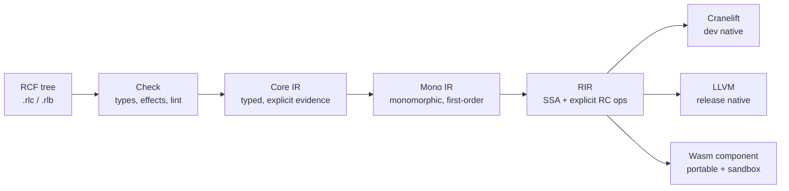
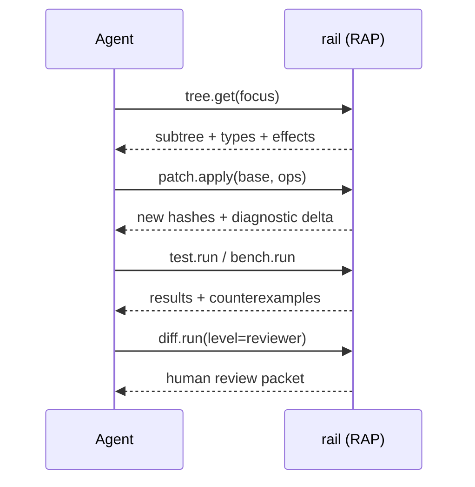
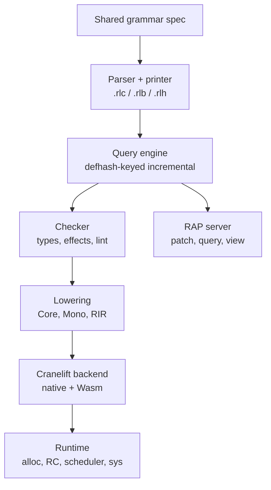

# rAiL — Language Specification for Software Agents

Sep 23, 2026 · @Kent Nickels

rAiL is a strict, statically typed, effect-tracked functional language whose source of truth is a deterministic canonical form that agents read and write, compiled ahead of time to native code or sandboxed WebAssembly. Humans work through a generated view that round-trips losslessly.

| Decision | Choice | Primary reason |
| --- | --- | --- |
| Source of truth | Canonical form (RCF): one abstract tree, two bijective encodings — text `.rlc` for models, binary `.rlb` for tools | Deterministic parsing, hashing, diffing |
| Human view | `.rlh`, generated and re-parsed by the translator | Review without a second source of truth |
| Evaluation | Strict; laziness only through explicit iterator and `Lazy` types | Predictable time and memory |
| Types | Hindley–Milner inference with row-typed effects, ADTs, traits, monomorphized generics | No runtime dispatch cost; types needed only at module boundaries |
| Memory | Precise reference counting with reuse and borrow inference (Perceus-style), plus arenas | No GC pauses; in-place update of uniquely owned data |
| Effects | Static effect rows compiled to capability evidence parameters; no resumable handlers | Explicit effects at near-zero runtime cost |
| Errors | `Result`/`Option` with `?` propagation; no exceptions; `abort` traps | Every failure path is visible in types |
| Concurrency | Structured tasks on an M:N work-stealing scheduler; immutable sharing; nondeterminism is an effect | Safe parallelism, deterministic by default |
| Backends | Cranelift (dev), LLVM (release), WebAssembly component (portable and sandbox) | Fast builds, fast binaries, one portable target |
| Linting | Part of `rail check`; errors and high-severity security findings block builds | Agents cannot skip it |
| Dependencies | Minimal version selection, BLAKE3-locked, signed, effect-bounded per package, no build scripts | Reproducible, low supply-chain risk |
| Agent edits | Structured patches addressed by stable definition IDs plus named-anchor paths | Local, mergeable, line-number-free |

No compiler exists yet. Every performance number in this document is a target to be verified by the harness in §11, not a measurement.

## 1. Design Principles

rAiL optimizes for the program an agent can emit, verify and run fastest with the fewest ways to be wrong. Every principle below is enforced by the compiler, not by convention.

### 1.1 Core principles

1. **One tree, one spelling.** Each semantic construct has exactly one canonical encoding. Equivalent spellings are rejected with an autofix, never silently accepted.
2. **The canonical form is the program.** Human text, IDE views and explanations are projections. Hashes, signatures, diffs and patches operate on the canonical form.
3. **Cost is visible.** Allocation, effects, parallelism and failure are all expressed in types or explicit calls. Nothing expensive happens implicitly (no implicit conversions, boxing, laziness or exceptions).
4. **Strict, pure, immutable by default.** Mutation, I/O and nondeterminism are opt-in effects with a static footprint.
5. **Pay only at boundaries.** Types are required on exported signatures and inferred everywhere else. Generics are monomorphized. Effects compile to plain parameters.
6. **Analysis is compilation.** Parsing, typing, effect checking and linting are one pass producing one structured diagnostic stream.
7. **No ambient authority.** Code can only touch the file system, network, processes, clock, randomness or environment through capabilities granted by its caller.
8. **Local edits stay local.** Definitions are order-independent, individually addressable and individually hashed, so an edit to one definition never renumbers or reflows another.

### 1.2 Explicit non-goals

- Hand-authoring comfort in the canonical form. Humans author in `.rlh` or not at all.
- Source compatibility with any existing language, and a C-like surface.
- Dynamic typing, runtime reflection, `eval`, macros and user-defined syntax. Each breaks static analysis or creates alternative spellings.
- Resumable algebraic effect handlers, higher-kinded types and dependent types in v1.
- A tracing garbage collector.
- Operator overloading beyond the fixed trait-backed operator set.
- Build-time code execution (build scripts, procedural macros, install hooks).

### 1.3 Design tradeoffs (decided)

| Tension | Decision | Cost accepted |
| --- | --- | --- |
| Reference counting vs tracing GC | RC with reuse and borrow inference | Cycles are impossible for immutable data; `Ref` cycles are linted and cannot escape their region |
| Laziness vs strictness | Strict | Infinite structures need explicit `Iter`/`Lazy` |
| Checked vs wrapping integers | Overflow traps in all builds; `+%` wraps explicitly | About 1–3% on arithmetic-heavy loops, recovered where range analysis proves safety |
| Monomorphization vs dictionary passing | Monomorphize | Larger binaries; bounded by tree shaking and identical-code folding |
| Readable names vs short handles in canonical text | Keep author names; compress only in binary | More characters; better model reasoning (token cost gated by §11) |
| Algebraic effect handlers vs capability passing | Capability passing | No user-defined control effects in v1 |
| Interpreter vs AOT | AOT only (Cranelift for speed of build) | No REPL until v2 |

### 1.4 Priority rules for conflicts

When goals conflict, the higher rule wins. The order differs from the brief's goal list in one place: safety and determinism rank above raw speed, because an unsafe fast program is not a correct agent output.

1. **Memory safety and capability safety.** Never traded away, including for speed. Escape hatch: `ffi` modules only.
2. **Determinism** of parsing, builds and default execution semantics.
3. **Execution efficiency** (runtime speed, then memory, then startup).
4. **Portability**: identical observable behavior across Windows, macOS and Linux; platform differences are surfaced as typed values, never as divergent semantics.
5. **Canonical compactness** (measured in model tokens, then bytes).
6. **Human readability**, which belongs to the translator and never constrains the canonical form.

### 1.5 Why this suits agents better than human-oriented languages

- **No formatting decisions.** An agent never chooses indentation, ordering, brace style or equivalent syntax, so regenerations of the same logic produce identical bytes and clean diffs.
- **Reliable parse from partial output.** Fully parenthesized prefix forms can be validated form-by-form as tokens stream, and a truncated generation fails at a precise point.
- **Edits without line numbers.** Stable IDs and anchor paths survive reformatting, reordering and concurrent edits.
- **Machine-checkable intent.** Effect rows state what a function may do; an agent or reviewer can reject a patch that widens effects without reading its body.
- **Structured diagnostics.** Every error and lint carries a rule ID, exact node location and a machine-applicable fix, so agents repair code in a closed loop instead of parsing prose.
- **Small surface.** About 20 canonical forms, 12 effects and one loop mechanism (tail recursion, with fused iterator combinators) reduce the space of plausible-but-wrong programs.

## 2. Syntax and Canonical Representation

The rAiL Canonical Form (RCF) is an abstract tree with two bijective encodings: canonical text (`.rlc`), a one-item-per-line S-expression format for models and diffs, and canonical binary (`.rlb`) for storage, transmission and the compiler. The human form (`.rlh`) is a third, generated projection.

### 2.1 The same module in all three forms

Canonical text (`.rlc`):

```
(mod geo)
(pub Pt Shape area)
(typ #k2m9qa Pt () (rec (x f64) (y f64)) (der Eq Show))
(typ #p7c1vd Shape () (sum (Circle Pt f64) (Rect Pt Pt)) (der Eq Show))
(fn #a4x0te area (s) (: (-> (Shape) f64)) (? s ((Circle _ r) (* 3.14159 (* r r))) ((Rect a b) (* (abs (- (. b x) (. a x))) (abs (- (. b y) (. a y)))))))
```

Human form (`.rlh`):

```
module geo

pub type Pt = {x: f64, y: f64} derive Eq, Show
pub type Shape = Circle(Pt, f64) | Rect(Pt, Pt) derive Eq, Show

pub area(s: Shape) -> f64 =
  match s
    Circle(_, r) -> 3.14159 * r * r
    Rect(a, b) -> abs(b.x - a.x) * abs(b.y - a.y)
```

The binary form stores the same tree as opcode bytes, LEB128 integers and a module string table (§2.5).

### 2.2 Canonical text: the complete form set

The canonical text has 18 core form heads plus three specialized items defined later (`ext` in §5.8, `req` and `ens` in §9.6), and no other keywords. Form heads are chosen to be single tokens in current BPE vocabularies; the choice is re-validated by the tokenizer harness (§11) before 1.0.

| Kind | Form | Meaning |
| --- | --- | --- |
| Module | `(mod qname)` | First line; module path |
| Module | `(use qname alias?)` | Import; alias only when the last path segment collides |
| Module | `(pub name...)` | Exported names, sorted |
| Item | `(typ #id Name (tvars) body ders?)` | Type; body is `(rec (field T)...)` or `(sum (Ctor T...)...)` |
| Item | `(trt #id Name (tvar) (sig name T)...)` | Trait (fixed method set) |
| Item | `(imp #id Trait T (fn ...)...)` | Trait implementation; one per (trait, type) pair |
| Item | `(fn #id name (params) sig? body)` | Function; `sig` = `(: T)`, required iff exported |
| Item | `(val #id name expr)` | Compile-time-evaluated pure constant |
| Item | `(tst #id name expr)` | Test; body has type `Result[unit, str]`; stripped from builds |
| Item | `(allow RULE #target "reason" date?)` | Scoped lint override (§6.5) |
| Item | `(meta #target key "value")` | Comment, doc or agent metadata; excluded from semantics |
| Expr | `(f a...)` | Application, including operators `(+ a b)` |
| Expr | `(\ (params) e)` | Lambda |
| Expr | `(let (pat e)... body)` | Sequential bindings (let\*) |
| Expr | `(? e arm...)` | Match; arm = `(pat e)` or `(pat guard e)` |
| Expr | `(. e field)` / `(upd e (field v)...)` | Field access / functional record update |
| Expr | `(! e)` | Propagate `Err`/`None` to the enclosing function |
| Expr | `(, a b...)` / `(@ a...)` / `(: e T)` | Tuple / vector literal / ascription (only where inference needs it) |

There is no `if`, no loop form and no mutation form. A Boolean conditional is `(? c (true a) (false b))`. Loops are tail calls or iterator combinators. Mutation uses `std.st` cells inside `st.run` (§3.9).

### 2.3 Formal grammar — canonical text (EBNF)

```
module   = header LF { item LF } ;
header   = "(mod " qname ")" ;
item     = use | pub | typ | trt | imp | fn | val | tst | allow | meta ;
use      = "(use " qname [ " " lname ] ")" ;
pub      = "(pub" { " " name } ")" ;
typ      = "(typ " id " " uname " (" [ tvars ] ") " tbody [ " " ders ] ")" ;
tbody    = "(rec" { " (" lname " " type ")" } ")"
         | "(sum" { " (" uname { " " type } ")" } ")" ;
ders     = "(der" { " " uname } ")" ;
trt      = "(trt " id " " uname " (" tvar ")" { " (sig " lname " " type ")" } ")" ;
imp      = "(imp " id " " uname " " type { " " fn } ")" ;
fn       = "(fn " id " " lname " (" [ params ] ")" [ " " sig ] " " expr ")" ;
sig      = "(: " type ")" ;
val      = "(val " id " " lname " " expr ")" ;
tst      = "(tst " id " " lname " " expr ")" ;
allow    = "(allow " rule " " id " " string [ " " date ] ")" ;
meta     = "(meta " id " " lname " " string ")" ;

expr     = lit | ref | "(" form ")" ;
form     = ref { " " expr }                          (* application, >= 1 arg *)
         | "\\ (" params ") " expr
         | "let" { " (" pat " " expr ")" }- " " expr
         | "? " expr { " (" pat [ " " expr ] " " expr ")" }-
         | ". " expr " " lname
         | "upd " expr { " (" lname " " expr ")" }-
         | "! " expr | ", " expr { " " expr }- | "@" { " " expr }
         | ": " expr " " type ;
pat      = "_" | lname | lit | "(" uname { " " pat } ")" | "(, " pat { " " pat }- ")" ;
type     = prim | uname | tvar | "(" uname { " " type }- ")"
         | "(, " type { " " type }- ")"
         | "(-> (" [ types ] ") " type { " " effect } ")"
         | "(=> (" constraint { " " constraint } ") " type ")" ;
effect   = "fs" | "net" | "proc" | "env" | "clk" | "rnd" | "st" | "par" | "nd" | "div" | "log" | "ffi" | tvar ;
ref      = lname | alias "." lname | uname | op ;
id       = "#" 6 * base32 ;               (* Crockford base32, lowercase *)
lname    = lower { lower | digit | "_" } ;  uname = upper { alnum } ;
tvar     = lower ;                         (* single letter *)
lit      = int | float | string | char | "true" | "false" | "()" ;
int      = [ "-" ] digits [ isuffix ] ;    (* isuffix: i8..u64; none = i64 *)
float    = shortest-roundtrip decimal [ "f32" ] ; (* none = f64 *)
```

### 2.4 Formal grammar — human form (EBNF, layout-sensitive)

```
module   = "module " qname NL { use NL } { NL decl } ;
decl     = [ doc ] ( typedecl | fndecl | valdecl | testdecl | allowdecl ) ;
typedecl = [ "pub " ] "type " Name [ "[" tvars "]" ] " = " ( record | variants ) [ " derive " names ] ;
fndecl   = [ "pub " ] name "(" [ params ] ")" [ " -> " type [ " ! " effects ] ] " =" body ;
body     = " " expr | INDENT block DEDENT ;
block    = { pat " = " expr NL } expr ;
expr     = match | ifexpr | lambda | pipeline | binop ;
match    = "match " expr INDENT { pat [ " if " expr ] " -> " body NL } DEDENT ;
ifexpr   = "if " expr " then " expr " else " expr ;
lambda   = "\\" params " -> " body ;
pipeline = expr { " |> " call }- ;        (* rendering rule, see 2.7 *)
binop    = unary { OP unary } ;           (* fixed precedence table, 2.7 *)
postfix  = atom { "(" args ")" | "." name | "?" | " with {" updates "}" } ;
```

Indentation is exactly two spaces per level. `INDENT` and `DEDENT` are produced by the lexer; tabs are a lexical error.

### 2.5 Deterministic formatting and serialization

**Canonical text.** UTF-8, NFC-normalized, LF line endings, final LF, no BOM. Exactly one space between sibling tokens, none inside parentheses. One top-level item per line. Items appear in the order `mod, use, pub, typ, trt, imp, val, fn, tst, allow, meta`; within a kind they are sorted by name (then by target ID for `allow` and `meta`). Definitions are mutually visible, so order carries no meaning and is never an agent decision.

**Literals.** Integers are decimal without leading zeros or `+`. Floats use the shortest round-trip representation (Ryū algorithm), always with a `.` or exponent. Strings use only the escapes `\" \\ \n \t \u{hex}`; every other code point is literal.

**Canonical binary.** `magic "RAIL" | u16 format version | u32 section count | sections`. Sections, in fixed order: string table (sorted, length-prefixed), type table, definition table (ID, name index, BLAKE3 content hash, offset), code (pre-order node stream: 1-byte opcode, LEB128 operands, string-table indices for names), metadata. Text and binary convert in both directions with no information loss; `rail fmt --check` verifies both.

### 2.6 Identifiers, IDs and symbol tables

- **Names** are the author's names in both text forms. Agent reasoning depends on semantic names; the binary form deduplicates them through its string table. Names are capped at 32 bytes; `Pascal` for types, traits and constructors, `snake` for everything else.
- **Definition IDs** (`#k2m9qa`): 30 random bits in Crockford base32, assigned on creation, never reused within a module and preserved across renames and moves. They are the primary edit and source-map anchor.
- **Anchor paths** address nodes inside a definition: `#a4x0te/r` is the binding `r`; `#a4x0te/1.0` is child 0 of match arm 1. Binding names are unique within a definition (shadowing is an error), so name anchors are stable under unrelated edits.
- **Content hashes.** Each definition has `defhash = BLAKE3(binary tree with local names replaced by de Bruijn indices; IDs and meta excluded)`. It keys incremental compilation and the build cache. `modhash` hashes the sorted definition table including names.
- **Imports** are always qualified through one alias per module: the last path segment, or an explicit alias only when that collides.

### 2.7 Rules eliminating ambiguity and equivalent spellings

Each rule is a parse-time error with a deterministic autofix (lint family `FMT`).

1. One form per construct: no `if`, loop or mutation syntax in canonical text; Booleans are matched with arms ordered `true`, `false`.
2. Nested `let` whose body is a `let` must be merged; empty `let` is invalid.
3. Shadowing is forbidden; unused bindings and parameters are errors (use `_`).
4. Eta-redundant lambdas `(\ (x) (f x))` must be written `f`.
5. Type ascription is allowed only where inference is ambiguous; redundant ascription is removed.
6. No type aliases; distinct names require a single-constructor `sum` (zero-cost newtype).
7. Match arms must be reachable; a wildcard arm must be last.
8. Human operators have one fixed precedence table (`|>` < `or` < `and` < comparisons (non-associative) < `+ -` < `* / %` < unary < postfix); redundant parentheses are rejected.
9. Pipelines are a rendering rule, not a node: the translator renders an application chain of depth three or more whose data argument is always first as `x |> f |> g`. The parser accepts `|>` only in that exact position.
10. Record construction is positional in canonical text and uses declared field order in human text.

### 2.8 Whitespace

Whitespace is not significant in canonical text beyond the exact single-space and one-item-per-line rules, which are validated rather than interpreted. Indentation is significant in human text, where layout replaces block delimiters.

### 2.9 Comments, annotations and agent metadata

All non-semantic data lives in `(meta #target key "value")` items, where `key` is one of `doc`, `note`, `agent`, `review`, `todo` or `x_<name>`. Metadata is excluded from `defhash`, never influences compilation, and survives edits because it targets IDs rather than positions. In human form, `doc` and `note` render as `--` comments directly above their anchor; `agent` and `review` render only in reviewer and audit views.

### 2.10 Lossless conversion rules

1. **Canonical → human → canonical** is byte-identical for every valid module (tested in §12).
2. **Human → canonical** is defined only for formatter-canonical human text. Anything else is rejected with an `FMT` diagnostic and its autofix; there is no lenient parse.
3. Definition IDs appear in human text as trailing `--#k2m9qa` markers only when the translator runs with `--ids` (the default for editable output). Edited human text without markers is matched to existing definitions by name; unmatched definitions receive new IDs.
4. Human-side comments not attached to a definition or binding are rejected, because they would have no anchor.

## 3. Type and Functional Programming Model

rAiL uses Hindley–Milner inference extended with effect rows and single-parameter traits, strict evaluation, and reference counting with reuse. Every choice below favors predictable machine code over expressive power.

### 3.1 Static types and inference

- Algorithm: HM with let-generalization restricted to top-level definitions (local bindings are monomorphic, which keeps inference linear in practice and error messages local).
- Signatures are required on exported functions and trait methods, and inferred everywhere else. This makes separate compilation and API diffing possible without whole-program inference.
- Primitive types: `i8 i16 i32 i64 u8 u16 u32 u64 f32 f64 bool char str bytes unit`. There are no implicit numeric conversions; `i64.of_i32` and friends are explicit and total, `i32.try_of_i64` returns `Option`.
- Integer overflow traps. Wrapping arithmetic is spelled `+% -% *%`. Division by zero traps. Float operations follow IEEE 754 with no fast-math reordering, so results are bit-identical across platforms.

### 3.2 Immutability

All values are immutable. Records, sums, tuples, `Vec`, `Map` and `Set` are persistent. When the compiler proves a value is uniquely referenced, functional updates execute in place (§3.12), so `vec.set(v, i, x)` on a unique vector costs one store.

### 3.3 Purity and effects

Functions are pure unless their inferred effect row says otherwise. Effect rows are sets of labels from a closed list plus effect variables for higher-order polymorphism:

| Effect | Grants | Capability type |
| --- | --- | --- |
| `fs` | File system access within granted roots | `Fs` |
| `net` | Sockets and DNS within granted hosts and ports | `Net` |
| `proc` | Spawning processes from an allowlist | `Proc` |
| `env` | Reading named environment variables | `Env` |
| `clk` | Wall and monotonic clocks | `Clock` |
| `rnd` | Randomness (seedable) | `Rand` |
| `log` | Structured log output | `Log` |
| `st` | Local mutable cells inside `st.run` | none (discharged locally) |
| `par` | Spawning parallel tasks | `Sched` |
| `nd` | Observable nondeterminism (racing, `select`) | none |
| `div` | Possible non-termination | none |
| `ffi` | Foreign calls | `Ffi` |

A function type is written `(-> (A B) R fs log e)` in canonical text and `(A, B) -> R ! fs, log, e` in human text. Effect rows are inferred and generalized; `map` has type `(-> ((Vec a) (-> (a) b e)) (Vec b) e)`, so it is pure when its argument is pure.

### 3.4 First-class functions, composition and pipelines

Functions are values; closures capture by value (captured values are immutable, so this is free of aliasing hazards). Composition is the library function `fn.cmp(f, g)` (human `f >> g`). Pipelines are rendered, not stored (§2.7 rule 9). Partial application is not implicit; use a lambda.

### 3.5 Algebraic data types

Product types are records (`rec`) and tuples; sum types are `sum` with positional constructor fields. Recursive types are allowed and always boxed at the recursion point. Deriving is limited to `Eq Ord Hash Show Json` and generates ordinary code visible in the audit view.

### 3.6 Pattern matching

Matches must be exhaustive and every arm reachable (both are errors). Patterns: wildcard, binding, literal, constructor, tuple. Guards are Boolean expressions. Matches compile to decision trees (Maranget's algorithm), and dense integer or tag switches compile to jump tables.

### 3.7 Generics and traits

Parametric polymorphism over types and effects. Traits have one type parameter and a fixed method set; coherence requires each implementation to live in the module of the trait or of the type, with no overlapping or blanket implementations. All generic code is monomorphized; identical machine code is folded after lowering. Built-in traits back the operators: `Eq`, `Ord`, `Hash`, `Num`, `Show`, `Json`.

### 3.8 Explicit effects at runtime

Effects compile in one of three ways. **Resource effects** (`fs`, `net`, `proc`, `env`, `ffi`) require an explicit capability value argument (`Dir`, `Net`, `Proc`, `Env`, `Ffi`) because they carry scope: which directory, host, command or variable. **Service effects** (`clk`, `rnd`, `log`, `par`) compile to hidden evidence parameters passed in registers, installed by the runtime for `main` or by the sandbox host, and replaceable in tests (`test.with_clock`, `test.with_seed`). **Static effects** (`st`, `nd`, `div`) have no runtime representation. There is no handler stack and no continuation capture, so an effectful call costs the same as a normal call with at most a few extra arguments; pure functions receive none.

### 3.9 Controlled mutable state

Local mutation uses `std.st`: `st.run(\ -> ...)` creates a region; `st.cell`, `st.get`, `st.set` and `st.array` operate inside it with effect `st`. The region's type parameter prevents cells from escaping (the `runST` technique), so `st.run` is pure from the outside. Shared mutable state across tasks exists only as `task.Chan` and `task.Atom` (atomic cell, `par` effect), never as unrestricted references.

### 3.10 Tail calls

All calls in tail position, including mutual and indirect calls, are guaranteed not to grow the stack. Self-tail-calls compile to jumps; other tail calls use the backend's guaranteed tail-call convention (`tail` calling convention in LLVM, `return_call` in Cranelift and WebAssembly). Non-tail recursion depth is bounded by the task's stack limit and linted (§6).

### 3.11 Lazy versus eager evaluation

Evaluation is strict, with left-to-right argument order. Laziness is explicit: `Iter[a, e]` is a pull-based stream whose combinator chains (`map`, `filter`, `fold`, `zip`, `take`) are fused into a single loop at compile time; `Lazy[a]` is a memoized thunk. Short-circuit `and`/`or` are the only built-in non-strict operators.

### 3.12 Memory management

rAiL uses precise, compiler-inserted reference counting in the Perceus style with four optimizations, all applied at the typed-IR level:

1. **Borrow inference.** Parameters that are only read are passed borrowed, eliminating increment/decrement pairs.
2. **Reuse analysis.** A destructured cell of the same size is reused for the constructed result when unique (functional-but-in-place).
3. **Drop specialization and fusion** of RC operations along each path.
4. **Unboxed values.** Records and tuples of up to 32 bytes with no recursive fields, and all primitives, are stored inline and never counted.

Counts are non-atomic by default. A value is marked shared (atomic counts) only when it crosses a task boundary, which the compiler detects at `task.spawn` and channel sends. Immutable data cannot form cycles; cycles through `st` cells die with their region. `st.arena` provides bump allocation for bulk temporaries, freed in one step. The result is deterministic deallocation, no pauses and no collector tuning.

## 4. Execution Model

rAiL is compiled ahead of time through three IRs to native code (Cranelift for development, LLVM for release) or to a WebAssembly component that is the portable and sandboxed target. There is no interpreter and no language-level JIT in v1.

### 4.1 Architecture and IRs



The three IRs each have one job. **Core IR** is the checked tree with inferred types, resolved traits and effect evidence made explicit. **Mono IR** is monomorphized, closure-converted and lambda-lifted, with decision trees for matches and fused iterator loops. **RIR** is an SSA control-flow graph with explicit `inc`, `dec`, `reuse` and `drop` operations, unboxed layouts and tail-call markers; it is the input to all backends and is itself serializable for caching.

### 4.2 Compilation modes

| Mode | Backend | Use | Optimization |
| --- | --- | --- | --- |
| `dev` | Cranelift | Agent edit-check-run loops, tests | RC optimizations, fusion, inlining of small functions |
| `release` | LLVM (O2, ThinLTO across modules) | Production binaries | Full pipeline, PGO optional |
| `wasm` | Cranelift-generated Wasm component | Portable distribution, untrusted code | Same as `dev` plus size optimization |

JIT compilation exists only inside the Wasm host: the embedded Wasmtime runtime compiles components with Cranelift on first load and caches the machine code by component hash. This gives a single portable artifact without a second language-level execution engine.

### 4.3 Startup strategy

- `val` items are evaluated at compile time and emitted as read-only data; there are no static initializers.
- The runtime is a static library of about 150 KB: allocator (mimalloc-derived size classes), scheduler, I/O reactor and panic path. The scheduler and reactor start lazily on the first `par` or I/O call.
- Binaries are statically linked (except the platform C library on macOS and Windows system DLLs), so startup performs no dynamic symbol resolution beyond the OS minimum.

### 4.4 Memory layout

- **Boxed values** carry an 8-byte header: 32-bit reference count (with a sticky-overflow bit), 16-bit constructor tag, 8-bit field-scan info, 8-bit flags (shared, static, arena).
- **Unboxed values** (primitives, and records or tuples of 32 bytes or less without recursive fields) are laid out C-style with fields reordered by descending alignment; field order is deterministic, so layout is identical on every 64-bit target.
- **Sums** use niche optimization: `Option[Box]` is a nullable pointer; all-nullary sums are a `u8`/`u16` tag; small payload sums are unboxed when every variant fits in 32 bytes.
- **`str`** is UTF-8 with 23-byte inline small-string storage. **`Vec`** is contiguous with a length and capacity and falls back to an RRB tree above 64 K elements for persistent updates. **`Map`/`Set`** are HAMTs with insertion-order-independent iteration by hash, seeded with a fixed per-build seed.
- Only 64-bit targets are supported in v1 (x86-64, AArch64, wasm32 with 64-bit integer semantics preserved in the language).

### 4.5 Function-call model

Direct calls to monomorphic functions use an internal register convention with guaranteed tail calls; effect evidence occupies the first argument registers. Closures are a pair (code pointer, environment pointer), and calls to known closures are devirtualized. Borrowed parameters are passed without RC traffic. The C ABI is used only at `ffi` boundaries and for `main`.

### 4.6 Optimization pipeline (fixed order)

1. Inlining of functions under 40 IR nodes and single-call-site functions.
2. Iterator fusion and deforestation of `map`/`filter`/`fold` chains.
3. Case-of-case, case-of-known-constructor and constant folding.
4. Monomorphization and identical-code folding.
5. Unboxing and worker/wrapper splitting of strict arguments.
6. Borrow inference, reuse analysis, RC fusion and drop specialization.
7. Overflow-check elimination via range analysis.
8. Backend optimization (Cranelift egraph passes, or LLVM O2 + ThinLTO).

The pipeline is deterministic: passes iterate to fixed points with fixed iteration caps, and no pass depends on hash-map iteration order or wall-clock time.

### 4.7 Parallel and asynchronous execution

- **Tasks** are green threads with growable stacks (8 KB initial, 1 MB default cap) on an M:N work-stealing scheduler with one worker per core.
- **Structured concurrency only.** `task.scope(\ s -> ...)` creates a nursery; tasks spawned in it cannot outlive it; a failing task cancels its siblings and the scope returns the first error by spawn order.
- **I/O** is blocking-style at the language level and non-blocking underneath (io\_uring on Linux, kqueue on macOS, IOCP on Windows). There is no `async`/`await` and therefore no function coloring.
- **Data parallelism**: `par.map`, `par.fold` (requires an associative combine, verified by property tests in `rail test`) and `par.chunks` split work deterministically by index.

### 4.8 Deterministic concurrency

Programs without the `nd` effect produce the same observable output on every run and core count. The rules that make this hold: parallel results are always collected in index or spawn order; channels are single-producer or ordered by spawn index unless created with `chan.racy` (effect `nd`); `select`, timeouts and `task.race` carry `nd`; `Map` iteration order depends only on content. A deterministic replay mode (`rail run --replay`) records `clk`, `rnd`, `net` and `nd` outcomes and replays them exactly.

### 4.9 Cross-platform system interface

All OS access goes through `std.sys`, a narrow internal interface of 64 operations implemented once per platform. The standard library normalizes behavior rather than exposing differences: paths are `Path` values with `/` separators and explicit `path.to_native`; text files are bytes (no newline translation); file names are case-preserving and compared by exact bytes; errors map to one portable `IoErr` sum; time is UTC nanoseconds. Where behavior genuinely differs (symlink support, file locking semantics), the API returns a typed `Unsupported` error rather than diverging silently.

### 4.10 Sandboxed execution of untrusted code

Agent-generated code runs by default through `rail run --sandbox`, which compiles to a Wasm component and executes it in the embedded Wasmtime host with:

- No ambient authority: the host constructs only the capabilities in the run manifest (for example `fs: ro:/data`, `net: api.example.com:443`).
- Fuel metering (instruction budget), a linear-memory cap, a wall-clock deadline and a cap on concurrent tasks.
- Deterministic mode on by default: `clk` and `rnd` are virtualized unless granted.
- An audit log of every capability use (§7.9).

Native execution is reserved for code that passed review and signing; it enforces the same capability model in-process but without hardware isolation.

### 4.11 Why this favors execution over compactness

The canonical form is compact, but no runtime decision is made to save source tokens. Strictness, monomorphization, unboxing, compile-time constant evaluation, guaranteed tail calls and in-place reuse all make programs larger or compilation slower in exchange for predictable, fast machine code. Compactness is pursued only where it is free: in the encoding of the tree, not in the semantics of the program.

## 5. Dependencies and Standard Library

The toolchain is one self-contained binary with a small standard library; third-party packages are content-addressed, signed, locked, effect-bounded and cannot execute code at build time.

### 5.1 Minimal standard library

| Module | Contents | Effects |
| --- | --- | --- |
| `std.core` | Primitives, `Option`, `Result`, tuples, core traits, `abort` | none |
| `std.col` | `Vec`, `Map`, `Set`, `Deque`, `Iter` and combinators | none |
| `std.text` | `str`, `char`, UTF-8, formatting, parsing numbers, `Regex` (linear-time, RE2 semantics) | none |
| `std.bin` | `bytes`, endian codecs, base64, hex | none |
| `std.json` | Streaming parser, `Json` value, derive support | none |
| `std.hash` | SipHash (tables), BLAKE3, SHA-256, HMAC | none |
| `std.st` | Local cells, arrays, arenas | `st` |
| `std.fs` | Files, directories, `Path`, atomic write | `fs` |
| `std.net` | TCP, UDP, DNS, TLS 1.3 client/server (bundled rustls-derived implementation in the runtime) | `net` |
| `std.proc`, `std.env` | Process spawn with argument vectors; named env reads | `proc`, `env` |
| `std.time`, `std.rand` | Clocks, durations, UTC; seedable PRNG and OS entropy | `clk`, `rnd` |
| `std.task`, `std.par` | Scopes, spawn, channels, atoms; data-parallel ops | `par`, `nd` |
| `std.log`, `std.test`, `std.bench` | Structured logs; assertions and property testing; benchmarks | `log`, none |
| `std.ffi` | C types and pointers for foreign modules | `ffi` |

HTTP, compression, databases and serialization formats other than JSON are first-party packages (`rail/http`, `rail/zstd`, …), versioned independently so the core stays small.

### 5.2 Modules and packages

A module is one `.rlc` file; its path is its name (`src/geo/stats.rlc` is `geo.stats`). A package is a directory with a manifest `rail.pkg` and a lockfile `rail.lock`, both in canonical text. Module dependency cycles are errors; definitions within a module may be mutually recursive.

### 5.3 Dependency declaration

```
(pkg acme/ingest 0.4.0)
(edition 2027)
(dep rail/http 1.2 (fx net))
(dep acme/csv 0.9 (fx))
(dev rail/bench 1.0 (fx clk))
(ffi zlib "libz.a" 1.3.1 blake3:5c1f…)
```

Each `dep` names the package, a minimum version and an effect bound `(fx ...)`. The compiler rejects the build if any exported function of that dependency has an effect row outside the bound, so a CSV parser declared `(fx)` provably cannot touch the network or disk. `dev` dependencies are available only to tests and benchmarks.

### 5.4 Lockfile and versioning

- **Resolution** is minimal version selection: the selected version of each package is the maximum of the minimums requested. It is deterministic, needs no solver and never picks a version nobody asked for.
- **`rail.lock`** records, per package: exact version, source (registry URL or path), BLAKE3 hash of the canonical binary package archive, publisher key fingerprint and the resolved effect bound. Lockfile entries are sorted; the lockfile is canonical text and diffs cleanly.
- **Semantic versioning is enforced.** `rail publish` diffs the public API (exported names, signatures, effect rows, type definitions) against the previous release and refuses a release whose version bump is smaller than the change requires. Widening an exported effect row is a breaking change.

### 5.5 Integrity, caching and offline builds

- Packages are published as canonical binary archives, never as arbitrary file trees. Hash verification happens on download and again on every cache read.
- The global cache is content-addressed (`~/.rail/cas/<blake3>`) and shared across projects; compiled RIR and object code are cached by `(defhash, compiler version, target, mode)`.
- `rail vendor` copies all locked packages into `vendor/`; `rail build --offline` never touches the network and fails if anything is missing. CI builds are required to be offline-capable.

### 5.6 Isolation

Dependencies are isolated by construction: no global mutable state exists, capabilities are only received from callers, and effect bounds are checked at every package boundary. Two major versions of the same package may coexist under distinct names; minor versions are unified by MVS.

### 5.7 Tree shaking and dead-code elimination

Compilation starts from `main` (or exported entry points for libraries) and includes only reachable definitions after monomorphization. Unused dependencies are lint errors (`DEP002`). Because there are no reflection, dynamic loading or initializer side effects, reachability is exact.

### 5.8 Foreign-function interface

Foreign code is reachable only from modules marked `(ffi-module)`, which may declare `(ext #id name "symbol" (: T))` items using C-compatible types from `std.ffi`. Every such function carries effect `ffi`, which propagates to callers until a wrapper in the same package discharges it with a reviewed `(allow SEC101 ...)` override stating the safety argument. Foreign libraries must be listed in the manifest with version and hash, are statically linked, and are unavailable on the `wasm` target except as imported Wasm components.

### 5.9 Supply-chain rules

1. No build scripts, procedural macros, install hooks or network access during builds.
2. Every registry package is signed (Ed25519) by its publisher and countersigned by the registry transparency log; `rail` verifies both.
3. New dependencies and effect-bound widenings raise `DEP` agent-review findings that require explicit approval in the lockfile diff.
4. `rail audit` checks locked packages against the advisory database and flags yanked versions, typosquat-similar names and packages published less than 72 hours ago.
5. Default policy caps total transitive dependencies at 50 for applications; exceeding it is a warning with a count.

## 6. Built-In Linting and Static Analysis

Linting is a phase of `rail check`, which every build runs; there is no way to compile without it. All diagnostics — parse errors, type errors and lints — share one schema and one rule namespace.

### 6.1 Severity levels

| Level | Code | Meaning | Blocks build |
| --- | --- | --- | --- |
| Error | `E` | Program is invalid or certainly wrong | Always; not overridable |
| Security finding | `S` | Capability, injection, secret or supply-chain risk; graded `low/med/high/crit` | `high` and `crit` block unless overridden |
| Warning | `W` | Probably wrong or fragile | In `release` and `--strict` (the agent default) unless overridden |
| Optimization opportunity | `O` | Correct but measurably slower or larger than necessary | Never |
| Agent-review finding | `A` | Legal code a reviewer should confirm (effect widening, new dependency, generated-code anomaly) | Blocks `rail approve` gates, not compilation |

### 6.2 Rule catalog (v1 core set)

| Rule | Detects | Level | Autofix |
| --- | --- | --- | --- |
| `FMT001–010` | Non-canonical text or layout (§2.7) | E | Yes |
| `TY001` | Type mismatch or unresolved trait | E | Sometimes |
| `FX001` | Effect used but not in declared signature | E | Yes (widen signature, raises `A`) |
| `FX002` | Declared effect never used | W | Yes |
| `PUR001` | `st` region escape or `Atom` use outside `par` scope | E | No |
| `DEAD001` | Unreachable match arm or code after `abort` | E | Yes |
| `DEAD002` | Unused private definition | W | Yes |
| `UNU001` | Unused binding or parameter | E | Yes (rename to `_`) |
| `DEP002` | Unused dependency | E | Yes |
| `DEP010` | New dependency or widened dependency effect bound | A | No |
| `REC001` | Non-tail recursion over an unbounded input | W | Sometimes (accumulator rewrite) |
| `REC002` | Recursion with no decreasing measure (infers `div`) | W | No |
| `CON001` | `nd` effect reaching a function documented deterministic | W | No |
| `CON002` | Channel created in a scope but never drained | E | No |
| `RES001` | Resource handle (file, socket, process) not closed on every path | E | Yes (`use` scope) |
| `PLT001` | Native path literal or platform-specific separator | W | Yes (`Path`) |
| `PLT002` | Behavior that returns `Unsupported` on a supported platform without handling | W | No |
| `ND001` | Unseeded `rnd` or wall-clock use in a test | W | Yes |
| `SEC001` | Unvalidated external input reaching `proc` argv, path join or SQL-like string builder (taint analysis) | S-high | Sometimes |
| `SEC010` | Secret-typed value reaching `log`, `Show` or a non-TLS socket | S-crit | No |
| `SEC020` | Capability granted wider than used (e.g. `fs` root `/`) | S-med | Yes (narrow grant) |
| `SEC101` | Discharge of `ffi` effect | S-high | No |
| `PERF001` | `Vec` append in a non-unique position inside a loop (quadratic copy) | O | Sometimes |
| `PERF002` | Unfusable iterator chain materializing an intermediate `Vec` | O | Yes |
| `PERF003` | Allocation inside a hot loop hoistable out | O | Yes |
| `PERF004` | `str` concatenation in a loop instead of `text.Builder` | O | Yes |
| `PERF005` | Sequential `map` over > 10 K elements of pure work where `par.map` applies | O | Yes |
| `AGT001` | Definition identical by `defhash` to an existing one (duplicate generation) | A | Yes (reuse) |
| `AGT002` | Patch widens effects, adds capabilities or touches > 20 definitions | A | No |
| `AGT003` | Unused-looking helper, magic constant or dead parameter in freshly generated code | A | No |

Rules are grouped so agents can filter by family; identifiers are permanent and never reused.

### 6.3 Analyses behind the rules

Type and effect inference; exhaustiveness and reachability; intraprocedural and summary-based interprocedural dataflow over Mono IR (taint for `SEC001`, uniqueness for `PERF001`); termination checking by structural or size-change recursion (`REC002`); linear tracking of resource handles (`RES001`); and escape analysis of `st` regions. Every analysis is deterministic and scales linearly with module size in practice, with per-function budgets that degrade to a `W` "analysis incomplete" finding rather than timing out.

### 6.4 Diagnostic schema

Every result is one JSON object (also emitted as canonical text for storage):

```
{
  "rule": "PERF004",
  "level": "O",
  "loc": {"module": "ingest.report", "def": "#t3n8wq", "path": "acc/2", "span": [412, 438]},
  "message": "String concatenation inside fold copies the accumulator on each step (O(n²) bytes).",
  "remedy": {"kind": "replace", "target": "#t3n8wq/acc", "with": "(text.build ...)"},
  "autofix": {"patch": {...}, "deterministic": true, "semantics_preserving": true},
  "confidence": 0.97,
  "impact": {"axis": "performance", "estimate": "~40x fewer bytes allocated at n=10k"}
}
```

`loc.span` is a byte range in the canonical text; `def` + `path` is the stable location. `remedy` is a structured patch (§9.4). `confidence` is 1.0 for sound analyses and lower for heuristic ones; heuristic rules never block builds. `impact.axis` is one of `performance`, `security`, `correctness`, `maintainability`.

### 6.5 Overrides

Overrides are canonical items, so they are visible, diffable and hashed into the module's policy digest:

```
(allow SEC020 #r5k0zm "Reads the whole volume by design; mounted read-only in prod" 2027-06-30)
```

Rules: an override names exactly one rule and one target (a definition or anchor path, never a module); it requires a non-empty reason; an optional expiry date turns it back into a finding afterwards; `E` rules cannot be overridden; `S-crit` overrides additionally require a signed approval record in the package's `rail.review` file. `rail check --overrides` lists all active overrides with their age.

## 7. Error Handling, Safety, and Security

Recoverable failures are values, unrecoverable failures trap, and all authority flows through capabilities; there are no exceptions and no ambient access.

### 7.1 Typed errors

Errors are ordinary sum types, typically one per module (`type CsvErr = BadRow(u64, str) | Io(IoErr)`). Error conversion is explicit through a `From` trait implemented for each wrapping; `?` (canonical `(! e)`) applies `From` automatically only when exactly one implementation matches, otherwise it is a type error. There is no universal error type in `std.core`.

### 7.2 Result and Option

`Result[a, e]` and `Option[a]` are the only failure carriers. `?` propagates `Err`/`None` from the enclosing function, which must return a compatible type. Combinators (`map`, `and_then`, `or_else`, `ok_or`) are ordinary library functions. Ignoring a `Result` value is error `TY020`.

### 7.3 No exceptions; controlled traps

There is no throw, catch or unwinding. Invariant violations (`abort`, overflow, out-of-bounds index, division by zero, stack-limit hit) trap the current task. A trapped task's scope receives `Err(TaskTrap)` with the trap kind and canonical location, so supervisors can restart work; the trap never propagates as a value through ordinary code. In `main`, an unhandled trap exits with code 70 and a structured trace.

### 7.4 Resource cleanup

Resources (`File`, `Socket`, `Child`, `Listener`) are linear handles: they must be consumed exactly once by a closing operation or by a scoped helper such as `fs.with_file(cap, path, mode, \f -> ...)`, which closes on every exit path including traps. `RES001` enforces this statically. Memory needs no cleanup because RC frees deterministically.

### 7.5 Capability-based access

`main` receives a `Caps` record constructed by the runtime from the run manifest; nothing else can create capabilities. Capabilities are attenuable, never amplifiable:

```
main(caps: Caps) -> Result[unit, AppErr] ! fs, net, log =
  data = fs.scope(caps.fs, "/srv/data", ReadOnly)
  api  = net.scope(caps.net, "api.example.com", 443)
  run(data, api)
```

The effect row states which kinds of authority a function may use; the capability value states exactly which files, hosts, commands or variables. Files are opened relative to a directory capability (no `..` escape, symlinks resolved and checked, `openat2`-style on Linux). `proc` capabilities list allowed executables and never invoke a shell. `env` capabilities list readable variable names.

### 7.6 Memory safety

Safe rAiL has no null, no dangling references, no uninitialized memory, no data races (immutable sharing plus `Atom`/`Chan`) and bounds-checked indexing. Unsafety exists only inside `ffi-module`s. Checked arithmetic prevents integer-overflow-driven logic bugs.

### 7.7 Input validation

External data enters as `bytes`, `str` or `Json` marked `Untrusted` by the type system (`Untrusted[a]` is a zero-cost newtype produced by all `fs`, `net`, `env` and `proc` reads). Sinks that are dangerous with unvalidated data (`proc` arguments, path joins, SQL-like builders in first-party packages) require `Trusted` or a validated type; `validate(u, parser)` is the only conversion. `SEC001` catches the rest through taint analysis.

### 7.8 Secret handling

`Secret[a]` wraps credentials: it has no `Show` or `Json` instance, is zeroed on free, compares in constant time, and can be read only through `secret.expose(s, \v -> ...)` whose result may not contain `a`. Secrets are read from `env` or files via dedicated `secret.from_env` functions so the manifest records them. `SEC010` flags any flow to logs or unencrypted sockets.

### 7.9 Execution limits and audit logging

Every run manifest may set CPU fuel, memory, wall time, open handles, tasks and output bytes; sandboxed runs default to 10 s, 512 MiB, 256 handles and 1,024 tasks. The runtime writes an append-only audit log (JSON lines, hash-chained) of capability grants, capability uses with arguments (secrets redacted), traps and limit hits, attributed to the canonical definition ID that made each call.

### 7.10 Reproducible builds

For a fixed compiler version, target, mode and lockfile, `rail build` produces byte-identical artifacts. The compiler embeds no timestamps, absolute paths, hostnames or random seeds; parallel compilation merges results in definition-ID order; the toolchain version is pinned in `rail.pkg` and downloaded by hash.

### 7.11 Signed packages and artifacts

Packages, compiled binaries and Wasm components carry a signed provenance record: source `modhash` set, lockfile hash, compiler hash, target, mode and the policy digest (active overrides). `rail verify <artifact>` rebuilds from the recorded inputs and compares bytes. Signing uses Ed25519 keys with transparency-log inclusion proofs.

## 8. Machine-to-Human Translator

The translator (`rail view` and `rail absorb`) is a pair of total, deterministic functions between the canonical tree and human text, plus a set of derived, non-compilable views; it is built into the compiler and shares its parser, type checker and lint engine.

### 8.1 Outputs

| Output | Compilable | Content |
| --- | --- | --- |
| Readable source (`.rlh`) | Yes | Human syntax of §2.4, doc comments, optional `--#id` markers |
| Typed view | No | Source with inferred types on every binding and parameter, effect rows on every function |
| Control-flow view | No | Per-function CFG as Mermaid, with match decision trees and tail calls marked |
| Dependency summary | No | Packages, versions, effect bounds, capabilities actually used, transitive count |
| Findings view | No | Security and performance findings inline at their anchors, with remedies |
| Explanation | No | Plain-language description of module, definitions and data flow |
| Source map (`.rlmap`) | — | Mapping between human spans and canonical nodes |

**Expanded names.** Names are already the author's; the translator expands only aliases (`fs.read` → `std.fs.read` in audit level) and shows fully qualified trait methods where resolution is non-obvious.

### 8.2 Explanation levels

| Level | Audience | Contains |
| --- | --- | --- |
| `concise` | Anyone | One sentence per exported function: inputs, output, effects |
| `developer` | Maintainer | Readable source plus types, effects and a paragraph per non-trivial function |
| `reviewer` | Change approver | Developer view restricted to changed definitions, with before/after effects, capabilities and all `A` findings |
| `audit` | Security and compliance | Every capability use site, every override with reason and age, dependency provenance, `ffi` surface, taint paths |

Plain-language text is generated from templates driven by the typed tree (effects, patterns, calls, doc metadata), not by free generation, so it cannot describe behavior the code lacks. An optional model-written narrative can be appended, always labeled as non-authoritative.

### 8.3 Source maps

`.rlmap` is canonical text: one line per human token range, `(map start end #defid path)`, where `path` is the anchor path within the definition. Mapping is total in both directions: every human span maps to exactly one canonical node, and every canonical node maps to one or more human spans (pipelines map a single application to several spans). Source maps depend only on the canonical tree, so they are stable: an edit to one definition leaves every other definition's map lines unchanged except for byte offsets, which are recomputed.

### 8.4 Round-trip guarantees

1. `absorb(view(c)) == c` byte-for-byte for every valid canonical module `c`.
2. `view(absorb(h)) == h` for every formatter-canonical human text `h`.
3. `absorb` on non-canonical human text fails with `FMT` diagnostics and an autofix that produces canonical text.
4. `view` never fails on a valid canonical module.

Both functions are syntax-directed with one production per canonical form, and the pretty-printer is the inverse of the parser by construction (they are generated from one shared grammar definition).

### 8.5 Semantic equivalence verification

`rail equiv a b` decides equivalence at three strengths and reports the strongest that holds:

1. **Canonical equality**: identical bytes after `absorb`.
2. **Hash equality**: identical `defhash` per definition (equal up to local renaming, IDs and metadata).
3. **Tested equivalence**: identical outputs on generated inputs for each changed exported function (property testing with 10,000 cases by default); reported as evidence, never as proof.

### 8.6 Translation-difference reports

`rail diff --human old new` renders a semantic diff: definitions added, removed, renamed (same ID, new name), moved, or changed, with changed definitions shown side by side in human form, plus deltas in effects, capabilities, dependencies, findings and exported signatures. Pure formatting differences cannot appear because both sides are canonical.

### 8.7 Preventing translator-generated semantic changes

- The translator never rewrites the tree; `view` is a projection and `absorb` is a parser.
- CI runs the round-trip property (§12, test T4) over the entire package registry on every translator release.
- After every `absorb`, the compiler compares `defhash` of untouched definitions with the previous version; any difference aborts with an internal-error diagnostic.
- Human edits that change semantics appear only in the definitions the human touched, and the reviewer view highlights them.

## 9. Agent-Oriented Tooling

All tooling ships in the single `rail` binary and is exposed two ways: a CLI with JSON output, and the rAiL Agent Protocol (RAP), a JSON-RPC 2.0 service over stdio that keeps a warm incremental compiler in memory.

### 9.1 Tool surface

| Capability | CLI | RAP method | Output |
| --- | --- | --- | --- |
| Parsing | `rail parse` | `tree.get` | Tree JSON with IDs and anchor paths |
| Formatting | `rail fmt` | `fmt.apply` | Canonical text; `--check` exit code |
| Linting + type checking | `rail check` | `check.run` | Diagnostics (§6.4), incremental |
| Testing | `rail test` | `test.run` | Per-`tst` results, property-test counterexamples as canonical literals |
| Benchmarking | `rail bench` | `bench.run` | Median, p99, allocations, bytes, with confidence intervals |
| Debugging | `rail debug` | `debug.*` | DAP-compatible; breakpoints on anchor paths; value printing in human form |
| Profiling | `rail prof` | `prof.run` | Sampled CPU, allocation and RC-traffic profiles keyed by definition ID |
| Dependency inspection | `rail deps` | `deps.graph` | Graph with effect bounds, versions, hashes |
| Security scanning | `rail audit` | `audit.run` | `S` findings, advisories, capability map |
| Semantic comparison | `rail equiv`, `rail diff` | `equiv.run`, `diff.run` | §8.5–8.6 reports |
| Localized modification | `rail patch` | `patch.apply` | New canonical text + diagnostics for touched definitions |
| Queries | `rail query` | `query.run` | Callers, callees, users of an effect, definitions by type |
| Verification | `rail verify` | `verify.run` | Property, contract and bounded-model-check results |

### 9.2 Addressing

Agents address code as `module#defid/anchor-path`, for example `ingest.report#t3n8wq/rows` (the binding `rows`) or `ingest.report#t3n8wq/?.1` (match arm 1 of the first match). Line and column positions are accepted only as a fallback and are converted to anchors immediately. `tree.get` with `depth` and `focus` parameters returns just the subtree an agent needs, which keeps context windows small.

### 9.3 Localized edits

Every edit is scoped to definitions. `patch.apply` re-checks only the edited definitions and their dependents (via the `defhash` graph), so a one-definition change in a 100 K-line package re-checks in milliseconds. Agents receive the new `defhash` values and the diagnostic delta, not a full rebuild log.

### 9.4 Structured patch format

Patches are canonical text, one operation per line:

```
(patch ingest.report base:blake3:8f2c… 
 (set #t3n8wq/acc (text.build))
 (ins #t3n8wq/let.2 after (line_count (vec.len rows)))
 (ren #t3n8wq summarize)
 (add (fn #q9d2mz median (xs) (...)))
 (del #h1w7ep)
 (meta #q9d2mz agent "task=T-4411"))
```

Operations: `set` (replace node), `ins` (insert sibling before/after an anchor), `add` (new item), `del`, `ren` (rename, ID unchanged; all references updated), `mov` (move to another module, with import fixes), `meta`. The `base` hash pins the module version the patch was computed against. Each operation is validated independently; the patch applies atomically or not at all, and the response lists failures by operation index.

### 9.5 Merge-conflict prevention

- **Order-independent items** mean two agents adding definitions never conflict textually.
- **Three-way merge on the tree** (`rail merge`) works per definition: changes to different definitions always merge; changes to different anchors within one definition merge when their anchor paths are disjoint; only overlapping node edits conflict.
- **Conflicts are structured**: reported as `(conflict #id/path ours theirs base)` items that are themselves patches, never as text markers.
- **Optimistic locking** in RAP: `patch.apply` fails fast if the `base` hash differs from the current module, returning the intervening patch so the agent can rebase.

### 9.6 Formal and property-based verification

- `tst` items can be properties: a function over generated inputs (`test.prop(gen.vec(gen.i64), \xs -> ...)`), with shrinking and deterministic seeds.
- Functions may carry contracts as metadata-free canonical items `(req #id expr)` and `(ens #id expr)`; they are checked at runtime in `dev` and tests, and statically by `rail verify --bmc`, a bounded model checker over RIR for pure integer and ADT code (SMT backend: bundled Bitwuzla).
- `par.fold` associativity and `Ord` law compliance are checked by generated property tests automatically.

### 9.7 Agent workflow (reference loop)



The loop ends with a reviewer packet in human form; approval records the reviewed `modhash` so later drift is detectable.

## 10. Examples

Three examples, each in canonical text, human form, explanation, lint output, behavior and performance; the third is the complete I/O, error-handling and parallel example. Byte sizes below were measured on these exact texts; model-token counts await the §11 harness, and runtime figures are targets, not measurements.

| Example | Canonical `.rlc` | Human `.rlh` | Canonical overhead |
| --- | --- | --- | --- |
| 1. Aggregation | 327 B | 258 B | +27% |
| 2. Recursion fix | 184 B | 159 B | +16% |
| 3. Parallel ingest | 1,514 B (1,370 B without IDs and metadata) | 1,393 B | +9% |

The canonical S-expression text is larger than the human form in bytes on all three, driven by parentheses (232 of 1,514 bytes in example 3), definition IDs and one-line `use` items. This is the risk the brief anticipated; §11.3 turns it into a decision gate.

### 10.1 Example 1 — immutable aggregation (pure)

Canonical:

```
(mod sales)
(use std.col.map)
(use std.col.vec)
(pub Order total_by_region)
(typ #b8r2kd Order () (rec (region str) (cents i64)) (der Eq Show))
(fn #c3v7pn total_by_region (orders) (: (-> ((Vec Order)) (Map str i64))) (vec.fold orders map.empty (\ (acc o) (map.upsert acc (. o region) (. o cents) (\ (t) (+ t (. o cents)))))))
```

Human:

```
module sales
use std.col.map, std.col.vec

pub type Order = {region: str, cents: i64} derive Eq, Show

pub total_by_region(orders: Vec[Order]) -> Map[str, i64] =
  vec.fold(orders, map.empty, \acc, o -> map.upsert(acc, o.region, o.cents, \t -> t + o.cents))
```

**Explanation (concise level).** `total_by_region` takes a list of orders and returns the total cents per region. It has no effects.

**Lint.** `rail check`: 0 findings. Effect row inferred as empty; `upsert` is proven to run on a uniquely owned accumulator.

**Behavior.** `[Order("eu", 100), Order("us", 50), Order("eu", 25)]` → `{"eu": 125, "us": 50}`. Overflow of a region total traps rather than wrapping.

**Performance.** Reuse analysis turns each `upsert` into an in-place HAMT update, so the fold allocates only when a new region appears: O(n) time, O(regions) memory. Target: within 1.3× of an equivalent Rust `HashMap` loop.

### 10.2 Example 2 — recursion lint and deterministic autofix

Canonical (agent's first draft):

```
(mod lines)
(use std.text)
(pub count_lines)
(fn #d5k1xs count_lines (s) (: (-> (str) u64)) (? (text.find s '\n') ((Some i) (+ 1u64 (count_lines (text.drop s (+ i 1))))) (None 0u64)))
```

Human:

```
module lines
use std.text

pub count_lines(s: str) -> u64 =
  match text.find(s, '\n')
    Some(i) -> 1u64 + count_lines(text.drop(s, i + 1))
    None -> 0u64
```

**Explanation.** Counts newline characters by repeatedly finding the next one and recursing on the remainder. Pure; terminates because the string strictly shrinks (structural measure found, so no `div` effect).

**Lint.**

```
W REC001 lines#d5k1xs/?.0  non-tail recursion over unbounded input (depth = newlines in s)
  remedy: accumulator rewrite  autofix: deterministic, semantics-preserving  confidence: 1.0
  impact: correctness — traps with StackLimit above ~20k lines at the 1 MiB default task stack
```

Autofixed canonical (the autofix adds a helper with a fresh ID and leaves the exported signature unchanged):

```
(fn #d5k1xs count_lines (s) (: (-> (str) u64)) (count_lines_go s 0u64))
(fn #f0m4ta count_lines_go (s n) (? (text.find s '\n') ((Some i) (count_lines_go (text.drop s (+ i 1)) (+ n 1u64))) (None n)))
```

**Behavior.** Draft: a 1,000,000-line input traps the task with `TaskTrap(StackLimit, lines#d5k1xs)`. Fixed: returns 1000000 in constant stack; `text.drop` returns an O(1) slice sharing the buffer.

**Performance.** The fixed version compiles to a loop over a SIMD `memchr`-style search. Target: at least 5 GB/s per core on x86-64, allocation-free.

### 10.3 Example 3 — complete: parallel file ingestion with typed errors

Canonical:

```
(mod ingest)
(use std.col.iter)
(use std.col.vec)
(use std.fs)
(use std.json)
(use std.log)
(use std.par)
(use std.text)
(pub Err Stat main summarize)
(typ #e2h6wc Err () (sum (Io IoErr) (Row str u64 str)) (der Show))
(typ #g9q3xm Stat () (rec (file str) (rows u64) (sum_cents i64)) (der Eq Json Show))
(fn #k1n5ra load (dir name) (let (body (! (res.map_err (fs.read_text dir name) Io))) (summarize name body)))
(fn #m6c2yf main (caps) (: (-> (Caps) (Result unit Err) fs par log)) (let (dir (fs.scope (. caps fs) "/srv/orders" ReadOnly)) (out (fs.scope (. caps fs) "/srv/reports" ReadWrite)) (names (! (res.map_err (fs.list dir) Io))) (stats (! (res.all (par.map names (\ (n) (load dir n)))))) (_ (! (res.map_err (fs.write_atomic out "summary.json" (json.encode stats)) Io))) (_ (log.info "ingested" (u64.show (vec.len stats)))) (Ok ())))
(fn #h4t8vb parse_row (file n line) (opt.ok_or (opt.and_then (iter.nth (text.split line ",") 2) i64.parse) (Row file n "bad cents")))
(fn #j7w1qe summarize (file body) (: (-> (str str) (Result Stat Err))) (let ((, rows total) (! (iter.try_fold (text.lines body) (, 0u64 0) (\ ((, k t) l) (let (c (! (parse_row file (+ k 1u64) l))) (Ok (, (+ k 1u64) (+ t c)))))))) (Ok (Stat file rows total))))
(tst #n3x8pd summarize_counts (? (summarize "a.csv" "x,y,150\nx,y,250\n") ((Ok s) (? (== s (Stat "a.csv" 2u64 400)) (true (Ok ())) (false (Err "wrong stat")))) ((Err _) (Err "parse failed"))))
(meta #m6c2yf doc "Summarize every orders file in parallel and write one JSON report.")
```

Human (generated by `rail view --ids=off`):

```
module ingest
use std.col.iter, std.col.vec, std.fs, std.json, std.log, std.par, std.text

pub type Err = Io(IoErr) | Row(str, u64, str) derive Show
pub type Stat = {file: str, rows: u64, sum_cents: i64} derive Eq, Json, Show

load(dir, name) =
  body = res.map_err(fs.read_text(dir, name), Io)?
  summarize(name, body)

-- Summarize every orders file in parallel and write one JSON report.
pub main(caps: Caps) -> Result[unit, Err] ! fs, par, log =
  dir = fs.scope(caps.fs, "/srv/orders", ReadOnly)
  out = fs.scope(caps.fs, "/srv/reports", ReadWrite)
  names = res.map_err(fs.list(dir), Io)?
  stats = res.all(par.map(names, \n -> load(dir, n)))?
  _ = res.map_err(fs.write_atomic(out, "summary.json", json.encode(stats)), Io)?
  _ = log.info("ingested", u64.show(vec.len(stats)))
  Ok(())

parse_row(file, n, line) =
  text.split(line, ",") |> iter.nth(2) |> opt.and_then(i64.parse) |> opt.ok_or(Row(file, n, "bad cents"))

pub summarize(file: str, body: str) -> Result[Stat, Err] =
  (rows, total) = iter.try_fold(text.lines(body), (0u64, 0), \(k, t), l ->
    c = parse_row(file, k + 1u64, l)?
    Ok((k + 1u64, t + c)))?
  Ok(Stat{file: file, rows: rows, sum_cents: total})

test summarize_counts =
  match summarize("a.csv", "x,y,150\nx,y,250\n")
    Ok(s) -> if s == Stat{file: "a.csv", rows: 2u64, sum_cents: 400} then Ok(()) else Err("wrong stat")
    Err(_) -> Err("parse failed")
```

Translation notes: `parse_row` is rendered as a pipeline because its four nested calls each take the previous result first (§2.7 rule 9); the Boolean match in the test is rendered as `if`; positional `(Stat "a.csv" 2u64 400)` becomes a named record literal. `absorb` of this text reproduces the canonical bytes exactly.

**Explanation (developer level).** `main` narrows the file-system capability to a read-only orders directory and a writable reports directory. It lists the orders files (sorted by name), loads and summarizes each in parallel, and fails with the first error by file order. On success it writes `summary.json` atomically and logs the file count. `summarize` is pure: it folds over lines, parsing the third comma-separated field as cents, and reports the 1-based line number of the first bad row. Effects: `main` uses `fs, par, log`; `load` uses `fs`; `parse_row` and `summarize` are pure.

**Lint** (the agent's first draft scoped `out` to `/` with `ReadWrite` and built the report with string concatenation):

```
S-med  SEC020  ingest#m6c2yf/out     fs grant wider than use: writes only /srv/reports/summary.json
  autofix: narrow scope to "/srv/reports"   confidence: 1.0   impact: security
O      PERF004 ingest#m6c2yf/report  str concatenation in fold; use json.encode or text.Builder
  autofix: replace with (json.encode stats)  confidence: 0.95  impact: ~n× fewer bytes copied
A      AGT002  ingest (patch)        patch introduces effects fs, par, log on new definition main
```

After applying both autofixes, `rail check` reports only the `A` finding, which a reviewer approves once.

**Behavior.** With `/srv/orders` holding `a.csv` (2 rows, 400 cents) and `b.csv` (3 rows, 900 cents), the program writes `[{"file":"a.csv","rows":2,"sum_cents":400},{"file":"b.csv","rows":3,"sum_cents":900}]` and exits 0, identically on every OS and core count. If line 7 of `b.csv` has `x,y,12k`, `main` returns `Err(Row("b.csv", 7, "bad cents"))`, exits 1 and writes nothing. The sandbox audit log records one `fs.list`, two `fs.read_text` and one `fs.write_atomic`, each attributed to its definition ID. The test `summarize_counts` passes.

**Performance (targets).** Parsing is a fused single pass per file with no intermediate vectors (`text.split` and `text.lines` are lazy iterators); each task holds one file body, freed by RC as soon as `summarize` returns, so peak memory ≈ workers × largest file + O(files) results. Throughput target: ≥ 700 MB/s per core for this CSV shape and ≥ 85% parallel efficiency to 16 cores when files outnumber cores. Release binary target: ≤ 600 KB; cold start ≤ 5 ms.

## 11. Performance Requirements

The prototype passes when it meets every target below on the reference machines, measured by the `rail-perf` harness and compared against Rust, Go and OCaml implementations of the same corpus.

### 11.1 Benchmark corpus and method

- **Programs.** 40 agent-generated programs in four classes: pure data transformation (10), parsing and text (10), I/O services with typed errors (10), data-parallel compute (10). Each is written once in rAiL and once idiomatically in Rust 1.9x, Go 1.2x and OCaml 5.x by an agent under the same prompt, then reviewed for fairness.
- **Machines.** Linux x86-64 (16 cores), macOS AArch64 (10 cores), Windows x86-64 (16 cores).
- **Statistics.** 30 runs after 5 warm-ups; report median and p95 with 95% bootstrap intervals; a target counts as met when the upper interval bound meets it.

### 11.2 Targets

| Metric | Definition | v1 target |
| --- | --- | --- |
| Compilation time (dev) | Clean build, 10 K canonical lines, 16 cores | ≤ 1.5 s |
| Compilation time (release) | Same, LLVM + ThinLTO | ≤ 10 s |
| Incremental check | One-definition patch in a 100 K-line package, `patch.apply` to diagnostics | ≤ 50 ms p95 |
| Incremental build | Same patch, to runnable dev binary | ≤ 300 ms p95 |
| Cold start | Exec to first instruction of `main`, hello-world, native | ≤ 5 ms Linux/macOS, ≤ 10 ms Windows |
| Cold start (sandbox) | Cached Wasm component, same program | ≤ 15 ms |
| Execution time | Geometric mean over corpus, release | ≤ 1.3× Rust; ≤ 1.0× Go; ≤ 0.9× OCaml |
| Peak memory | Geometric mean of max RSS | ≤ 1.3× Rust; ≤ 0.8× Go |
| Binary size | Hello-world / corpus median, stripped | ≤ 400 KB / ≤ 1.5 MB |
| Allocation rate | Bytes allocated per unit of work, corpus geomean | ≤ 1.5× Rust |
| RC overhead | Share of cycles in `inc`/`dec`, profiler-attributed | ≤ 8% median |
| Parallel scalability | Speedup on data-parallel class at 16 cores | ≥ 12× (75% efficiency) |
| Canonical binary size | `.rlb` bytes vs gzip of Rust source | ≤ 0.6× |
| Model-token count | Canonical text tokens vs the human form and vs Rust source (§11.3) | ≤ 1.0× human form; ≤ 0.7× Rust |
| Dependency count | Transitive packages in the toolchain and in hello-world | 0 and 0 |
| Toolchain size | Single `rail` binary including runtime and std | ≤ 60 MB |

### 11.3 Model-token measurement and the canonical-encoding gate

Shorter source does not imply fewer tokens, and §10 already shows the canonical S-expression text is 9–27% larger than the human form in bytes. Tokens are therefore measured, not assumed:

1. Tokenize every corpus program in each form with the tokenizers of at least three current model families, using each vendor's official token-counting tool.
2. Report tokens per program, per definition and per patch (a patch is what agents emit most often).
3. Also measure generation reliability: parse-valid rate and check-pass rate on 1,000 generation tasks per form.

**Gate (decided now).** If canonical text exceeds the human form by more than 5% in median tokens, or trails it in check-pass rate by more than 2 points, the canonical text encoding switches before 1.0 to the formatter-canonical human syntax with `--#id` markers on definitions. The abstract tree, binary form, IDs, hashes, patches and every other part of this specification are unchanged by that switch, because they operate on the tree rather than its spelling.

### 11.4 Comparison with existing languages

| Property | rAiL (target) | Rust | Go | OCaml 5 |
| --- | --- | --- | --- | --- |
| Memory management | RC + reuse, deterministic | Ownership, deterministic | Tracing GC | Tracing GC |
| Effects in types | Yes, inferred | No | No | Effects exist, untyped by default |
| Default evaluation | Strict, immutable | Strict, mutable opt-in | Strict, mutable | Strict, mostly immutable |
| Canonical formatting | Enforced by parser | `rustfmt` optional | `gofmt` conventional | `ocamlformat` optional |
| Build-time code execution | None | `build.rs`, proc macros | `go generate` (manual) | PPX |
| Dependency effect bounds | Enforced | No | No | No |
| Sandbox target | Built-in Wasm + capabilities | Via external tooling | Via external tooling | Via external tooling |
| Compile speed (dev) | Target ≤ 1.5 s / 10 K lines | Slower | Faster | Similar |
| Runtime speed | Target ≤ 1.3× Rust | Baseline | \~1.5–2× Rust typical | \~1.5–3× Rust typical |
| Agent edit addressing | Stable IDs + anchors | Lines | Lines | Lines |

Rust remains faster at the ceiling because ownership avoids RC entirely; rAiL trades that margin for inference-only types inside modules, no lifetimes for agents to get wrong, and effect tracking. Go compiles faster but offers neither effect tracking nor ADTs. OCaml is closest in model but has a tracing GC, untyped effects and optional formatting. The Go and OCaml speed ratios in the table are broad characterizations, not measurements; the harness produces the real comparison.

## 12. Acceptance Tests

The prototype is accepted when all 14 suites pass in CI on Linux, macOS and Windows; each has an objective, automated pass criterion.

| ID | Property | Procedure | Pass criterion |
| --- | --- | --- | --- |
| T1 | Deterministic parsing | Parse 10⁶ generated valid modules and 10⁶ single-byte mutations; parse each twice on each OS | Identical trees and diagnostics everywhere; every mutation either parses to its canonical re-encoding or is rejected with a located error |
| T2 | Unique spelling | For each §2.7 rule, feed generated non-canonical variants | 100% rejected with the rule's `FMT` ID; autofix output equals the canonical form |
| T3 | Deterministic builds | Build the corpus twice per OS in different directories, users, clocks and core counts | Byte-identical artifacts per target and mode; `rail verify` reproduces them |
| T4 | Lossless round trips | `absorb(view(c))` over the corpus, the std library and 10⁵ generated modules; `view(absorb(h))` over their human forms | Byte-identical in both directions; text ↔ binary identical |
| T5 | Stable source maps | Apply 10⁴ random single-definition patches; regenerate maps | Map lines of untouched definitions unchanged except byte offsets; every human span maps to exactly one node |
| T6 | Localized agent edits | 500 scripted edit tasks (rename, add parameter, fix bug, add effect) applied via `patch.apply` | ≥ 99% apply; untouched definitions keep identical `defhash`; concurrent disjoint patches merge with zero conflicts |
| T7 | Cross-platform consistency | Run corpus with fixed inputs, seeds and replay logs on all three OSes | Identical stdout, stderr, exit codes, written files and audit logs (paths normalized) |
| T8 | Unsafe and inefficient code detection | Seeded-defect suite: 300 programs, each with one known defect across all §6.2 families, plus 300 clean controls | Recall ≥ 95% for sound rules (100% for `E`), ≥ 80% for heuristic rules; false-positive rate ≤ 2% on controls |
| T9 | Functional correctness | Std library and corpus tests; differential testing of each corpus program against its Rust version on 10⁴ generated inputs | 100% test pass; zero output differences |
| T10 | Memory safety | Run corpus under AddressSanitizer-instrumented runtime and a leak checker; fuzz std parsers for 24 CPU-hours | Zero memory errors, zero leaks (excluding intentional `static` values), zero fuzz crashes other than typed errors |
| T11 | Bounded resource use | Sandbox runs of 100 adversarial programs (infinite loops, allocation bombs, fork bombs, file-handle floods, capability escalation attempts) | Every program is stopped at its limit with the correct trap kind; zero capability escapes; audit log complete |
| T12 | Capability enforcement | Attempt every `std.fs/net/proc/env` operation outside granted scope, including `..`, symlink and DNS-rebinding tricks | 100% denied with typed errors; no side effect observable outside the grant |
| T13 | Performance targets | `rail-perf` over §11 | Every §11.2 target met on every reference machine |
| T14 | Minimal dependency operation | Fresh machine, no network, only the `rail` binary and a vendored package | Hello-world and the full corpus build, test and run offline; toolchain resolves zero external packages; `ldd`/`otool`/`dumpbin` show only OS system libraries |

## Conclusion

Build rAiL as a Rust-hosted compiler with a Cranelift backend first, prove the round-trip, determinism and agent-edit properties in phase 1, and only then invest in LLVM and optimization.

### Name and file extensions

The language is **rAiL**. The mixed-case spelling highlights the AI inside the name and the idea of rails that keep agents on safe, deterministic tracks. It is a display spelling only: the CLI, file names, package namespaces and binary magic use lowercase `rail` (or `RAIL`), because mixed-case words tokenize less efficiently and invite spelling variants. The `.rl*` extensions are kept as the short form of the name.

| Extension | Content |
| --- | --- |
| `.rlc` | Canonical text (source of truth in repositories) |
| `.rlb` | Canonical binary (packages, caches, transmission) |
| `.rlh` | Human form (generated; editable when formatter-canonical) |
| `.rlmap` | Source map |
| `rail.pkg`, `rail.lock`, `rail.review` | Manifest, lockfile, signed approvals |

### Minimum viable prototype architecture



The compiler is written in Rust as one crate workspace producing one binary. A shared grammar definition generates the three parsers and printers, which is what makes round trips correct by construction. The query engine (in the style of Salsa) caches every phase by `defhash`. The MVP runtime is about 8 K lines of Rust with no dependencies beyond the platform C library. Self-hosting is explicitly deferred until after 1.0.

### Phased roadmap

| Phase | Duration | Scope | Exit criterion |
| --- | --- | --- | --- |
| 0. Foundations | 2 months | Grammar spec, parsers, printers, binary codec, IDs, hashes, `fmt`, `view`, `absorb` | T1, T2, T4 pass |
| 1. Checker and agent loop | 4 months | HM + effects, exhaustiveness, lint framework with `FMT TY FX DEAD UNU` families, RAP, patches, merge | T5, T6 pass; tokenizer harness run and §11.3 gate decided |
| 2. Execution | 5 months | Core/Mono/RIR, Perceus RC, Cranelift native, runtime, `std.core/col/text/fs/json`, tests | T9, T10 pass; corpus runs |
| 3. Concurrency and sandbox | 4 months | Scheduler, `std.task/par`, Wasm component target, Wasmtime host, capabilities, audit log, limits | T7, T11, T12 pass |
| 4. Supply chain | 3 months | Packages, MVS, lockfile, signing, registry, vendoring, API-diff semver | T3, T14 pass |
| 5. Performance | 6 months | LLVM backend, full optimization pipeline, security and performance lint families, BMC verifier | T8, T13 pass; 1.0 |

Phases 2–4 can overlap by two to three months each with separate teams, giving roughly 18–20 months to 1.0 for a team of six to eight compiler engineers.

### Ten major technical risks

| # | Risk | Mitigation |
| --- | --- | --- |
| 1 | S-expression canonical text costs more tokens than human syntax (bytes already +9–27% in §10) | Pre-decided §11.3 gate switches the text encoding; tree, IDs and tooling are unaffected |
| 2 | Models generate unfamiliar syntax less reliably than Rust or Python | Measure parse-valid and check-pass rates in phase 1; ship few-shot grammar cards and constrained decoding grammars for the canonical form |
| 3 | RC overhead exceeds targets on pointer-heavy code | Borrow and reuse inference first; non-atomic counts by default; arenas; profiler attribution of RC cycles; `PERF` lints on hot RC traffic |
| 4 | Monomorphization inflates binaries and compile times | Identical-code folding; dev builds share generic instances by layout class; size budget enforced in T13 |
| 5 | Effect rows become noisy in signatures and hurt adoption | Closed small effect set; inference inside modules; effect-row polymorphism; typed view shows effects only where they differ from callers |
| 6 | Guaranteed tail calls are unevenly supported across backends and Windows unwinding | Self-tail-calls become loops in Mono IR; `return_call` in Cranelift and Wasm; LLVM `musttail`; dedicated T9 tail-call tests per platform |
| 7 | Deterministic concurrency limits expressiveness for servers | `nd` effect as a clearly marked escape; replay mode keeps nondeterministic programs debuggable |
| 8 | Analysis-heavy linting slows the agent loop | Per-function budgets, incremental query cache, heuristic rules run asynchronously and never block |
| 9 | Small stdlib pushes users toward FFI and weakens safety | First-party packages for HTTP, compression and databases; `ffi` confined to marked modules with `S-high` review |
| 10 | Cross-platform file-system semantics (case, symlinks, locking) leak through | Single `std.sys` layer; typed `Unsupported` errors; T7 and T12 run on all three OSes in every CI build |

### Reference specification (sufficient for the first compiler and translator)

**R1. Lexical.** UTF-8 NFC, LF. Tokens: `(` `)`, names (`[a-z][a-z0-9_]*`, `[A-Z][A-Za-z0-9]*`, dotted qualifiers), IDs (`#` + 6 Crockford base32), integer and float literals with optional type suffix, strings and chars with escapes `\" \\ \n \t \u{…}`, operator names `+ - * / % +% -% *% == != < <= > >= & | ^ << >> and or not`. Single space between tokens; one item per line.

**R2. Items.** `mod use pub typ trt imp fn val tst allow meta`, plus `ext` (ffi modules), `req`, `ens`. Order and sorting per §2.5. Exported `fn` and all `trt` signatures are required.

**R3. Expressions.** Application, `\`, `let` (sequential, patterns allowed), `?` (match, arms `(pat e)` or `(pat guard e)`), `.`, `upd`, `!`, `,`, `@`, `:`; literals and names. No other forms.

**R4. Well-formedness.** Rules §2.7 (1–10), no shadowing, unique binding names per definition, exhaustive and reachable matches, no unused bindings, acyclic module imports.

**R5. Typing.** HM with top-level generalization only; types `prim | Con[T…] | (T…) | (T…) -> T ! row`; rows are sets of the 12 effect labels plus at most one row variable; subsumption only by row extension. Traits: single parameter, coherent, no overlap. `(! e)`: if `e : Result[a, e1]` and the enclosing function or lambda returns `Result[b, e2]`, then `(! e) : a` requiring `e1 = e2` or a unique `From[e1] for e2`; `Option` likewise.

**R6. Dynamic semantics.** Strict, call-by-value, left-to-right. Integer overflow, division by zero, out-of-bounds and `abort` trap the current task. Tail calls do not grow the stack. Pure expressions may be reordered or deduplicated by the compiler; effectful ones may not.

**R7. Effects at runtime.** Resource effects take explicit capability values; service effects receive evidence parameters in the first argument registers; static effects are erased (§3.8).

**R8. Memory.** Every heap value has an 8-byte header (§4.4). The compiler inserts `inc` on each duplicated owned use and `dec` at last use (Perceus algorithm), then applies borrow inference, reuse and RC fusion. Values crossing `task.spawn` or channels are marked shared and switch to atomic counts.

**R9. Binary encoding.** Header `RAIL`, `u16` version, sections: strings, types, definitions `(id, name, defhash, offset)`, code, meta. Code is a pre-order stream: one opcode byte per form (`0x01 app, 0x02 lam, 0x03 let, 0x04 match, 0x05 field, 0x06 upd, 0x07 prop, 0x08 tuple, 0x09 vec, 0x0A ascribe, 0x10–0x1F literals, 0x20 local, 0x21 global, 0x22 ctor`), child counts and indices as LEB128. Text ↔ binary is a bijection.

**R10. Hashes.** `defhash` = BLAKE3 over the definition's binary code with locals as de Bruijn indices, excluding ID and metadata; `modhash` = BLAKE3 over the sorted definition table.

**R11. Human form.** Grammar §2.4, two-space layout, precedence table §2.7 rule 8, rendering rules for `if`, pipelines and record literals; `absorb` rejects any non-canonical layout.

**R12. Diagnostics.** Schema §6.4; rule IDs permanent; severities `E W O S A`; overrides as `allow` items (§6.5).

**R13. Patches.** Operations `set ins add del ren mov meta`, pinned to a `base` modhash, atomic (§9.4).

**R14. Capabilities.** `main(caps: Caps)`; only the runtime constructs capabilities; scoping functions return narrower capabilities and never wider ones (§7.5).
